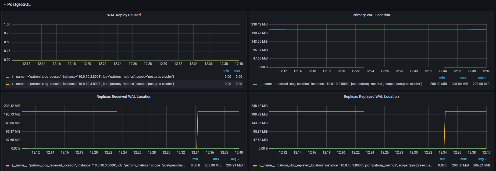
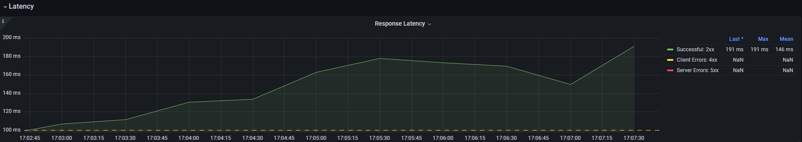
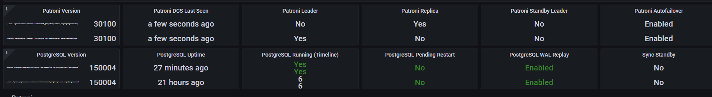
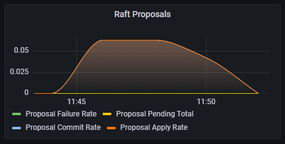

# Домашнее задание №4 (Chaos Engineering) MtsCloud "Проект для студента poshta69" K8s namespase "sre-cource-student-72"
*Задача:*

1. [Отключение узла: Планово остановить один из узлов кластера, чтобы проверить процедуру переключения ролей (failover). - Анализировать время, необходимое для восстановления и как система выбирает новый Master узел (и есть ли вообще там стратегия выбора?).](README.md#%D0%B7%D0%B0%D0%B4%D0%B0%D1%87%D0%B0-1)
2. [Имитация частичной потери сети: Использовать инструменты для имитации потери пакетов или разрыва TCP-соединений между узлами. Цель — проверить, насколько хорошо система справляется с временной недоступностью узлов и как быстро восстанавливается репликация.](README.md#задача-2)
3. [Высокая нагрузка на CPU или I/O: Запустить процессы, которые создают высокую нагрузку на CPU или дисковую подсистему одного из узлов кластера, чтобы проверить, как это влияет на производительность кластера в целом и на работу Patroni.](README.md#задача-3)
4. [Тестирование систем мониторинга и оповещения: С помощью chaos engineering можно также проверить, насколько эффективны системы мониторинга и оповещения. Например, можно искусственно вызвать отказ, который должен быть зарегистрирован системой мониторинга, и убедиться, что оповещения доставляются вовремя.](README.md#задача-4)

*Если сделали все предыдущие:*

1. ["Split-brain": Одновременно изолировать несколько узлов от сети и дать им возможность объявить себя новыми мастер-узлами. Проверить, успеет ли Patroni достичь
консенсуса и избежать ситуации "split-brain".](./README.md#Задача-Split-brain)
2. [Долгосрочная изоляция: Оставить узел изолированным от кластера на длительное время, затем восстановить соединение и наблюдать за процессом синхронизации и
восстановления реплики.](./README.md#Задача №1.)
3. [Сбои сервисов зависимостей: Изучить поведение кластера Patroni при сбоях в сопутствующих сервисах, например, etcd (которые используются для хранения состояния кластера), путем имитации его недоступности или некорректной работы.](./README.md#Задача №1.)

*Схема системы*


## Инструменты
Для выполнения тестирования будем использовать следующие инструменты:
- [Artillery](https://www.artillery.io/docs/get-started/get-artillery)
- [ChaosBlade](https://chaosblade.io/en/)
- Консоль MtsCloud

## Задача №1.
Иcходя из условий задачи, нашей цулью является кластер Postgres под управлением patroni. Поведение кластера ETCD будет проверено в задаче по Split-brain.
### Описание эксперимента
Отработаем два варианта отключения:
1. Ведомый хост
2. Ведущий хост
Ход выполнения:
1. Создадим нагрузку на приложение в 10 rps/s используя Artillery
2. Планово остановим один из узлов кластера используя один из способов
```Bash
shutdown -P now
services postgresql stop
```
или выключить хост через консоль MtsCloud
Определим сервера:
```Bash
sudo patronictl list
+ Cluster: postgres-cluster ------+-----------+----+-----------+
| Member    | Host      | Role    | State     | TL | Lag in MB |
+-----------+-----------+---------+-----------+----+-----------+
| db-srv-01 | 10.0.10.2 | Leader  | running   |  1 |           |
| db-srv-02 | 10.0.10.3 | Replica | streaming |  1 |         0 |
+-----------+-----------+---------+-----------+----+-----------+
```
Сеачала проведем отключение реплики, после восстановления - лидера.
Отключать хосты будем через консоль MtsCloud.
### Ожидаемые результаты
При потере ведомомо узла - оповещения от системы мониторинга и при наличии разделения чтение/запись просадку в rps/s, если не настроено, то влияния на приложение не окажет. Приложение не настроено на разделение чтение/запись, значит должны получить только оповещения, на работу не должно быть оказано влияние.

При потере ведущего узла - оповещения от системы мониторинга, смена лидера и недоступность ресурса не более 30 секунд (patroni ttl=30), после восстановления работы отключенной ноды она должна стать ведомой и начать репликацию.
### Реальные результаты
При отключении реплики:
- При плановом выключении и при имитации потери питания влияния на работу приложения оказано не было
```Bash
sudo patronictl list
+ Cluster: postgres-cluster -----+---------+----+-----------+
| Member    | Host      | Role   | State   | TL | Lag in MB |
+-----------+-----------+--------+---------+----+-----------+
| db-srv-01 | 10.0.10.2 | Leader | running |  1 |           |
+-----------+-----------+--------+---------+----+-----------+
```
Сработали алерты на потерю экспортеров завязанных на хост и о потери плеча реплики от Haproxy


После включени хоста работа кластера восстановилась и восстановились алерты.
```Bash
sudo patronictl list
+ Cluster: postgres-cluster ------+-----------+----+-----------+
| Member    | Host      | Role    | State     | TL | Lag in MB |
+-----------+-----------+---------+-----------+----+-----------+
| db-srv-01 | 10.0.10.2 | Leader  | running   |  1 |           |
| db-srv-02 | 10.0.10.3 | Replica | streaming |  1 |         0 |
+-----------+-----------+---------+-----------+----+-----------+
```

При отключении лидера:
```Bash
sudo patronictl list
+ Cluster: postgres-cluster -----+---------+----+-----------+
| Member    | Host      | Role   | State   | TL | Lag in MB |
+-----------+-----------+--------+---------+----+-----------+
| db-srv-02 | 10.0.10.3 | Leader | running |  2 |           |
+-----------+-----------+--------+---------+----+-----------+
```
Произошла смена лидера мене 10s

Сработали алерты на потерю экспортеров завязанных на хост и о потери плеча реплики от Haproxy.
После включени хоста работа кластера восстановилась и восстановились алерты.
```Bash
sudo patronictl list
+ Cluster: postgres-cluster ------+-----------+----+-----------+
| Member    | Host      | Role    | State     | TL | Lag in MB |
+-----------+-----------+---------+-----------+----+-----------+
| db-srv-01 | 10.0.10.2 | Replica | streaming |  2 |         0 |
| db-srv-02 | 10.0.10.3 | Leader  | running   |  2 |           |
+-----------+-----------+---------+-----------+----+-----------+
```
Произошло падение RPS, errors 499, 500 выросло latency P99. P95 осталось в пределах SLO.


### Анализ результатов
Ожидаемые результаты совпали с реальными - тест пройден.

Механизм failover-а и выбора нового лидера отработал штатно, согласно схемы

Из возможных улучшений - добавить алерт на потерю ноды кластера postgres.

## Задача №2.
Иcходя из условий задачи, сконцентрируемся на кластере Postgres и ETCD.
### Описание эксперимента
Будем имитировать потерю исходящих пакетов на мастер ноде.
Ход выполнения:
1. Создадим нагрузку на приложение в 10 rps/s используя Artillery
2. Используя инструмент ChaosBlade имитируем потерю пакетов 30% 50% 70%
```Bash
blade create network loss --interface ens* --percent 30 --timeout 60 --exclude-port 22 --destination-ip *.*.*.*
blade create network loss --interface ens* --percent 50 --timeout 60 --exclude-port 22 --destination-ip *.*.*.*
blade create network loss --interface ens* --percent 70 --timeout 60 --exclude-port 22 --destination-ip *.*.*.*
```
или альтернативный вариант, используя iptables
```Bash
iptables -I OUTPUT -d *.*.*.* -m statistic --mode random --probability 0.30 -j DROP
iptables -I OUTPUT -d *.*.*.* -m statistic --mode random --probability 0.50 -j DROP
iptables -I OUTPUT -d *.*.*.* -m statistic --mode random --probability 0.70 -j DROP
```
Определим сервера:
```Bash
sudo patronictl list
+ Cluster: postgres-cluster ------+-----------+----+-----------+
| Member    | Host      | Role    | State     | TL | Lag in MB |
+-----------+-----------+---------+-----------+----+-----------+
| db-srv-01 | 10.0.10.2 | Leader  | running   |  3 |           |
| db-srv-02 | 10.0.10.3 | Replica | streaming |  3 |         0 |
+-----------+-----------+---------+-----------+----+-----------+
```
```Bash
sudo ETCDCTL_API=3 etcdctl endpoint status --write-out=table --endpoints=http://10.0.10.4:2379 --endpoints=http://10.0.10.5:2379 --endpoints=http://10.0.10.6:2379
+-----------------------+------------------+---------+---------+-----------+------------+-----------+------------+--------------------+--------+
|       ENDPOINT        |        ID        | VERSION | DB SIZE | IS LEADER | IS LEARNER | RAFT TERM | RAFT INDEX | RAFT APPLIED INDEX | ERRORS |
+-----------------------+------------------+---------+---------+-----------+------------+-----------+------------+--------------------+--------+
| http://10.0.10.4:2379 | 28cd7332cee13aa8 |   3.5.9 |   90 kB |     false |      false |         2 |        236 |                236 |        |
| http://10.0.10.5:2379 | e8cc3f7ff72fe07d |   3.5.9 |   94 kB |     false |      false |         2 |        236 |                236 |        |
| http://10.0.10.6:2379 | b586ded327f9460d |   3.5.9 |   94 kB |      true |      false |         2 |        236 |                236 |        |
+-----------------------+------------------+---------+---------+-----------+------------+-----------+------------+--------------------+--------+
```
Далее на каждом мастере будем поочередно запускать комманды и наблюдать за поведением системы. При тестировании ETCD будем производить смену лидера в кластере postgres. При тестировании postgres будем писать и стирать данные в БД кластера.
### Ожидаемые результаты
По мере увеличения процента потерь должно увеличиваться отставание реплик, при привышение порога отставания должен сработать алерт, если такой имеется. При наличии разделения чтение/запись нарушение консистентности данных. Приложение не настроено на разделение чтение/запись, на работу не должно быть оказано влияние.
### Реальные результаты
При при проведении эксперемента на ETCD кластере не было выявлено критического воздействия на репликацию даже при повышении потерь до 98%, члены кластера в течении секунды забирали изменения с лидера, время переключения лидера в кластере postgres также оставлось в пределах 10s.


При проведении теста на кластере postgres были выявлены следующие результаты:
- При потере 30% пакетов не наблюдалось отставания репликации
- При потере 50% был стабильный лаг в 20ms

- При потере 70% был стабильный лаг в 90ms

Оповещений от системы мониторинга не было.

### Анализ результатов
Ожидаемые результаты частично совпали с реальными.

Кластер ETCD в данной схеме оказался наименее подвержен проблемам сети, это связано с небольшой активностью работы с хранимой в нем информации, при более активном использовании мы бы получили задержки при сохранении данных, так как ответ об сохранинии данных в кластере отдается только после подтверждения их сохранения всеми членами кластера.

При тестировании кластера postgres наблюдалась четкая закономерность, что при увеличении потерь происходило увеличение отставания репликации! Цифры получились небольшие, т.к. использовался небольшой объем изменяемых данных в БД, однако при его увеличении цифры покажут рост. Для получения более показательного результата необходимо подготовить сценарий на грузки направленный на операции записи и редактирования записей в БД.

Система оповещения не сработала, т.к. не были достигнуты граничные результаты. Для отслежывания таких ситуаций стоит добавить правило для отслеживания потери пакетов.

## Задача №3.
Иcходя из условий задачи, сконцентрируемся на кластере Postgres как наиболее ответсвенной точке системы.
### Описание эксперимента
Будем имитировать наргузку 80-100% на CPU и чтение запись на дисковую подсистему на мастер ноде.
Ход выполнения:
1. Создадим нагрузку на приложение в 10 rps/s используя Artillery
2. Используя инструмент ChaosBlade создадим нагрузку на диск и процессор
```Bash
blade create cpu fullload --cpu-percent 80 --timeout 600
blade create cpu fullload --cpu-percent 100 --timeout 600
blade create disk burn --read --write --path ~/test --timeout 600
```

### Ожидаемые результаты
По мере увеличения нагрузки должны сработать алерты от системы мониторинга по утилизации ресурсов, увеличиться время ответа системы. Возмажна задержка репликации или смена лидера.

### Реальные результаты
- При нагрузке на CPU в 80% система работает стабильно, наблюдается небольшое увеличение latency, оповещений о приближении к крит. лимиту cpu нет.


- При нагрузке на CPU в 100% система работает не устойчиво, но при этом ошибок в приложении не наблюдается при текущей нагрузке, есть небольшой лаг в сборе метрик и увеличилось время ответа приложения. Операции чтения и изменения данных в БД также увеличились по времени и занимали 40-250ms, при штатной работе выполнялись >40. При тестировании процессор не был загружен на 100%, максимум 97-98%. Оповещений о приближении к крит. лимиту cpu нет.




- При нагрузке на дисковую систему наблюдалось схожее поведение с результатом 100% нагрузки на CPU, оповещений о приближении к крит. лимиту cpu нет.

### Анализ результатов
Ожидаемые результаты частично совпали с реальными.
При текущих нагрузках система вела себя предсказуемо, однако при увеличении числа запросов и их смешанном характере возможна деградация сервиса. Задержка в репликации отсутствует, лидер не сменился. Так же влияние оказало не возможность полностью нагрузить процессор, из-за этого результаты не ровные. Отсутствуют оповещения!

Для улучшения наблюдаемости стоит настроить оповещения с корректными порогами по утилизации ресурсов!

## Задача №3.
В проведенных тестах уже есть упоминание системы монит оринга, поэтому в этом пункте просто подитожим результаты.

В результате тестов выяснили, что система мониторинга присутствует и имеющиеся в ней правила отрабатывают в штатном порядке, однако отсутствуют оповещения по утилизации ресурсов и работоспособности сервисов. Для улучшения работы мониторинга и наблюдаемости системы необходимо настроить оповещения по:
1. Утилизации ресурсов (cpu, i/o, mem)
2. Ключевых служб системы (patroni, etcd, postgres, haproxy)

## Задача Split-brain
Возможны два варианта один для кластера postgres второй для etcd.

Для postgres, переключением занимается patroni, информацию о лидере он хранит в etcd, при потере связи с etcd кластер переходит в состояние `read-only` или при наличии опции `failsafe_mode: true` у patroni - остаемся в последнем состоянии. Исходя из это получаем, что Split-brain не возможен в авто режиме, только если в ручную назначить каждой ноде мастера.

Для etcd, кластер состоит из 3 членов используется протокол Raft. Исходя из это получаем, что Split-brain не возможен.

### Описание эксперимента
Изолируем postgres от кластера etcd и реплику от мастера, на каждой ноде кластера postgres прописываем
```Bash
blade create network loss --percent 100 --destination-ip адреса etcd --interface ens160 --exclude-port 22 --timeout 600
```
Изолируем одну ноду etcd от остальных нод кластера
```Bash
blade create network loss --percent 100 --destination-ip адреса etcd --interface ens160 --exclude-port 22 --timeout 600
```
### Ожидаемые результаты
В первом случае, получим состояние `read-only`, так как согласно документации patroni режим `failsafe_mode: true` выключен. Сервис деградирует, т.к. на балансере проверяется доступность сервиса patroni, он будет отдавать ошибку т.к. не сможет связаться с ETCD.

Во втором случае, получим работающий сервис, но состояние кластера ETCD будет `unhealthy cluster`. Split-brain так же не будет, если убрать допом лидера, то кластер развалится, т.к. не получится выбрать лидера, для голосования нужно две ноды.

### Реальные результаты
В первом случае:

Запрос статуса patroni

```Bash
sudo patronictl list
2023-12-14 08:29:23,584 - WARNING - postgresql parameter max_prepared_transactions=0 failed validation, defaulting to 0
2023-12-14 08:29:25,314 - ERROR - Failed to get list of machines from http://10.0.10.6:2379/v3beta: MaxRetryError("HTTPConnectionPool(host='10.0.10.6', port=2379): Max retries exceeded with url: /version (Caused by ConnectTimeoutError(<urllib3.connection.HTTPConnection object at 0x7f2cd627b160>, 'Connection to 10.0.10.6 timed out. (connect timeout=1.6666666666666667)'))")
2023-12-14 08:29:26,985 - ERROR - Failed to get list of machines from http://10.0.10.5:2379/v3beta: MaxRetryError("HTTPConnectionPool(host='10.0.10.5', port=2379): Max retries exceeded with url: /version (Caused by ConnectTimeoutError(<urllib3.connection.HTTPConnection object at 0x7f2cd627b5e0>, 'Connection to 10.0.10.5 timed out. (connect timeout=1.6666666666666667)'))")
2023-12-14 08:29:28,655 - ERROR - Failed to get list of machines from http://10.0.10.4:2379/v3beta: MaxRetryError("HTTPConnectionPool(host='10.0.10.4', port=2379): Max retries exceeded with url: /version (Caused by ConnectTimeoutError(<urllib3.connection.HTTPConnection object at 0x7f2cd627ba00>, 'Connection to 10.0.10.4 timed out. (connect timeout=1.6666666666666667)'))")
2023-12-14 08:29:35,330 - ERROR - Failed to get list of machines from http://10.0.10.6:2379/v3beta: MaxRetryError("HTTPConnectionPool(host='10.0.10.6', port=2379): Max retries exceeded with url: /version (Caused by ConnectTimeoutError(<urllib3.connection.HTTPConnection object at 0x7f2cd628a040>, 'Connection to 10.0.10.6 timed out. (connect timeout=1.6666666666666667)'))")
2023-12-14 08:29:37,000 - ERROR - Failed to get list of machines from http://10.0.10.5:2379/v3beta: MaxRetryError("HTTPConnectionPool(host='10.0.10.5', port=2379): Max retries exceeded with url: /version (Caused by ConnectTimeoutError(<urllib3.connection.HTTPConnection object at 0x7f2cd628a400>, 'Connection to 10.0.10.5 timed out. (connect timeout=1.6666666666666667)'))")
2023-12-14 08:29:38,669 - ERROR - Failed to get list of machines from http://10.0.10.4:2379/v3beta: MaxRetryError("HTTPConnectionPool(host='10.0.10.4', port=2379): Max retries exceeded with url: /version (Caused by ConnectTimeoutError(<urllib3.connection.HTTPConnection object at 0x7f2cd628a7f0>, 'Connection to 10.0.10.4 timed out. (connect timeout=1.6666666666666667)'))")
```

Ожидаемо patroni перевел обе ноды в реплики и в режим `read-only`, произошла деградация приложения т.к. отвалился балансировщик, сработали оповещения.


После восстановления кластер принял предыдущее состояние, работа восстановилась, Split-brain не допущен.


```Bash
sudo patronictl list
+ Cluster: postgres-cluster ------+-----------+----+-----------+
| Member    | Host      | Role    | State     | TL | Lag in MB |
+-----------+-----------+---------+-----------+----+-----------+
| db-srv-01 | 10.0.10.2 | Replica | streaming |  6 |         0 |
| db-srv-02 | 10.0.10.3 | Leader  | running   |  6 |           |
+-----------+-----------+---------+-----------+----+-----------+
```

Во втором случае:

Состояние до теста

```Bash
sudo ETCDCTL_API=3 etcdctl endpoint status --write-out=table --endpoints=http://10.0.10.4:2379 --endpoints=http://10.0.10.5:2379 --endpoints=http://10.0.10.6:2379
+-----------------------+------------------+---------+---------+-----------+------------+-----------+------------+--------------------+--------+
|       ENDPOINT        |        ID        | VERSION | DB SIZE | IS LEADER | IS LEARNER | RAFT TERM | RAFT INDEX | RAFT APPLIED INDEX | ERRORS |
+-----------------------+------------------+---------+---------+-----------+------------+-----------+------------+--------------------+--------+
| http://10.0.10.4:2379 | 28cd7332cee13aa8 |   3.5.9 |  123 kB |     false |      false |         2 |        356 |                356 |        |
| http://10.0.10.5:2379 | e8cc3f7ff72fe07d |   3.5.9 |  123 kB |     false |      false |         2 |        356 |                356 |        |
| http://10.0.10.6:2379 | b586ded327f9460d |   3.5.9 |  127 kB |      true |      false |         2 |        356 |                356 |        |
+-----------------------+------------------+---------+---------+-----------+------------+-----------+------------+--------------------+--------+
```

Изолируем первую ноду (10.0.10.4)

```Bash
sudo ETCDCTL_API=3 etcdctl endpoint status --write-out=table --endpoints=http://10.0.10.4:2379 --endpoints=http://10.0.10.5:2379 --endpoints=http://10.0.10.6:2379
{"level":"warn","ts":"2023-12-14T08:54:30.147606Z","logger":"etcd-client","caller":"v3@v3.5.9/retry_interceptor.go:62","msg":"retrying of unary invoker failed","target":"etcd-endpoints://0xc0002c6a80/10.0.10.4:2379","attempt":0,"error":"rpc error: code = DeadlineExceeded desc = context deadline exceeded"}
Failed to get the status of endpoint http://10.0.10.4:2379 (context deadline exceeded)
+-----------------------+------------------+---------+---------+-----------+------------+-----------+------------+--------------------+--------+
|       ENDPOINT        |        ID        | VERSION | DB SIZE | IS LEADER | IS LEARNER | RAFT TERM | RAFT INDEX | RAFT APPLIED INDEX | ERRORS |
+-----------------------+------------------+---------+---------+-----------+------------+-----------+------------+--------------------+--------+
| http://10.0.10.5:2379 | e8cc3f7ff72fe07d |   3.5.9 |  123 kB |     false |      false |         2 |        362 |                362 |        |
| http://10.0.10.6:2379 | b586ded327f9460d |   3.5.9 |  127 kB |      true |      false |         2 |        362 |                362 |        |
+-----------------------+------------------+---------+---------+-----------+------------+-----------+------------+--------------------+--------+
```

Логи с ноды

```Bash
Oct 06 09:08:39 etcd-srv-01 bash[57444]: {"level":"info","ts":"2023-10-06T09:08:39.466997Z","caller":"api/capability.go:75","msg":"enabled capabilities for version","cluster-version":"3.5"}
Dec 14 08:53:46 etcd-srv-01 bash[57444]: {"level":"info","ts":"2023-12-14T08:53:46.306852Z","logger":"raft","caller":"etcdserver/zap_raft.go:77","msg":"28cd7332cee13aa8 is starting a new election at term 2"}
Dec 14 08:53:46 etcd-srv-01 bash[57444]: {"level":"info","ts":"2023-12-14T08:53:46.314572Z","logger":"raft","caller":"etcdserver/zap_raft.go:77","msg":"28cd7332cee13aa8 became pre-candidate at term 2"}
Dec 14 08:53:46 etcd-srv-01 bash[57444]: {"level":"info","ts":"2023-12-14T08:53:46.315748Z","logger":"raft","caller":"etcdserver/zap_raft.go:77","msg":"28cd7332cee13aa8 received MsgPreVoteResp from 28cd7332cee13aa8 at term 2"}
Dec 14 08:53:46 etcd-srv-01 bash[57444]: {"level":"info","ts":"2023-12-14T08:53:46.316105Z","logger":"raft","caller":"etcdserver/zap_raft.go:77","msg":"28cd7332cee13aa8 [logterm: 2, index: 362] sent MsgPreVote request to b586ded327f9460d at term 2"}
Dec 14 08:53:46 etcd-srv-01 bash[57444]: {"level":"info","ts":"2023-12-14T08:53:46.31635Z","logger":"raft","caller":"etcdserver/zap_raft.go:77","msg":"28cd7332cee13aa8 [logterm: 2, index: 362] sent MsgPreVote request to e8cc3f7ff72fe07d at term 2"}
Dec 14 08:53:46 etcd-srv-01 bash[57444]: {"level":"info","ts":"2023-12-14T08:53:46.316569Z","logger":"raft","caller":"etcdserver/zap_raft.go:77","msg":"raft.node: 28cd7332cee13aa8 lost leader b586ded327f9460d at term 2"}
Dec 14 08:53:54 etcd-srv-01 bash[57444]: {"level":"info","ts":"2023-12-14T08:53:54.304518Z","logger":"raft","caller":"etcdserver/zap_raft.go:77","msg":"28cd7332cee13aa8 is starting a new election at term 2"}
Dec 14 08:53:54 etcd-srv-01 bash[57444]: {"level":"info","ts":"2023-12-14T08:53:54.305071Z","logger":"raft","caller":"etcdserver/zap_raft.go:77","msg":"28cd7332cee13aa8 became pre-candidate at term 2"}
Dec 14 08:53:54 etcd-srv-01 bash[57444]: {"level":"info","ts":"2023-12-14T08:53:54.305178Z","logger":"raft","caller":"etcdserver/zap_raft.go:77","msg":"28cd7332cee13aa8 received MsgPreVoteResp from 28cd7332cee13aa8 at term 2"}
Dec 14 08:53:54 etcd-srv-01 bash[57444]: {"level":"info","ts":"2023-12-14T08:53:54.305266Z","logger":"raft","caller":"etcdserver/zap_raft.go:77","msg":"28cd7332cee13aa8 [logterm: 2, index: 362] sent MsgPreVote request to b586ded327f9460d at term 2"}
Dec 14 08:53:54 etcd-srv-01 bash[57444]: {"level":"info","ts":"2023-12-14T08:53:54.305345Z","logger":"raft","caller":"etcdserver/zap_raft.go:77","msg":"28cd7332cee13aa8 [logterm: 2, index: 362] sent MsgPreVote request to e8cc3f7ff72fe07d at term 2"}
Dec 14 08:54:02 etcd-srv-01 bash[57444]: {"level":"info","ts":"2023-12-14T08:54:02.304812Z","logger":"raft","caller":"etcdserver/zap_raft.go:77","msg":"28cd7332cee13aa8 is starting a new election at term 2"}
Dec 14 08:54:02 etcd-srv-01 bash[57444]: {"level":"info","ts":"2023-12-14T08:54:02.305348Z","logger":"raft","caller":"etcdserver/zap_raft.go:77","msg":"28cd7332cee13aa8 became pre-candidate at term 2"}
Dec 14 08:54:02 etcd-srv-01 bash[57444]: {"level":"info","ts":"2023-12-14T08:54:02.305443Z","logger":"raft","caller":"etcdserver/zap_raft.go:77","msg":"28cd7332cee13aa8 received MsgPreVoteResp from 28cd7332cee13aa8 at term 2"}
Dec 14 08:54:02 etcd-srv-01 bash[57444]: {"level":"info","ts":"2023-12-14T08:54:02.305622Z","logger":"raft","caller":"etcdserver/zap_raft.go:77","msg":"28cd7332cee13aa8 [logterm: 2, index: 362] sent MsgPreVote request to b586ded327f9460d at term 2"}
Dec 14 08:54:02 etcd-srv-01 bash[57444]: {"level":"info","ts":"2023-12-14T08:54:02.305716Z","logger":"raft","caller":"etcdserver/zap_raft.go:77","msg":"28cd7332cee13aa8 [logterm: 2, index: 362] sent MsgPreVote request to e8cc3f7ff72fe07d at term 2"}
Dec 14 08:54:04 etcd-srv-01 bash[57444]: {"level":"warn","ts":"2023-12-14T08:54:04.759186Z","caller":"rafthttp/probing_status.go:68","msg":"prober detected unhealthy status","round-tripper-name":"ROUND_TRIPPER_SNAPSHOT","remote-peer-id":"b586ded327f9460d","rtt":"752.659µs","error":"dial tcp 10.0.10.6:2380: i/o timeout"}
Dec 14 08:54:05 etcd-srv-01 bash[57444]: {"level":"warn","ts":"2023-12-14T08:54:05.223667Z","caller":"rafthttp/probing_status.go:68","msg":"prober detected unhealthy status","round-tripper-name":"ROUND_TRIPPER_RAFT_MESSAGE","remote-peer-id":"e8cc3f7ff72fe07d","rtt":"948.202µs","error":"dial tcp 10.0.10.5:2380: i/o timeout"}
Dec 14 08:54:05 etcd-srv-01 bash[57444]: {"level":"warn","ts":"2023-12-14T08:54:05.599913Z","caller":"rafthttp/probing_status.go:68","msg":"prober detected unhealthy status","round-tripper-name":"ROUND_TRIPPER_RAFT_MESSAGE","remote-peer-id":"b586ded327f9460d","rtt":"1.257742ms","error":"dial tcp 10.0.10.6:2380: i/o timeout"}
Dec 14 08:54:05 etcd-srv-01 bash[57444]: {"level":"warn","ts":"2023-12-14T08:54:05.729611Z","caller":"rafthttp/probing_status.go:68","msg":"prober detected unhealthy status","round-tripper-name":"ROUND_TRIPPER_SNAPSHOT","remote-peer-id":"e8cc3f7ff72fe07d","rtt":"588.495µs","error":"dial tcp 10.0.10.5:2380: i/o timeout"}
Dec 14 08:54:09 etcd-srv-01 bash[57444]: {"level":"warn","ts":"2023-12-14T08:54:09.762311Z","caller":"rafthttp/probing_status.go:68","msg":"prober detected unhealthy status","round-tripper-name":"ROUND_TRIPPER_SNAPSHOT","remote-peer-id":"b586ded327f9460d","rtt":"752.659µs","error":"dial tcp 10.0.10.6:2380: i/o timeout"}
Dec 14 08:54:10 etcd-srv-01 bash[57444]: {"level":"warn","ts":"2023-12-14T08:54:10.224894Z","caller":"rafthttp/probing_status.go:68","msg":"prober detected unhealthy status","round-tripper-name":"ROUND_TRIPPER_RAFT_MESSAGE","remote-peer-id":"e8cc3f7ff72fe07d","rtt":"948.202µs","error":"dial tcp 10.0.10.5:2380: i/o timeout"}
Dec 14 08:54:10 etcd-srv-01 bash[57444]: {"level":"info","ts":"2023-12-14T08:54:10.304853Z","logger":"raft","caller":"etcdserver/zap_raft.go:77","msg":"28cd7332cee13aa8 is starting a new election at term 2"}
Dec 14 08:54:10 etcd-srv-01 bash[57444]: {"level":"info","ts":"2023-12-14T08:54:10.305383Z","logger":"raft","caller":"etcdserver/zap_raft.go:77","msg":"28cd7332cee13aa8 became pre-candidate at term 2"}
Dec 14 08:54:10 etcd-srv-01 bash[57444]: {"level":"info","ts":"2023-12-14T08:54:10.305638Z","logger":"raft","caller":"etcdserver/zap_raft.go:77","msg":"28cd7332cee13aa8 received MsgPreVoteResp from 28cd7332cee13aa8 at term 2"}
Dec 14 08:54:10 etcd-srv-01 bash[57444]: {"level":"info","ts":"2023-12-14T08:54:10.305908Z","logger":"raft","caller":"etcdserver/zap_raft.go:77","msg":"28cd7332cee13aa8 [logterm: 2, index: 362] sent MsgPreVote request to b586ded327f9460d at term 2"}
Dec 14 08:54:10 etcd-srv-01 bash[57444]: {"level":"info","ts":"2023-12-14T08:54:10.306121Z","logger":"raft","caller":"etcdserver/zap_raft.go:77","msg":"28cd7332cee13aa8 [logterm: 2, index: 362] sent MsgPreVote request to e8cc3f7ff72fe07d at term 2"}
Dec 14 08:54:10 etcd-srv-01 bash[57444]: {"level":"warn","ts":"2023-12-14T08:54:10.601382Z","caller":"rafthttp/probing_status.go:68","msg":"prober detected unhealthy status","round-tripper-name":"ROUND_TRIPPER_RAFT_MESSAGE","remote-peer-id":"b586ded327f9460d","rtt":"1.257742ms","error":"dial tcp 10.0.10.6:2380: i/o timeout"}
Dec 14 08:54:10 etcd-srv-01 bash[57444]: {"level":"warn","ts":"2023-12-14T08:54:10.730656Z","caller":"rafthttp/probing_status.go:68","msg":"prober detected unhealthy status","round-tripper-name":"ROUND_TRIPPER_SNAPSHOT","remote-peer-id":"e8cc3f7ff72fe07d","rtt":"588.495µs","error":"dial tcp 10.0.10.5:2380: i/o timeout"}
Dec 14 08:54:14 etcd-srv-01 bash[57444]: {"level":"warn","ts":"2023-12-14T08:54:14.764007Z","caller":"rafthttp/probing_status.go:68","msg":"prober detected unhealthy status","round-tripper-name":"ROUND_TRIPPER_SNAPSHOT","remote-peer-id":"b586ded327f9460d","rtt":"752.659µs","error":"dial tcp 10.0.10.6:2380: i/o timeout"}
Dec 14 08:54:15 etcd-srv-01 bash[57444]: {"level":"warn","ts":"2023-12-14T08:54:15.225706Z","caller":"rafthttp/probing_status.go:68","msg":"prober detected unhealthy status","round-tripper-name":"ROUND_TRIPPER_RAFT_MESSAGE","remote-peer-id":"e8cc3f7ff72fe07d","rtt":"948.202µs","error":"dial tcp 10.0.10.5:2380: i/o timeout"}
Dec 14 08:54:15 etcd-srv-01 bash[57444]: {"level":"warn","ts":"2023-12-14T08:54:15.602701Z","caller":"rafthttp/probing_status.go:68","msg":"prober detected unhealthy status","round-tripper-name":"ROUND_TRIPPER_RAFT_MESSAGE","remote-peer-id":"b586ded327f9460d","rtt":"1.257742ms","error":"dial tcp 10.0.10.6:2380: i/o timeout"}
Dec 14 08:54:15 etcd-srv-01 bash[57444]: {"level":"warn","ts":"2023-12-14T08:54:15.731537Z","caller":"rafthttp/probing_status.go:68","msg":"prober detected unhealthy status","round-tripper-name":"ROUND_TRIPPER_SNAPSHOT","remote-peer-id":"e8cc3f7ff72fe07d","rtt":"588.495µs","error":"dial tcp 10.0.10.5:2380: i/o timeout"}
```

Приложение работает, лидер не сменился не на postdres ни на etcd, сработал алерт




Была попытка перевыбора лидера



Попробуем изолировать лидера

Произошел выбор нового лидера


```Bash
sudo ETCDCTL_API=3 etcdctl endpoint status --write-out=table --endpoints=http://10.0.10.4:2379 --endpoints=http://10.0.10.5:2379 --endpoints=http://10.0.10.6:2379
{"level":"warn","ts":"2023-12-14T09:18:00.982076Z","logger":"etcd-client","caller":"v3@v3.5.9/retry_interceptor.go:62","msg":"retrying of unary invoker failed","target":"etcd-endpoints://0xc0002c6a80/10.0.10.4:2379","attempt":0,"error":"rpc error: code = DeadlineExceeded desc = context deadline exceeded"}
Failed to get the status of endpoint http://10.0.10.6:2379 (context deadline exceeded)
+-----------------------+------------------+---------+---------+-----------+------------+-----------+------------+--------------------+--------+
|       ENDPOINT        |        ID        | VERSION | DB SIZE | IS LEADER | IS LEARNER | RAFT TERM | RAFT INDEX | RAFT APPLIED INDEX | ERRORS |
+-----------------------+------------------+---------+---------+-----------+------------+-----------+------------+--------------------+--------+
| http://10.0.10.4:2379 | 28cd7332cee13aa8 |   3.5.9 |  123 kB |     false |      false |         3 |        366 |                366 |        |
| http://10.0.10.5:2379 | e8cc3f7ff72fe07d |   3.5.9 |  123 kB |      true |      false |         3 |        366 |                366 |        |
+-----------------------+------------------+---------+---------+-----------+------------+-----------+------------+--------------------+--------+
```

Сервис работает, в кластере бд лидер не сменился.

После ввода старого лидера Split-brain не допущен кластер сохранил рабочее состояние


```Bash
sudo ETCDCTL_API=3 etcdctl endpoint status --write-out=table --endpoints=http://10.0.10.4:2379 --endpoints=http://10.0.10.5:2379 --endpoints=http://10.0.10.6:2379
+-----------------------+------------------+---------+---------+-----------+------------+-----------+------------+--------------------+--------+
|       ENDPOINT        |        ID        | VERSION | DB SIZE | IS LEADER | IS LEARNER | RAFT TERM | RAFT INDEX | RAFT APPLIED INDEX | ERRORS |
+-----------------------+------------------+---------+---------+-----------+------------+-----------+------------+--------------------+--------+
| http://10.0.10.4:2379 | 28cd7332cee13aa8 |   3.5.9 |  123 kB |     false |      false |         3 |        366 |                366 |        |
| http://10.0.10.5:2379 | e8cc3f7ff72fe07d |   3.5.9 |  123 kB |      true |      false |         3 |        366 |                366 |        |
| http://10.0.10.6:2379 | b586ded327f9460d |   3.5.9 |  127 kB |     false |      false |         3 |        366 |                366 |        |
+-----------------------+------------------+---------+---------+-----------+------------+-----------+------------+--------------------+--------+
```

Логи со старого лидера
<details>
<summary>Логи</summary>
sudo journalctl -f -u etcd.service
-- Logs begin at Wed 2023-06-07 17:52:47 UTC. --
Dec 14 09:03:48 etcd-srv-03 bash[57184]: {"level":"info","ts":"2023-12-14T09:03:48.399318Z","caller":"rafthttp/stream.go:249","msg":"set message encoder","from":"b586ded327f9460d","to":"28cd7332cee13aa8","stream-type":"stream Message"}
Dec 14 09:03:48 etcd-srv-03 bash[57184]: {"level":"info","ts":"2023-12-14T09:03:48.401485Z","caller":"rafthttp/stream.go:274","msg":"established TCP streaming connection with remote peer","stream-writer-type":"stream Message","local-member-id":"b586ded327f9460d","remote-peer-id":"28cd7332cee13aa8"}
Dec 14 09:04:04 etcd-srv-03 bash[57184]: {"level":"warn","ts":"2023-12-14T09:04:04.426509Z","caller":"rafthttp/peer_status.go:66","msg":"peer became inactive (message send to peer failed)","peer-id":"28cd7332cee13aa8","error":"failed to write 28cd7332cee13aa8 on stream MsgApp v2 (write tcp 10.0.10.6:2380->10.0.10.4:60958: i/o timeout)"}
Dec 14 09:04:04 etcd-srv-03 bash[57184]: {"level":"warn","ts":"2023-12-14T09:04:04.430374Z","caller":"rafthttp/stream.go:223","msg":"lost TCP streaming connection with remote peer","stream-writer-type":"stream MsgApp v2","local-member-id":"b586ded327f9460d","remote-peer-id":"28cd7332cee13aa8"}
Dec 14 09:05:18 etcd-srv-03 bash[57184]: {"level":"info","ts":"2023-12-14T09:05:18.512647Z","caller":"rafthttp/stream.go:249","msg":"set message encoder","from":"b586ded327f9460d","to":"28cd7332cee13aa8","stream-type":"stream MsgApp v2"}
Dec 14 09:05:18 etcd-srv-03 bash[57184]: {"level":"info","ts":"2023-12-14T09:05:18.514081Z","caller":"rafthttp/peer_status.go:53","msg":"peer became active","peer-id":"28cd7332cee13aa8"}
Dec 14 09:05:18 etcd-srv-03 bash[57184]: {"level":"info","ts":"2023-12-14T09:05:18.514398Z","caller":"rafthttp/stream.go:274","msg":"established TCP streaming connection with remote peer","stream-writer-type":"stream MsgApp v2","local-member-id":"b586ded327f9460d","remote-peer-id":"28cd7332cee13aa8"}
Dec 14 09:14:49 etcd-srv-03 bash[57184]: {"level":"warn","ts":"2023-12-14T09:14:49.425795Z","logger":"raft","caller":"etcdserver/zap_raft.go:85","msg":"b586ded327f9460d stepped down to follower since quorum is not active"}
Dec 14 09:14:49 etcd-srv-03 bash[57184]: {"level":"info","ts":"2023-12-14T09:14:49.429334Z","logger":"raft","caller":"etcdserver/zap_raft.go:77","msg":"b586ded327f9460d became follower at term 2"}
Dec 14 09:14:49 etcd-srv-03 bash[57184]: {"level":"info","ts":"2023-12-14T09:14:49.429671Z","logger":"raft","caller":"etcdserver/zap_raft.go:77","msg":"raft.node: b586ded327f9460d lost leader b586ded327f9460d at term 2"}
Dec 14 09:14:55 etcd-srv-03 bash[57184]: {"level":"warn","ts":"2023-12-14T09:14:55.081219Z","caller":"etcdserver/cluster_util.go:288","msg":"failed to reach the peer URL","address":"http://10.0.10.4:2380/version","remote-member-id":"28cd7332cee13aa8","error":"Get \"http://10.0.10.4:2380/version\": dial tcp 10.0.10.4:2380: i/o timeout"}
Dec 14 09:14:55 etcd-srv-03 bash[57184]: {"level":"warn","ts":"2023-12-14T09:14:55.082394Z","caller":"etcdserver/cluster_util.go:155","msg":"failed to get version","remote-member-id":"28cd7332cee13aa8","error":"Get \"http://10.0.10.4:2380/version\": dial tcp 10.0.10.4:2380: i/o timeout"}
Dec 14 09:14:56 etcd-srv-03 bash[57184]: {"level":"info","ts":"2023-12-14T09:14:56.427408Z","logger":"raft","caller":"etcdserver/zap_raft.go:77","msg":"b586ded327f9460d is starting a new election at term 2"}
Dec 14 09:14:56 etcd-srv-03 bash[57184]: {"level":"info","ts":"2023-12-14T09:14:56.428082Z","logger":"raft","caller":"etcdserver/zap_raft.go:77","msg":"b586ded327f9460d became pre-candidate at term 2"}
Dec 14 09:14:56 etcd-srv-03 bash[57184]: {"level":"info","ts":"2023-12-14T09:14:56.428288Z","logger":"raft","caller":"etcdserver/zap_raft.go:77","msg":"b586ded327f9460d received MsgPreVoteResp from b586ded327f9460d at term 2"}
Dec 14 09:14:56 etcd-srv-03 bash[57184]: {"level":"info","ts":"2023-12-14T09:14:56.428454Z","logger":"raft","caller":"etcdserver/zap_raft.go:77","msg":"b586ded327f9460d [logterm: 2, index: 365] sent MsgPreVote request to 28cd7332cee13aa8 at term 2"}
Dec 14 09:14:56 etcd-srv-03 bash[57184]: {"level":"info","ts":"2023-12-14T09:14:56.428563Z","logger":"raft","caller":"etcdserver/zap_raft.go:77","msg":"b586ded327f9460d [logterm: 2, index: 365] sent MsgPreVote request to e8cc3f7ff72fe07d at term 2"}
Dec 14 09:15:01 etcd-srv-03 bash[57184]: {"level":"warn","ts":"2023-12-14T09:15:01.084012Z","caller":"etcdserver/cluster_util.go:288","msg":"failed to reach the peer URL","address":"http://10.0.10.5:2380/version","remote-member-id":"e8cc3f7ff72fe07d","error":"Get \"http://10.0.10.5:2380/version\": dial tcp 10.0.10.5:2380: i/o timeout"}
Dec 14 09:15:01 etcd-srv-03 bash[57184]: {"level":"warn","ts":"2023-12-14T09:15:01.084699Z","caller":"etcdserver/cluster_util.go:155","msg":"failed to get version","remote-member-id":"e8cc3f7ff72fe07d","error":"Get \"http://10.0.10.5:2380/version\": dial tcp 10.0.10.5:2380: i/o timeout"}
Dec 14 09:15:03 etcd-srv-03 bash[57184]: {"level":"info","ts":"2023-12-14T09:15:03.425762Z","logger":"raft","caller":"etcdserver/zap_raft.go:77","msg":"b586ded327f9460d is starting a new election at term 2"}
Dec 14 09:15:03 etcd-srv-03 bash[57184]: {"level":"info","ts":"2023-12-14T09:15:03.4264Z","logger":"raft","caller":"etcdserver/zap_raft.go:77","msg":"b586ded327f9460d became pre-candidate at term 2"}
Dec 14 09:15:03 etcd-srv-03 bash[57184]: {"level":"info","ts":"2023-12-14T09:15:03.426527Z","logger":"raft","caller":"etcdserver/zap_raft.go:77","msg":"b586ded327f9460d received MsgPreVoteResp from b586ded327f9460d at term 2"}
Dec 14 09:15:03 etcd-srv-03 bash[57184]: {"level":"info","ts":"2023-12-14T09:15:03.426651Z","logger":"raft","caller":"etcdserver/zap_raft.go:77","msg":"b586ded327f9460d [logterm: 2, index: 365] sent MsgPreVote request to 28cd7332cee13aa8 at term 2"}
Dec 14 09:15:03 etcd-srv-03 bash[57184]: {"level":"info","ts":"2023-12-14T09:15:03.426787Z","logger":"raft","caller":"etcdserver/zap_raft.go:77","msg":"b586ded327f9460d [logterm: 2, index: 365] sent MsgPreVote request to e8cc3f7ff72fe07d at term 2"}
Dec 14 09:15:05 etcd-srv-03 bash[57184]: {"level":"warn","ts":"2023-12-14T09:15:05.752195Z","caller":"rafthttp/probing_status.go:68","msg":"prober detected unhealthy status","round-tripper-name":"ROUND_TRIPPER_RAFT_MESSAGE","remote-peer-id":"e8cc3f7ff72fe07d","rtt":"1.018655ms","error":"dial tcp 10.0.10.5:2380: i/o timeout"}
Dec 14 09:15:06 etcd-srv-03 bash[57184]: {"level":"warn","ts":"2023-12-14T09:15:06.24177Z","caller":"rafthttp/probing_status.go:68","msg":"prober detected unhealthy status","round-tripper-name":"ROUND_TRIPPER_SNAPSHOT","remote-peer-id":"e8cc3f7ff72fe07d","rtt":"614.066µs","error":"dial tcp 10.0.10.5:2380: i/o timeout"}
Dec 14 09:15:06 etcd-srv-03 bash[57184]: {"level":"warn","ts":"2023-12-14T09:15:06.363049Z","caller":"rafthttp/probing_status.go:68","msg":"prober detected unhealthy status","round-tripper-name":"ROUND_TRIPPER_SNAPSHOT","remote-peer-id":"28cd7332cee13aa8","rtt":"726.4µs","error":"dial tcp 10.0.10.4:2380: i/o timeout"}
Dec 14 09:15:10 etcd-srv-03 bash[57184]: {"level":"info","ts":"2023-12-14T09:15:10.425461Z","logger":"raft","caller":"etcdserver/zap_raft.go:77","msg":"b586ded327f9460d is starting a new election at term 2"}
Dec 14 09:15:10 etcd-srv-03 bash[57184]: {"level":"info","ts":"2023-12-14T09:15:10.426079Z","logger":"raft","caller":"etcdserver/zap_raft.go:77","msg":"b586ded327f9460d became pre-candidate at term 2"}
Dec 14 09:15:10 etcd-srv-03 bash[57184]: {"level":"info","ts":"2023-12-14T09:15:10.426209Z","logger":"raft","caller":"etcdserver/zap_raft.go:77","msg":"b586ded327f9460d received MsgPreVoteResp from b586ded327f9460d at term 2"}
Dec 14 09:15:10 etcd-srv-03 bash[57184]: {"level":"info","ts":"2023-12-14T09:15:10.426341Z","logger":"raft","caller":"etcdserver/zap_raft.go:77","msg":"b586ded327f9460d [logterm: 2, index: 365] sent MsgPreVote request to 28cd7332cee13aa8 at term 2"}
Dec 14 09:15:10 etcd-srv-03 bash[57184]: {"level":"info","ts":"2023-12-14T09:15:10.426436Z","logger":"raft","caller":"etcdserver/zap_raft.go:77","msg":"b586ded327f9460d [logterm: 2, index: 365] sent MsgPreVote request to e8cc3f7ff72fe07d at term 2"}
Dec 14 09:15:10 etcd-srv-03 bash[57184]: {"level":"warn","ts":"2023-12-14T09:15:10.753465Z","caller":"rafthttp/probing_status.go:68","msg":"prober detected unhealthy status","round-tripper-name":"ROUND_TRIPPER_RAFT_MESSAGE","remote-peer-id":"e8cc3f7ff72fe07d","rtt":"1.018655ms","error":"dial tcp 10.0.10.5:2380: i/o timeout"}
Dec 14 09:15:11 etcd-srv-03 bash[57184]: {"level":"warn","ts":"2023-12-14T09:15:11.120918Z","caller":"rafthttp/probing_status.go:68","msg":"prober detected unhealthy status","round-tripper-name":"ROUND_TRIPPER_RAFT_MESSAGE","remote-peer-id":"28cd7332cee13aa8","rtt":"1.186087ms","error":"dial tcp 10.0.10.4:2380: i/o timeout"}
Dec 14 09:15:11 etcd-srv-03 bash[57184]: {"level":"warn","ts":"2023-12-14T09:15:11.242803Z","caller":"rafthttp/probing_status.go:68","msg":"prober detected unhealthy status","round-tripper-name":"ROUND_TRIPPER_SNAPSHOT","remote-peer-id":"e8cc3f7ff72fe07d","rtt":"614.066µs","error":"dial tcp 10.0.10.5:2380: i/o timeout"}
Dec 14 09:15:11 etcd-srv-03 bash[57184]: {"level":"warn","ts":"2023-12-14T09:15:11.36397Z","caller":"rafthttp/probing_status.go:68","msg":"prober detected unhealthy status","round-tripper-name":"ROUND_TRIPPER_SNAPSHOT","remote-peer-id":"28cd7332cee13aa8","rtt":"726.4µs","error":"dial tcp 10.0.10.4:2380: i/o timeout"}
Dec 14 09:15:15 etcd-srv-03 bash[57184]: {"level":"warn","ts":"2023-12-14T09:15:15.754984Z","caller":"rafthttp/probing_status.go:68","msg":"prober detected unhealthy status","round-tripper-name":"ROUND_TRIPPER_RAFT_MESSAGE","remote-peer-id":"e8cc3f7ff72fe07d","rtt":"1.018655ms","error":"dial tcp 10.0.10.5:2380: i/o timeout"}
Dec 14 09:15:16 etcd-srv-03 bash[57184]: {"level":"warn","ts":"2023-12-14T09:15:16.122333Z","caller":"rafthttp/probing_status.go:68","msg":"prober detected unhealthy status","round-tripper-name":"ROUND_TRIPPER_RAFT_MESSAGE","remote-peer-id":"28cd7332cee13aa8","rtt":"1.186087ms","error":"dial tcp 10.0.10.4:2380: i/o timeout"}
Dec 14 09:15:16 etcd-srv-03 bash[57184]: {"level":"warn","ts":"2023-12-14T09:15:16.2442Z","caller":"rafthttp/probing_status.go:68","msg":"prober detected unhealthy status","round-tripper-name":"ROUND_TRIPPER_SNAPSHOT","remote-peer-id":"e8cc3f7ff72fe07d","rtt":"614.066µs","error":"dial tcp 10.0.10.5:2380: i/o timeout"}
Dec 14 09:15:16 etcd-srv-03 bash[57184]: {"level":"warn","ts":"2023-12-14T09:15:16.365409Z","caller":"rafthttp/probing_status.go:68","msg":"prober detected unhealthy status","round-tripper-name":"ROUND_TRIPPER_SNAPSHOT","remote-peer-id":"28cd7332cee13aa8","rtt":"726.4µs","error":"dial tcp 10.0.10.4:2380: i/o timeout"}
Dec 14 09:15:17 etcd-srv-03 bash[57184]: {"level":"info","ts":"2023-12-14T09:15:17.42623Z","logger":"raft","caller":"etcdserver/zap_raft.go:77","msg":"b586ded327f9460d is starting a new election at term 2"}
Dec 14 09:15:17 etcd-srv-03 bash[57184]: {"level":"info","ts":"2023-12-14T09:15:17.426879Z","logger":"raft","caller":"etcdserver/zap_raft.go:77","msg":"b586ded327f9460d became pre-candidate at term 2"}
Dec 14 09:15:17 etcd-srv-03 bash[57184]: {"level":"info","ts":"2023-12-14T09:15:17.427056Z","logger":"raft","caller":"etcdserver/zap_raft.go:77","msg":"b586ded327f9460d received MsgPreVoteResp from b586ded327f9460d at term 2"}
Dec 14 09:15:17 etcd-srv-03 bash[57184]: {"level":"info","ts":"2023-12-14T09:15:17.427191Z","logger":"raft","caller":"etcdserver/zap_raft.go:77","msg":"b586ded327f9460d [logterm: 2, index: 365] sent MsgPreVote request to 28cd7332cee13aa8 at term 2"}
Dec 14 09:15:17 etcd-srv-03 bash[57184]: {"level":"info","ts":"2023-12-14T09:15:17.427301Z","logger":"raft","caller":"etcdserver/zap_raft.go:77","msg":"b586ded327f9460d [logterm: 2, index: 365] sent MsgPreVote request to e8cc3f7ff72fe07d at term 2"}
Dec 14 09:15:20 etcd-srv-03 bash[57184]: {"level":"warn","ts":"2023-12-14T09:15:20.756472Z","caller":"rafthttp/probing_status.go:68","msg":"prober detected unhealthy status","round-tripper-name":"ROUND_TRIPPER_RAFT_MESSAGE","remote-peer-id":"e8cc3f7ff72fe07d","rtt":"1.018655ms","error":"dial tcp 10.0.10.5:2380: i/o timeout"}
Dec 14 09:15:21 etcd-srv-03 bash[57184]: {"level":"warn","ts":"2023-12-14T09:15:21.124387Z","caller":"rafthttp/probing_status.go:68","msg":"prober detected unhealthy status","round-tripper-name":"ROUND_TRIPPER_RAFT_MESSAGE","remote-peer-id":"28cd7332cee13aa8","rtt":"1.186087ms","error":"dial tcp 10.0.10.4:2380: i/o timeout"}
Dec 14 09:15:21 etcd-srv-03 bash[57184]: {"level":"warn","ts":"2023-12-14T09:15:21.245205Z","caller":"rafthttp/probing_status.go:68","msg":"prober detected unhealthy status","round-tripper-name":"ROUND_TRIPPER_SNAPSHOT","remote-peer-id":"e8cc3f7ff72fe07d","rtt":"614.066µs","error":"dial tcp 10.0.10.5:2380: i/o timeout"}
Dec 14 09:15:21 etcd-srv-03 bash[57184]: {"level":"warn","ts":"2023-12-14T09:15:21.366245Z","caller":"rafthttp/probing_status.go:68","msg":"prober detected unhealthy status","round-tripper-name":"ROUND_TRIPPER_SNAPSHOT","remote-peer-id":"28cd7332cee13aa8","rtt":"726.4µs","error":"dial tcp 10.0.10.4:2380: i/o timeout"}
Dec 14 09:15:24 etcd-srv-03 bash[57184]: {"level":"info","ts":"2023-12-14T09:15:24.426127Z","logger":"raft","caller":"etcdserver/zap_raft.go:77","msg":"b586ded327f9460d is starting a new election at term 2"}
Dec 14 09:15:24 etcd-srv-03 bash[57184]: {"level":"info","ts":"2023-12-14T09:15:24.426724Z","logger":"raft","caller":"etcdserver/zap_raft.go:77","msg":"b586ded327f9460d became pre-candidate at term 2"}
Dec 14 09:15:24 etcd-srv-03 bash[57184]: {"level":"info","ts":"2023-12-14T09:15:24.426904Z","logger":"raft","caller":"etcdserver/zap_raft.go:77","msg":"b586ded327f9460d received MsgPreVoteResp from b586ded327f9460d at term 2"}
Dec 14 09:15:24 etcd-srv-03 bash[57184]: {"level":"info","ts":"2023-12-14T09:15:24.427026Z","logger":"raft","caller":"etcdserver/zap_raft.go:77","msg":"b586ded327f9460d [logterm: 2, index: 365] sent MsgPreVote request to 28cd7332cee13aa8 at term 2"}
Dec 14 09:15:24 etcd-srv-03 bash[57184]: {"level":"info","ts":"2023-12-14T09:15:24.427137Z","logger":"raft","caller":"etcdserver/zap_raft.go:77","msg":"b586ded327f9460d [logterm: 2, index: 365] sent MsgPreVote request to e8cc3f7ff72fe07d at term 2"}
Dec 14 09:15:25 etcd-srv-03 bash[57184]: {"level":"warn","ts":"2023-12-14T09:15:25.758138Z","caller":"rafthttp/probing_status.go:68","msg":"prober detected unhealthy status","round-tripper-name":"ROUND_TRIPPER_RAFT_MESSAGE","remote-peer-id":"e8cc3f7ff72fe07d","rtt":"1.018655ms","error":"dial tcp 10.0.10.5:2380: i/o timeout"}
Dec 14 09:15:26 etcd-srv-03 bash[57184]: {"level":"warn","ts":"2023-12-14T09:15:26.12626Z","caller":"rafthttp/probing_status.go:68","msg":"prober detected unhealthy status","round-tripper-name":"ROUND_TRIPPER_RAFT_MESSAGE","remote-peer-id":"28cd7332cee13aa8","rtt":"1.186087ms","error":"dial tcp 10.0.10.4:2380: i/o timeout"}
Dec 14 09:15:26 etcd-srv-03 bash[57184]: {"level":"warn","ts":"2023-12-14T09:15:26.246704Z","caller":"rafthttp/probing_status.go:68","msg":"prober detected unhealthy status","round-tripper-name":"ROUND_TRIPPER_SNAPSHOT","remote-peer-id":"e8cc3f7ff72fe07d","rtt":"614.066µs","error":"dial tcp 10.0.10.5:2380: i/o timeout"}
Dec 14 09:15:26 etcd-srv-03 bash[57184]: {"level":"warn","ts":"2023-12-14T09:15:26.367245Z","caller":"rafthttp/probing_status.go:68","msg":"prober detected unhealthy status","round-tripper-name":"ROUND_TRIPPER_SNAPSHOT","remote-peer-id":"28cd7332cee13aa8","rtt":"726.4µs","error":"dial tcp 10.0.10.4:2380: i/o timeout"}
Dec 14 09:15:30 etcd-srv-03 bash[57184]: {"level":"warn","ts":"2023-12-14T09:15:30.759433Z","caller":"rafthttp/probing_status.go:68","msg":"prober detected unhealthy status","round-tripper-name":"ROUND_TRIPPER_RAFT_MESSAGE","remote-peer-id":"e8cc3f7ff72fe07d","rtt":"1.018655ms","error":"dial tcp 10.0.10.5:2380: i/o timeout"}
Dec 14 09:15:31 etcd-srv-03 bash[57184]: {"level":"warn","ts":"2023-12-14T09:15:31.127902Z","caller":"rafthttp/probing_status.go:68","msg":"prober detected unhealthy status","round-tripper-name":"ROUND_TRIPPER_RAFT_MESSAGE","remote-peer-id":"28cd7332cee13aa8","rtt":"1.186087ms","error":"dial tcp 10.0.10.4:2380: i/o timeout"}
Dec 14 09:15:31 etcd-srv-03 bash[57184]: {"level":"warn","ts":"2023-12-14T09:15:31.247678Z","caller":"rafthttp/probing_status.go:68","msg":"prober detected unhealthy status","round-tripper-name":"ROUND_TRIPPER_SNAPSHOT","remote-peer-id":"e8cc3f7ff72fe07d","rtt":"614.066µs","error":"dial tcp 10.0.10.5:2380: i/o timeout"}
Dec 14 09:15:31 etcd-srv-03 bash[57184]: {"level":"warn","ts":"2023-12-14T09:15:31.368731Z","caller":"rafthttp/probing_status.go:68","msg":"prober detected unhealthy status","round-tripper-name":"ROUND_TRIPPER_SNAPSHOT","remote-peer-id":"28cd7332cee13aa8","rtt":"726.4µs","error":"dial tcp 10.0.10.4:2380: i/o timeout"}
Dec 14 09:15:31 etcd-srv-03 bash[57184]: {"level":"info","ts":"2023-12-14T09:15:31.425549Z","logger":"raft","caller":"etcdserver/zap_raft.go:77","msg":"b586ded327f9460d is starting a new election at term 2"}
Dec 14 09:15:31 etcd-srv-03 bash[57184]: {"level":"info","ts":"2023-12-14T09:15:31.426634Z","logger":"raft","caller":"etcdserver/zap_raft.go:77","msg":"b586ded327f9460d became pre-candidate at term 2"}
Dec 14 09:15:31 etcd-srv-03 bash[57184]: {"level":"info","ts":"2023-12-14T09:15:31.426913Z","logger":"raft","caller":"etcdserver/zap_raft.go:77","msg":"b586ded327f9460d received MsgPreVoteResp from b586ded327f9460d at term 2"}
Dec 14 09:15:31 etcd-srv-03 bash[57184]: {"level":"info","ts":"2023-12-14T09:15:31.427137Z","logger":"raft","caller":"etcdserver/zap_raft.go:77","msg":"b586ded327f9460d [logterm: 2, index: 365] sent MsgPreVote request to 28cd7332cee13aa8 at term 2"}
Dec 14 09:15:31 etcd-srv-03 bash[57184]: {"level":"info","ts":"2023-12-14T09:15:31.427333Z","logger":"raft","caller":"etcdserver/zap_raft.go:77","msg":"b586ded327f9460d [logterm: 2, index: 365] sent MsgPreVote request to e8cc3f7ff72fe07d at term 2"}
Dec 14 09:15:35 etcd-srv-03 bash[57184]: {"level":"warn","ts":"2023-12-14T09:15:35.760395Z","caller":"rafthttp/probing_status.go:68","msg":"prober detected unhealthy status","round-tripper-name":"ROUND_TRIPPER_RAFT_MESSAGE","remote-peer-id":"e8cc3f7ff72fe07d","rtt":"1.018655ms","error":"dial tcp 10.0.10.5:2380: i/o timeout"}
Dec 14 09:15:36 etcd-srv-03 bash[57184]: {"level":"warn","ts":"2023-12-14T09:15:36.129754Z","caller":"rafthttp/probing_status.go:68","msg":"prober detected unhealthy status","round-tripper-name":"ROUND_TRIPPER_RAFT_MESSAGE","remote-peer-id":"28cd7332cee13aa8","rtt":"1.186087ms","error":"dial tcp 10.0.10.4:2380: i/o timeout"}
Dec 14 09:15:36 etcd-srv-03 bash[57184]: {"level":"warn","ts":"2023-12-14T09:15:36.248385Z","caller":"rafthttp/probing_status.go:68","msg":"prober detected unhealthy status","round-tripper-name":"ROUND_TRIPPER_SNAPSHOT","remote-peer-id":"e8cc3f7ff72fe07d","rtt":"614.066µs","error":"dial tcp 10.0.10.5:2380: i/o timeout"}
Dec 14 09:15:36 etcd-srv-03 bash[57184]: {"level":"warn","ts":"2023-12-14T09:15:36.369726Z","caller":"rafthttp/probing_status.go:68","msg":"prober detected unhealthy status","round-tripper-name":"ROUND_TRIPPER_SNAPSHOT","remote-peer-id":"28cd7332cee13aa8","rtt":"726.4µs","error":"dial tcp 10.0.10.4:2380: i/o timeout"}
Dec 14 09:15:38 etcd-srv-03 bash[57184]: {"level":"info","ts":"2023-12-14T09:15:38.425637Z","logger":"raft","caller":"etcdserver/zap_raft.go:77","msg":"b586ded327f9460d is starting a new election at term 2"}
Dec 14 09:15:38 etcd-srv-03 bash[57184]: {"level":"info","ts":"2023-12-14T09:15:38.426276Z","logger":"raft","caller":"etcdserver/zap_raft.go:77","msg":"b586ded327f9460d became pre-candidate at term 2"}
Dec 14 09:15:38 etcd-srv-03 bash[57184]: {"level":"info","ts":"2023-12-14T09:15:38.426433Z","logger":"raft","caller":"etcdserver/zap_raft.go:77","msg":"b586ded327f9460d received MsgPreVoteResp from b586ded327f9460d at term 2"}
Dec 14 09:15:38 etcd-srv-03 bash[57184]: {"level":"info","ts":"2023-12-14T09:15:38.426541Z","logger":"raft","caller":"etcdserver/zap_raft.go:77","msg":"b586ded327f9460d [logterm: 2, index: 365] sent MsgPreVote request to 28cd7332cee13aa8 at term 2"}
Dec 14 09:15:38 etcd-srv-03 bash[57184]: {"level":"info","ts":"2023-12-14T09:15:38.426648Z","logger":"raft","caller":"etcdserver/zap_raft.go:77","msg":"b586ded327f9460d [logterm: 2, index: 365] sent MsgPreVote request to e8cc3f7ff72fe07d at term 2"}
Dec 14 09:15:40 etcd-srv-03 bash[57184]: {"level":"warn","ts":"2023-12-14T09:15:40.762096Z","caller":"rafthttp/probing_status.go:68","msg":"prober detected unhealthy status","round-tripper-name":"ROUND_TRIPPER_RAFT_MESSAGE","remote-peer-id":"e8cc3f7ff72fe07d","rtt":"1.018655ms","error":"dial tcp 10.0.10.5:2380: i/o timeout"}
Dec 14 09:15:41 etcd-srv-03 bash[57184]: {"level":"warn","ts":"2023-12-14T09:15:41.131445Z","caller":"rafthttp/probing_status.go:68","msg":"prober detected unhealthy status","round-tripper-name":"ROUND_TRIPPER_RAFT_MESSAGE","remote-peer-id":"28cd7332cee13aa8","rtt":"1.186087ms","error":"dial tcp 10.0.10.4:2380: i/o timeout"}
Dec 14 09:15:41 etcd-srv-03 bash[57184]: {"level":"warn","ts":"2023-12-14T09:15:41.248871Z","caller":"rafthttp/probing_status.go:68","msg":"prober detected unhealthy status","round-tripper-name":"ROUND_TRIPPER_SNAPSHOT","remote-peer-id":"e8cc3f7ff72fe07d","rtt":"614.066µs","error":"dial tcp 10.0.10.5:2380: i/o timeout"}
Dec 14 09:15:41 etcd-srv-03 bash[57184]: {"level":"warn","ts":"2023-12-14T09:15:41.370932Z","caller":"rafthttp/probing_status.go:68","msg":"prober detected unhealthy status","round-tripper-name":"ROUND_TRIPPER_SNAPSHOT","remote-peer-id":"28cd7332cee13aa8","rtt":"726.4µs","error":"dial tcp 10.0.10.4:2380: i/o timeout"}
Dec 14 09:15:45 etcd-srv-03 bash[57184]: {"level":"info","ts":"2023-12-14T09:15:45.426325Z","logger":"raft","caller":"etcdserver/zap_raft.go:77","msg":"b586ded327f9460d is starting a new election at term 2"}
Dec 14 09:15:45 etcd-srv-03 bash[57184]: {"level":"info","ts":"2023-12-14T09:15:45.428361Z","logger":"raft","caller":"etcdserver/zap_raft.go:77","msg":"b586ded327f9460d became pre-candidate at term 2"}
Dec 14 09:15:45 etcd-srv-03 bash[57184]: {"level":"info","ts":"2023-12-14T09:15:45.428639Z","logger":"raft","caller":"etcdserver/zap_raft.go:77","msg":"b586ded327f9460d received MsgPreVoteResp from b586ded327f9460d at term 2"}
Dec 14 09:15:45 etcd-srv-03 bash[57184]: {"level":"info","ts":"2023-12-14T09:15:45.428896Z","logger":"raft","caller":"etcdserver/zap_raft.go:77","msg":"b586ded327f9460d [logterm: 2, index: 365] sent MsgPreVote request to 28cd7332cee13aa8 at term 2"}
Dec 14 09:15:45 etcd-srv-03 bash[57184]: {"level":"info","ts":"2023-12-14T09:15:45.429115Z","logger":"raft","caller":"etcdserver/zap_raft.go:77","msg":"b586ded327f9460d [logterm: 2, index: 365] sent MsgPreVote request to e8cc3f7ff72fe07d at term 2"}
Dec 14 09:15:45 etcd-srv-03 bash[57184]: {"level":"warn","ts":"2023-12-14T09:15:45.764108Z","caller":"rafthttp/probing_status.go:68","msg":"prober detected unhealthy status","round-tripper-name":"ROUND_TRIPPER_RAFT_MESSAGE","remote-peer-id":"e8cc3f7ff72fe07d","rtt":"1.018655ms","error":"dial tcp 10.0.10.5:2380: i/o timeout"}
Dec 14 09:15:46 etcd-srv-03 bash[57184]: {"level":"warn","ts":"2023-12-14T09:15:46.132726Z","caller":"rafthttp/probing_status.go:68","msg":"prober detected unhealthy status","round-tripper-name":"ROUND_TRIPPER_RAFT_MESSAGE","remote-peer-id":"28cd7332cee13aa8","rtt":"1.186087ms","error":"dial tcp 10.0.10.4:2380: i/o timeout"}
Dec 14 09:15:46 etcd-srv-03 bash[57184]: {"level":"warn","ts":"2023-12-14T09:15:46.249925Z","caller":"rafthttp/probing_status.go:68","msg":"prober detected unhealthy status","round-tripper-name":"ROUND_TRIPPER_SNAPSHOT","remote-peer-id":"e8cc3f7ff72fe07d","rtt":"614.066µs","error":"dial tcp 10.0.10.5:2380: i/o timeout"}
Dec 14 09:15:46 etcd-srv-03 bash[57184]: {"level":"warn","ts":"2023-12-14T09:15:46.372214Z","caller":"rafthttp/probing_status.go:68","msg":"prober detected unhealthy status","round-tripper-name":"ROUND_TRIPPER_SNAPSHOT","remote-peer-id":"28cd7332cee13aa8","rtt":"726.4µs","error":"dial tcp 10.0.10.4:2380: i/o timeout"}
Dec 14 09:15:50 etcd-srv-03 bash[57184]: {"level":"warn","ts":"2023-12-14T09:15:50.76507Z","caller":"rafthttp/probing_status.go:68","msg":"prober detected unhealthy status","round-tripper-name":"ROUND_TRIPPER_RAFT_MESSAGE","remote-peer-id":"e8cc3f7ff72fe07d","rtt":"1.018655ms","error":"dial tcp 10.0.10.5:2380: i/o timeout"}
Dec 14 09:15:51 etcd-srv-03 bash[57184]: {"level":"warn","ts":"2023-12-14T09:15:51.1341Z","caller":"rafthttp/probing_status.go:68","msg":"prober detected unhealthy status","round-tripper-name":"ROUND_TRIPPER_RAFT_MESSAGE","remote-peer-id":"28cd7332cee13aa8","rtt":"1.186087ms","error":"dial tcp 10.0.10.4:2380: i/o timeout"}
Dec 14 09:15:51 etcd-srv-03 bash[57184]: {"level":"warn","ts":"2023-12-14T09:15:51.250703Z","caller":"rafthttp/probing_status.go:68","msg":"prober detected unhealthy status","round-tripper-name":"ROUND_TRIPPER_SNAPSHOT","remote-peer-id":"e8cc3f7ff72fe07d","rtt":"614.066µs","error":"dial tcp 10.0.10.5:2380: i/o timeout"}
Dec 14 09:15:51 etcd-srv-03 bash[57184]: {"level":"warn","ts":"2023-12-14T09:15:51.372941Z","caller":"rafthttp/probing_status.go:68","msg":"prober detected unhealthy status","round-tripper-name":"ROUND_TRIPPER_SNAPSHOT","remote-peer-id":"28cd7332cee13aa8","rtt":"726.4µs","error":"dial tcp 10.0.10.4:2380: i/o timeout"}
Dec 14 09:15:52 etcd-srv-03 bash[57184]: {"level":"info","ts":"2023-12-14T09:15:52.426358Z","logger":"raft","caller":"etcdserver/zap_raft.go:77","msg":"b586ded327f9460d is starting a new election at term 2"}
Dec 14 09:15:52 etcd-srv-03 bash[57184]: {"level":"info","ts":"2023-12-14T09:15:52.427385Z","logger":"raft","caller":"etcdserver/zap_raft.go:77","msg":"b586ded327f9460d became pre-candidate at term 2"}
Dec 14 09:15:52 etcd-srv-03 bash[57184]: {"level":"info","ts":"2023-12-14T09:15:52.427636Z","logger":"raft","caller":"etcdserver/zap_raft.go:77","msg":"b586ded327f9460d received MsgPreVoteResp from b586ded327f9460d at term 2"}
Dec 14 09:15:52 etcd-srv-03 bash[57184]: {"level":"info","ts":"2023-12-14T09:15:52.427878Z","logger":"raft","caller":"etcdserver/zap_raft.go:77","msg":"b586ded327f9460d [logterm: 2, index: 365] sent MsgPreVote request to 28cd7332cee13aa8 at term 2"}
Dec 14 09:15:52 etcd-srv-03 bash[57184]: {"level":"info","ts":"2023-12-14T09:15:52.428098Z","logger":"raft","caller":"etcdserver/zap_raft.go:77","msg":"b586ded327f9460d [logterm: 2, index: 365] sent MsgPreVote request to e8cc3f7ff72fe07d at term 2"}
Dec 14 09:15:55 etcd-srv-03 bash[57184]: {"level":"warn","ts":"2023-12-14T09:15:55.766138Z","caller":"rafthttp/probing_status.go:68","msg":"prober detected unhealthy status","round-tripper-name":"ROUND_TRIPPER_RAFT_MESSAGE","remote-peer-id":"e8cc3f7ff72fe07d","rtt":"1.018655ms","error":"dial tcp 10.0.10.5:2380: i/o timeout"}
Dec 14 09:15:56 etcd-srv-03 bash[57184]: {"level":"warn","ts":"2023-12-14T09:15:56.13491Z","caller":"rafthttp/probing_status.go:68","msg":"prober detected unhealthy status","round-tripper-name":"ROUND_TRIPPER_RAFT_MESSAGE","remote-peer-id":"28cd7332cee13aa8","rtt":"1.186087ms","error":"dial tcp 10.0.10.4:2380: i/o timeout"}
Dec 14 09:15:56 etcd-srv-03 bash[57184]: {"level":"warn","ts":"2023-12-14T09:15:56.252243Z","caller":"rafthttp/probing_status.go:68","msg":"prober detected unhealthy status","round-tripper-name":"ROUND_TRIPPER_SNAPSHOT","remote-peer-id":"e8cc3f7ff72fe07d","rtt":"614.066µs","error":"dial tcp 10.0.10.5:2380: i/o timeout"}
Dec 14 09:15:56 etcd-srv-03 bash[57184]: {"level":"warn","ts":"2023-12-14T09:15:56.373358Z","caller":"rafthttp/probing_status.go:68","msg":"prober detected unhealthy status","round-tripper-name":"ROUND_TRIPPER_SNAPSHOT","remote-peer-id":"28cd7332cee13aa8","rtt":"726.4µs","error":"dial tcp 10.0.10.4:2380: i/o timeout"}
Dec 14 09:15:59 etcd-srv-03 bash[57184]: {"level":"info","ts":"2023-12-14T09:15:59.42629Z","logger":"raft","caller":"etcdserver/zap_raft.go:77","msg":"b586ded327f9460d is starting a new election at term 2"}
Dec 14 09:15:59 etcd-srv-03 bash[57184]: {"level":"info","ts":"2023-12-14T09:15:59.427328Z","logger":"raft","caller":"etcdserver/zap_raft.go:77","msg":"b586ded327f9460d became pre-candidate at term 2"}
Dec 14 09:15:59 etcd-srv-03 bash[57184]: {"level":"info","ts":"2023-12-14T09:15:59.427625Z","logger":"raft","caller":"etcdserver/zap_raft.go:77","msg":"b586ded327f9460d received MsgPreVoteResp from b586ded327f9460d at term 2"}
Dec 14 09:15:59 etcd-srv-03 bash[57184]: {"level":"info","ts":"2023-12-14T09:15:59.427887Z","logger":"raft","caller":"etcdserver/zap_raft.go:77","msg":"b586ded327f9460d [logterm: 2, index: 365] sent MsgPreVote request to 28cd7332cee13aa8 at term 2"}
Dec 14 09:15:59 etcd-srv-03 bash[57184]: {"level":"info","ts":"2023-12-14T09:15:59.428102Z","logger":"raft","caller":"etcdserver/zap_raft.go:77","msg":"b586ded327f9460d [logterm: 2, index: 365] sent MsgPreVote request to e8cc3f7ff72fe07d at term 2"}
Dec 14 09:16:00 etcd-srv-03 bash[57184]: {"level":"warn","ts":"2023-12-14T09:16:00.766842Z","caller":"rafthttp/probing_status.go:68","msg":"prober detected unhealthy status","round-tripper-name":"ROUND_TRIPPER_RAFT_MESSAGE","remote-peer-id":"e8cc3f7ff72fe07d","rtt":"1.018655ms","error":"dial tcp 10.0.10.5:2380: i/o timeout"}
Dec 14 09:16:01 etcd-srv-03 bash[57184]: {"level":"warn","ts":"2023-12-14T09:16:01.136491Z","caller":"rafthttp/probing_status.go:68","msg":"prober detected unhealthy status","round-tripper-name":"ROUND_TRIPPER_RAFT_MESSAGE","remote-peer-id":"28cd7332cee13aa8","rtt":"1.186087ms","error":"dial tcp 10.0.10.4:2380: i/o timeout"}
Dec 14 09:16:01 etcd-srv-03 bash[57184]: {"level":"warn","ts":"2023-12-14T09:16:01.253824Z","caller":"rafthttp/probing_status.go:68","msg":"prober detected unhealthy status","round-tripper-name":"ROUND_TRIPPER_SNAPSHOT","remote-peer-id":"e8cc3f7ff72fe07d","rtt":"614.066µs","error":"dial tcp 10.0.10.5:2380: i/o timeout"}
Dec 14 09:16:01 etcd-srv-03 bash[57184]: {"level":"warn","ts":"2023-12-14T09:16:01.373762Z","caller":"rafthttp/probing_status.go:68","msg":"prober detected unhealthy status","round-tripper-name":"ROUND_TRIPPER_SNAPSHOT","remote-peer-id":"28cd7332cee13aa8","rtt":"726.4µs","error":"dial tcp 10.0.10.4:2380: i/o timeout"}
Dec 14 09:16:05 etcd-srv-03 bash[57184]: {"level":"warn","ts":"2023-12-14T09:16:05.768832Z","caller":"rafthttp/probing_status.go:68","msg":"prober detected unhealthy status","round-tripper-name":"ROUND_TRIPPER_RAFT_MESSAGE","remote-peer-id":"e8cc3f7ff72fe07d","rtt":"1.018655ms","error":"dial tcp 10.0.10.5:2380: i/o timeout"}
Dec 14 09:16:06 etcd-srv-03 bash[57184]: {"level":"warn","ts":"2023-12-14T09:16:06.137212Z","caller":"rafthttp/probing_status.go:68","msg":"prober detected unhealthy status","round-tripper-name":"ROUND_TRIPPER_RAFT_MESSAGE","remote-peer-id":"28cd7332cee13aa8","rtt":"1.186087ms","error":"dial tcp 10.0.10.4:2380: i/o timeout"}
Dec 14 09:16:06 etcd-srv-03 bash[57184]: {"level":"warn","ts":"2023-12-14T09:16:06.254299Z","caller":"rafthttp/probing_status.go:68","msg":"prober detected unhealthy status","round-tripper-name":"ROUND_TRIPPER_SNAPSHOT","remote-peer-id":"e8cc3f7ff72fe07d","rtt":"614.066µs","error":"dial tcp 10.0.10.5:2380: i/o timeout"}
Dec 14 09:16:06 etcd-srv-03 bash[57184]: {"level":"warn","ts":"2023-12-14T09:16:06.374487Z","caller":"rafthttp/probing_status.go:68","msg":"prober detected unhealthy status","round-tripper-name":"ROUND_TRIPPER_SNAPSHOT","remote-peer-id":"28cd7332cee13aa8","rtt":"726.4µs","error":"dial tcp 10.0.10.4:2380: i/o timeout"}
Dec 14 09:16:06 etcd-srv-03 bash[57184]: {"level":"info","ts":"2023-12-14T09:16:06.425542Z","logger":"raft","caller":"etcdserver/zap_raft.go:77","msg":"b586ded327f9460d is starting a new election at term 2"}
Dec 14 09:16:06 etcd-srv-03 bash[57184]: {"level":"info","ts":"2023-12-14T09:16:06.426611Z","logger":"raft","caller":"etcdserver/zap_raft.go:77","msg":"b586ded327f9460d became pre-candidate at term 2"}
Dec 14 09:16:06 etcd-srv-03 bash[57184]: {"level":"info","ts":"2023-12-14T09:16:06.426873Z","logger":"raft","caller":"etcdserver/zap_raft.go:77","msg":"b586ded327f9460d received MsgPreVoteResp from b586ded327f9460d at term 2"}
Dec 14 09:16:06 etcd-srv-03 bash[57184]: {"level":"info","ts":"2023-12-14T09:16:06.427089Z","logger":"raft","caller":"etcdserver/zap_raft.go:77","msg":"b586ded327f9460d [logterm: 2, index: 365] sent MsgPreVote request to 28cd7332cee13aa8 at term 2"}
Dec 14 09:16:06 etcd-srv-03 bash[57184]: {"level":"info","ts":"2023-12-14T09:16:06.42728Z","logger":"raft","caller":"etcdserver/zap_raft.go:77","msg":"b586ded327f9460d [logterm: 2, index: 365] sent MsgPreVote request to e8cc3f7ff72fe07d at term 2"}
Dec 14 09:16:10 etcd-srv-03 bash[57184]: {"level":"warn","ts":"2023-12-14T09:16:10.770522Z","caller":"rafthttp/probing_status.go:68","msg":"prober detected unhealthy status","round-tripper-name":"ROUND_TRIPPER_RAFT_MESSAGE","remote-peer-id":"e8cc3f7ff72fe07d","rtt":"1.018655ms","error":"dial tcp 10.0.10.5:2380: i/o timeout"}
Dec 14 09:16:11 etcd-srv-03 bash[57184]: {"level":"warn","ts":"2023-12-14T09:16:11.13894Z","caller":"rafthttp/probing_status.go:68","msg":"prober detected unhealthy status","round-tripper-name":"ROUND_TRIPPER_RAFT_MESSAGE","remote-peer-id":"28cd7332cee13aa8","rtt":"1.186087ms","error":"dial tcp 10.0.10.4:2380: i/o timeout"}
Dec 14 09:16:11 etcd-srv-03 bash[57184]: {"level":"warn","ts":"2023-12-14T09:16:11.255194Z","caller":"rafthttp/probing_status.go:68","msg":"prober detected unhealthy status","round-tripper-name":"ROUND_TRIPPER_SNAPSHOT","remote-peer-id":"e8cc3f7ff72fe07d","rtt":"614.066µs","error":"dial tcp 10.0.10.5:2380: i/o timeout"}
Dec 14 09:16:11 etcd-srv-03 bash[57184]: {"level":"warn","ts":"2023-12-14T09:16:11.376082Z","caller":"rafthttp/probing_status.go:68","msg":"prober detected unhealthy status","round-tripper-name":"ROUND_TRIPPER_SNAPSHOT","remote-peer-id":"28cd7332cee13aa8","rtt":"726.4µs","error":"dial tcp 10.0.10.4:2380: i/o timeout"}
Dec 14 09:16:13 etcd-srv-03 bash[57184]: {"level":"info","ts":"2023-12-14T09:16:13.425855Z","logger":"raft","caller":"etcdserver/zap_raft.go:77","msg":"b586ded327f9460d is starting a new election at term 2"}
Dec 14 09:16:13 etcd-srv-03 bash[57184]: {"level":"info","ts":"2023-12-14T09:16:13.426882Z","logger":"raft","caller":"etcdserver/zap_raft.go:77","msg":"b586ded327f9460d became pre-candidate at term 2"}
Dec 14 09:16:13 etcd-srv-03 bash[57184]: {"level":"info","ts":"2023-12-14T09:16:13.427143Z","logger":"raft","caller":"etcdserver/zap_raft.go:77","msg":"b586ded327f9460d received MsgPreVoteResp from b586ded327f9460d at term 2"}
Dec 14 09:16:13 etcd-srv-03 bash[57184]: {"level":"info","ts":"2023-12-14T09:16:13.427366Z","logger":"raft","caller":"etcdserver/zap_raft.go:77","msg":"b586ded327f9460d [logterm: 2, index: 365] sent MsgPreVote request to 28cd7332cee13aa8 at term 2"}
Dec 14 09:16:13 etcd-srv-03 bash[57184]: {"level":"info","ts":"2023-12-14T09:16:13.427589Z","logger":"raft","caller":"etcdserver/zap_raft.go:77","msg":"b586ded327f9460d [logterm: 2, index: 365] sent MsgPreVote request to e8cc3f7ff72fe07d at term 2"}
Dec 14 09:16:15 etcd-srv-03 bash[57184]: {"level":"warn","ts":"2023-12-14T09:16:15.772499Z","caller":"rafthttp/probing_status.go:68","msg":"prober detected unhealthy status","round-tripper-name":"ROUND_TRIPPER_RAFT_MESSAGE","remote-peer-id":"e8cc3f7ff72fe07d","rtt":"1.018655ms","error":"dial tcp 10.0.10.5:2380: i/o timeout"}
Dec 14 09:16:16 etcd-srv-03 bash[57184]: {"level":"warn","ts":"2023-12-14T09:16:16.139999Z","caller":"rafthttp/probing_status.go:68","msg":"prober detected unhealthy status","round-tripper-name":"ROUND_TRIPPER_RAFT_MESSAGE","remote-peer-id":"28cd7332cee13aa8","rtt":"1.186087ms","error":"dial tcp 10.0.10.4:2380: i/o timeout"}
Dec 14 09:16:16 etcd-srv-03 bash[57184]: {"level":"warn","ts":"2023-12-14T09:16:16.256323Z","caller":"rafthttp/probing_status.go:68","msg":"prober detected unhealthy status","round-tripper-name":"ROUND_TRIPPER_SNAPSHOT","remote-peer-id":"e8cc3f7ff72fe07d","rtt":"614.066µs","error":"dial tcp 10.0.10.5:2380: i/o timeout"}
Dec 14 09:16:16 etcd-srv-03 bash[57184]: {"level":"warn","ts":"2023-12-14T09:16:16.376862Z","caller":"rafthttp/probing_status.go:68","msg":"prober detected unhealthy status","round-tripper-name":"ROUND_TRIPPER_SNAPSHOT","remote-peer-id":"28cd7332cee13aa8","rtt":"726.4µs","error":"dial tcp 10.0.10.4:2380: i/o timeout"}
Dec 14 09:16:20 etcd-srv-03 bash[57184]: {"level":"info","ts":"2023-12-14T09:16:20.426219Z","logger":"raft","caller":"etcdserver/zap_raft.go:77","msg":"b586ded327f9460d is starting a new election at term 2"}
Dec 14 09:16:20 etcd-srv-03 bash[57184]: {"level":"info","ts":"2023-12-14T09:16:20.42681Z","logger":"raft","caller":"etcdserver/zap_raft.go:77","msg":"b586ded327f9460d became pre-candidate at term 2"}
Dec 14 09:16:20 etcd-srv-03 bash[57184]: {"level":"info","ts":"2023-12-14T09:16:20.426962Z","logger":"raft","caller":"etcdserver/zap_raft.go:77","msg":"b586ded327f9460d received MsgPreVoteResp from b586ded327f9460d at term 2"}
Dec 14 09:16:20 etcd-srv-03 bash[57184]: {"level":"info","ts":"2023-12-14T09:16:20.427071Z","logger":"raft","caller":"etcdserver/zap_raft.go:77","msg":"b586ded327f9460d [logterm: 2, index: 365] sent MsgPreVote request to 28cd7332cee13aa8 at term 2"}
Dec 14 09:16:20 etcd-srv-03 bash[57184]: {"level":"info","ts":"2023-12-14T09:16:20.427171Z","logger":"raft","caller":"etcdserver/zap_raft.go:77","msg":"b586ded327f9460d [logterm: 2, index: 365] sent MsgPreVote request to e8cc3f7ff72fe07d at term 2"}
Dec 14 09:16:20 etcd-srv-03 bash[57184]: {"level":"warn","ts":"2023-12-14T09:16:20.773977Z","caller":"rafthttp/probing_status.go:68","msg":"prober detected unhealthy status","round-tripper-name":"ROUND_TRIPPER_RAFT_MESSAGE","remote-peer-id":"e8cc3f7ff72fe07d","rtt":"1.018655ms","error":"dial tcp 10.0.10.5:2380: i/o timeout"}
Dec 14 09:16:21 etcd-srv-03 bash[57184]: {"level":"warn","ts":"2023-12-14T09:16:21.14161Z","caller":"rafthttp/probing_status.go:68","msg":"prober detected unhealthy status","round-tripper-name":"ROUND_TRIPPER_RAFT_MESSAGE","remote-peer-id":"28cd7332cee13aa8","rtt":"1.186087ms","error":"dial tcp 10.0.10.4:2380: i/o timeout"}
Dec 14 09:16:21 etcd-srv-03 bash[57184]: {"level":"warn","ts":"2023-12-14T09:16:21.257328Z","caller":"rafthttp/probing_status.go:68","msg":"prober detected unhealthy status","round-tripper-name":"ROUND_TRIPPER_SNAPSHOT","remote-peer-id":"e8cc3f7ff72fe07d","rtt":"614.066µs","error":"dial tcp 10.0.10.5:2380: i/o timeout"}
Dec 14 09:16:21 etcd-srv-03 bash[57184]: {"level":"warn","ts":"2023-12-14T09:16:21.378401Z","caller":"rafthttp/probing_status.go:68","msg":"prober detected unhealthy status","round-tripper-name":"ROUND_TRIPPER_SNAPSHOT","remote-peer-id":"28cd7332cee13aa8","rtt":"726.4µs","error":"dial tcp 10.0.10.4:2380: i/o timeout"}
Dec 14 09:16:25 etcd-srv-03 bash[57184]: {"level":"warn","ts":"2023-12-14T09:16:25.775194Z","caller":"rafthttp/probing_status.go:68","msg":"prober detected unhealthy status","round-tripper-name":"ROUND_TRIPPER_RAFT_MESSAGE","remote-peer-id":"e8cc3f7ff72fe07d","rtt":"1.018655ms","error":"dial tcp 10.0.10.5:2380: i/o timeout"}
Dec 14 09:16:26 etcd-srv-03 bash[57184]: {"level":"warn","ts":"2023-12-14T09:16:26.142902Z","caller":"rafthttp/probing_status.go:68","msg":"prober detected unhealthy status","round-tripper-name":"ROUND_TRIPPER_RAFT_MESSAGE","remote-peer-id":"28cd7332cee13aa8","rtt":"1.186087ms","error":"dial tcp 10.0.10.4:2380: i/o timeout"}
Dec 14 09:16:26 etcd-srv-03 bash[57184]: {"level":"warn","ts":"2023-12-14T09:16:26.258204Z","caller":"rafthttp/probing_status.go:68","msg":"prober detected unhealthy status","round-tripper-name":"ROUND_TRIPPER_SNAPSHOT","remote-peer-id":"e8cc3f7ff72fe07d","rtt":"614.066µs","error":"dial tcp 10.0.10.5:2380: i/o timeout"}
Dec 14 09:16:26 etcd-srv-03 bash[57184]: {"level":"warn","ts":"2023-12-14T09:16:26.379312Z","caller":"rafthttp/probing_status.go:68","msg":"prober detected unhealthy status","round-tripper-name":"ROUND_TRIPPER_SNAPSHOT","remote-peer-id":"28cd7332cee13aa8","rtt":"726.4µs","error":"dial tcp 10.0.10.4:2380: i/o timeout"}
Dec 14 09:16:27 etcd-srv-03 bash[57184]: {"level":"info","ts":"2023-12-14T09:16:27.425754Z","logger":"raft","caller":"etcdserver/zap_raft.go:77","msg":"b586ded327f9460d is starting a new election at term 2"}
Dec 14 09:16:27 etcd-srv-03 bash[57184]: {"level":"info","ts":"2023-12-14T09:16:27.4264Z","logger":"raft","caller":"etcdserver/zap_raft.go:77","msg":"b586ded327f9460d became pre-candidate at term 2"}
Dec 14 09:16:27 etcd-srv-03 bash[57184]: {"level":"info","ts":"2023-12-14T09:16:27.426543Z","logger":"raft","caller":"etcdserver/zap_raft.go:77","msg":"b586ded327f9460d received MsgPreVoteResp from b586ded327f9460d at term 2"}
Dec 14 09:16:27 etcd-srv-03 bash[57184]: {"level":"info","ts":"2023-12-14T09:16:27.426659Z","logger":"raft","caller":"etcdserver/zap_raft.go:77","msg":"b586ded327f9460d [logterm: 2, index: 365] sent MsgPreVote request to 28cd7332cee13aa8 at term 2"}
Dec 14 09:16:27 etcd-srv-03 bash[57184]: {"level":"info","ts":"2023-12-14T09:16:27.426766Z","logger":"raft","caller":"etcdserver/zap_raft.go:77","msg":"b586ded327f9460d [logterm: 2, index: 365] sent MsgPreVote request to e8cc3f7ff72fe07d at term 2"}
Dec 14 09:16:30 etcd-srv-03 bash[57184]: {"level":"warn","ts":"2023-12-14T09:16:30.776466Z","caller":"rafthttp/probing_status.go:68","msg":"prober detected unhealthy status","round-tripper-name":"ROUND_TRIPPER_RAFT_MESSAGE","remote-peer-id":"e8cc3f7ff72fe07d","rtt":"1.018655ms","error":"dial tcp 10.0.10.5:2380: i/o timeout"}
Dec 14 09:16:31 etcd-srv-03 bash[57184]: {"level":"warn","ts":"2023-12-14T09:16:31.144215Z","caller":"rafthttp/probing_status.go:68","msg":"prober detected unhealthy status","round-tripper-name":"ROUND_TRIPPER_RAFT_MESSAGE","remote-peer-id":"28cd7332cee13aa8","rtt":"1.186087ms","error":"dial tcp 10.0.10.4:2380: i/o timeout"}
Dec 14 09:16:31 etcd-srv-03 bash[57184]: {"level":"warn","ts":"2023-12-14T09:16:31.259593Z","caller":"rafthttp/probing_status.go:68","msg":"prober detected unhealthy status","round-tripper-name":"ROUND_TRIPPER_SNAPSHOT","remote-peer-id":"e8cc3f7ff72fe07d","rtt":"614.066µs","error":"dial tcp 10.0.10.5:2380: i/o timeout"}
Dec 14 09:16:31 etcd-srv-03 bash[57184]: {"level":"warn","ts":"2023-12-14T09:16:31.380801Z","caller":"rafthttp/probing_status.go:68","msg":"prober detected unhealthy status","round-tripper-name":"ROUND_TRIPPER_SNAPSHOT","remote-peer-id":"28cd7332cee13aa8","rtt":"726.4µs","error":"dial tcp 10.0.10.4:2380: i/o timeout"}
Dec 14 09:16:34 etcd-srv-03 bash[57184]: {"level":"info","ts":"2023-12-14T09:16:34.425953Z","logger":"raft","caller":"etcdserver/zap_raft.go:77","msg":"b586ded327f9460d is starting a new election at term 2"}
Dec 14 09:16:34 etcd-srv-03 bash[57184]: {"level":"info","ts":"2023-12-14T09:16:34.42697Z","logger":"raft","caller":"etcdserver/zap_raft.go:77","msg":"b586ded327f9460d became pre-candidate at term 2"}
Dec 14 09:16:34 etcd-srv-03 bash[57184]: {"level":"info","ts":"2023-12-14T09:16:34.427245Z","logger":"raft","caller":"etcdserver/zap_raft.go:77","msg":"b586ded327f9460d received MsgPreVoteResp from b586ded327f9460d at term 2"}
Dec 14 09:16:34 etcd-srv-03 bash[57184]: {"level":"info","ts":"2023-12-14T09:16:34.427468Z","logger":"raft","caller":"etcdserver/zap_raft.go:77","msg":"b586ded327f9460d [logterm: 2, index: 365] sent MsgPreVote request to 28cd7332cee13aa8 at term 2"}
Dec 14 09:16:34 etcd-srv-03 bash[57184]: {"level":"info","ts":"2023-12-14T09:16:34.427681Z","logger":"raft","caller":"etcdserver/zap_raft.go:77","msg":"b586ded327f9460d [logterm: 2, index: 365] sent MsgPreVote request to e8cc3f7ff72fe07d at term 2"}
Dec 14 09:16:35 etcd-srv-03 bash[57184]: {"level":"warn","ts":"2023-12-14T09:16:35.778368Z","caller":"rafthttp/probing_status.go:68","msg":"prober detected unhealthy status","round-tripper-name":"ROUND_TRIPPER_RAFT_MESSAGE","remote-peer-id":"e8cc3f7ff72fe07d","rtt":"1.018655ms","error":"dial tcp 10.0.10.5:2380: i/o timeout"}
Dec 14 09:16:36 etcd-srv-03 bash[57184]: {"level":"warn","ts":"2023-12-14T09:16:36.146431Z","caller":"rafthttp/probing_status.go:68","msg":"prober detected unhealthy status","round-tripper-name":"ROUND_TRIPPER_RAFT_MESSAGE","remote-peer-id":"28cd7332cee13aa8","rtt":"1.186087ms","error":"dial tcp 10.0.10.4:2380: i/o timeout"}
Dec 14 09:16:36 etcd-srv-03 bash[57184]: {"level":"warn","ts":"2023-12-14T09:16:36.260688Z","caller":"rafthttp/probing_status.go:68","msg":"prober detected unhealthy status","round-tripper-name":"ROUND_TRIPPER_SNAPSHOT","remote-peer-id":"e8cc3f7ff72fe07d","rtt":"614.066µs","error":"dial tcp 10.0.10.5:2380: i/o timeout"}
Dec 14 09:16:36 etcd-srv-03 bash[57184]: {"level":"warn","ts":"2023-12-14T09:16:36.381666Z","caller":"rafthttp/probing_status.go:68","msg":"prober detected unhealthy status","round-tripper-name":"ROUND_TRIPPER_SNAPSHOT","remote-peer-id":"28cd7332cee13aa8","rtt":"726.4µs","error":"dial tcp 10.0.10.4:2380: i/o timeout"}
Dec 14 09:16:40 etcd-srv-03 bash[57184]: {"level":"warn","ts":"2023-12-14T09:16:40.779542Z","caller":"rafthttp/probing_status.go:68","msg":"prober detected unhealthy status","round-tripper-name":"ROUND_TRIPPER_RAFT_MESSAGE","remote-peer-id":"e8cc3f7ff72fe07d","rtt":"1.018655ms","error":"dial tcp 10.0.10.5:2380: i/o timeout"}
Dec 14 09:16:41 etcd-srv-03 bash[57184]: {"level":"warn","ts":"2023-12-14T09:16:41.148188Z","caller":"rafthttp/probing_status.go:68","msg":"prober detected unhealthy status","round-tripper-name":"ROUND_TRIPPER_RAFT_MESSAGE","remote-peer-id":"28cd7332cee13aa8","rtt":"1.186087ms","error":"dial tcp 10.0.10.4:2380: i/o timeout"}
Dec 14 09:16:41 etcd-srv-03 bash[57184]: {"level":"warn","ts":"2023-12-14T09:16:41.261444Z","caller":"rafthttp/probing_status.go:68","msg":"prober detected unhealthy status","round-tripper-name":"ROUND_TRIPPER_SNAPSHOT","remote-peer-id":"e8cc3f7ff72fe07d","rtt":"614.066µs","error":"dial tcp 10.0.10.5:2380: i/o timeout"}
Dec 14 09:16:41 etcd-srv-03 bash[57184]: {"level":"warn","ts":"2023-12-14T09:16:41.382633Z","caller":"rafthttp/probing_status.go:68","msg":"prober detected unhealthy status","round-tripper-name":"ROUND_TRIPPER_SNAPSHOT","remote-peer-id":"28cd7332cee13aa8","rtt":"726.4µs","error":"dial tcp 10.0.10.4:2380: i/o timeout"}
Dec 14 09:16:41 etcd-srv-03 bash[57184]: {"level":"info","ts":"2023-12-14T09:16:41.425483Z","logger":"raft","caller":"etcdserver/zap_raft.go:77","msg":"b586ded327f9460d is starting a new election at term 2"}
Dec 14 09:16:41 etcd-srv-03 bash[57184]: {"level":"info","ts":"2023-12-14T09:16:41.426522Z","logger":"raft","caller":"etcdserver/zap_raft.go:77","msg":"b586ded327f9460d became pre-candidate at term 2"}
Dec 14 09:16:41 etcd-srv-03 bash[57184]: {"level":"info","ts":"2023-12-14T09:16:41.426756Z","logger":"raft","caller":"etcdserver/zap_raft.go:77","msg":"b586ded327f9460d received MsgPreVoteResp from b586ded327f9460d at term 2"}
Dec 14 09:16:41 etcd-srv-03 bash[57184]: {"level":"info","ts":"2023-12-14T09:16:41.426994Z","logger":"raft","caller":"etcdserver/zap_raft.go:77","msg":"b586ded327f9460d [logterm: 2, index: 365] sent MsgPreVote request to 28cd7332cee13aa8 at term 2"}
Dec 14 09:16:41 etcd-srv-03 bash[57184]: {"level":"info","ts":"2023-12-14T09:16:41.427211Z","logger":"raft","caller":"etcdserver/zap_raft.go:77","msg":"b586ded327f9460d [logterm: 2, index: 365] sent MsgPreVote request to e8cc3f7ff72fe07d at term 2"}
Dec 14 09:16:45 etcd-srv-03 bash[57184]: {"level":"warn","ts":"2023-12-14T09:16:45.781645Z","caller":"rafthttp/probing_status.go:68","msg":"prober detected unhealthy status","round-tripper-name":"ROUND_TRIPPER_RAFT_MESSAGE","remote-peer-id":"e8cc3f7ff72fe07d","rtt":"1.018655ms","error":"dial tcp 10.0.10.5:2380: i/o timeout"}
Dec 14 09:16:46 etcd-srv-03 bash[57184]: {"level":"warn","ts":"2023-12-14T09:16:46.149852Z","caller":"rafthttp/probing_status.go:68","msg":"prober detected unhealthy status","round-tripper-name":"ROUND_TRIPPER_RAFT_MESSAGE","remote-peer-id":"28cd7332cee13aa8","rtt":"1.186087ms","error":"dial tcp 10.0.10.4:2380: i/o timeout"}
Dec 14 09:16:46 etcd-srv-03 bash[57184]: {"level":"warn","ts":"2023-12-14T09:16:46.262238Z","caller":"rafthttp/probing_status.go:68","msg":"prober detected unhealthy status","round-tripper-name":"ROUND_TRIPPER_SNAPSHOT","remote-peer-id":"e8cc3f7ff72fe07d","rtt":"614.066µs","error":"dial tcp 10.0.10.5:2380: i/o timeout"}
Dec 14 09:16:46 etcd-srv-03 bash[57184]: {"level":"warn","ts":"2023-12-14T09:16:46.383596Z","caller":"rafthttp/probing_status.go:68","msg":"prober detected unhealthy status","round-tripper-name":"ROUND_TRIPPER_SNAPSHOT","remote-peer-id":"28cd7332cee13aa8","rtt":"726.4µs","error":"dial tcp 10.0.10.4:2380: i/o timeout"}
Dec 14 09:16:48 etcd-srv-03 bash[57184]: {"level":"info","ts":"2023-12-14T09:16:48.426443Z","logger":"raft","caller":"etcdserver/zap_raft.go:77","msg":"b586ded327f9460d is starting a new election at term 2"}
Dec 14 09:16:48 etcd-srv-03 bash[57184]: {"level":"info","ts":"2023-12-14T09:16:48.427061Z","logger":"raft","caller":"etcdserver/zap_raft.go:77","msg":"b586ded327f9460d became pre-candidate at term 2"}
Dec 14 09:16:48 etcd-srv-03 bash[57184]: {"level":"info","ts":"2023-12-14T09:16:48.427206Z","logger":"raft","caller":"etcdserver/zap_raft.go:77","msg":"b586ded327f9460d received MsgPreVoteResp from b586ded327f9460d at term 2"}
Dec 14 09:16:48 etcd-srv-03 bash[57184]: {"level":"info","ts":"2023-12-14T09:16:48.427323Z","logger":"raft","caller":"etcdserver/zap_raft.go:77","msg":"b586ded327f9460d [logterm: 2, index: 365] sent MsgPreVote request to 28cd7332cee13aa8 at term 2"}
Dec 14 09:16:48 etcd-srv-03 bash[57184]: {"level":"info","ts":"2023-12-14T09:16:48.427429Z","logger":"raft","caller":"etcdserver/zap_raft.go:77","msg":"b586ded327f9460d [logterm: 2, index: 365] sent MsgPreVote request to e8cc3f7ff72fe07d at term 2"}
Dec 14 09:16:50 etcd-srv-03 bash[57184]: {"level":"warn","ts":"2023-12-14T09:16:50.783645Z","caller":"rafthttp/probing_status.go:68","msg":"prober detected unhealthy status","round-tripper-name":"ROUND_TRIPPER_RAFT_MESSAGE","remote-peer-id":"e8cc3f7ff72fe07d","rtt":"1.018655ms","error":"dial tcp 10.0.10.5:2380: i/o timeout"}
Dec 14 09:16:51 etcd-srv-03 bash[57184]: {"level":"warn","ts":"2023-12-14T09:16:51.151273Z","caller":"rafthttp/probing_status.go:68","msg":"prober detected unhealthy status","round-tripper-name":"ROUND_TRIPPER_RAFT_MESSAGE","remote-peer-id":"28cd7332cee13aa8","rtt":"1.186087ms","error":"dial tcp 10.0.10.4:2380: i/o timeout"}
Dec 14 09:16:51 etcd-srv-03 bash[57184]: {"level":"warn","ts":"2023-12-14T09:16:51.263725Z","caller":"rafthttp/probing_status.go:68","msg":"prober detected unhealthy status","round-tripper-name":"ROUND_TRIPPER_SNAPSHOT","remote-peer-id":"e8cc3f7ff72fe07d","rtt":"614.066µs","error":"dial tcp 10.0.10.5:2380: i/o timeout"}
Dec 14 09:16:51 etcd-srv-03 bash[57184]: {"level":"warn","ts":"2023-12-14T09:16:51.384163Z","caller":"rafthttp/probing_status.go:68","msg":"prober detected unhealthy status","round-tripper-name":"ROUND_TRIPPER_SNAPSHOT","remote-peer-id":"28cd7332cee13aa8","rtt":"726.4µs","error":"dial tcp 10.0.10.4:2380: i/o timeout"}
Dec 14 09:16:55 etcd-srv-03 bash[57184]: {"level":"info","ts":"2023-12-14T09:16:55.426154Z","logger":"raft","caller":"etcdserver/zap_raft.go:77","msg":"b586ded327f9460d is starting a new election at term 2"}
Dec 14 09:16:55 etcd-srv-03 bash[57184]: {"level":"info","ts":"2023-12-14T09:16:55.426852Z","logger":"raft","caller":"etcdserver/zap_raft.go:77","msg":"b586ded327f9460d became pre-candidate at term 2"}
Dec 14 09:16:55 etcd-srv-03 bash[57184]: {"level":"info","ts":"2023-12-14T09:16:55.427035Z","logger":"raft","caller":"etcdserver/zap_raft.go:77","msg":"b586ded327f9460d received MsgPreVoteResp from b586ded327f9460d at term 2"}
Dec 14 09:16:55 etcd-srv-03 bash[57184]: {"level":"info","ts":"2023-12-14T09:16:55.427196Z","logger":"raft","caller":"etcdserver/zap_raft.go:77","msg":"b586ded327f9460d [logterm: 2, index: 365] sent MsgPreVote request to 28cd7332cee13aa8 at term 2"}
Dec 14 09:16:55 etcd-srv-03 bash[57184]: {"level":"info","ts":"2023-12-14T09:16:55.427314Z","logger":"raft","caller":"etcdserver/zap_raft.go:77","msg":"b586ded327f9460d [logterm: 2, index: 365] sent MsgPreVote request to e8cc3f7ff72fe07d at term 2"}
Dec 14 09:16:55 etcd-srv-03 bash[57184]: {"level":"warn","ts":"2023-12-14T09:16:55.785111Z","caller":"rafthttp/probing_status.go:68","msg":"prober detected unhealthy status","round-tripper-name":"ROUND_TRIPPER_RAFT_MESSAGE","remote-peer-id":"e8cc3f7ff72fe07d","rtt":"1.018655ms","error":"dial tcp 10.0.10.5:2380: i/o timeout"}
Dec 14 09:16:56 etcd-srv-03 bash[57184]: {"level":"warn","ts":"2023-12-14T09:16:56.152954Z","caller":"rafthttp/probing_status.go:68","msg":"prober detected unhealthy status","round-tripper-name":"ROUND_TRIPPER_RAFT_MESSAGE","remote-peer-id":"28cd7332cee13aa8","rtt":"1.186087ms","error":"dial tcp 10.0.10.4:2380: i/o timeout"}
Dec 14 09:16:56 etcd-srv-03 bash[57184]: {"level":"warn","ts":"2023-12-14T09:16:56.265254Z","caller":"rafthttp/probing_status.go:68","msg":"prober detected unhealthy status","round-tripper-name":"ROUND_TRIPPER_SNAPSHOT","remote-peer-id":"e8cc3f7ff72fe07d","rtt":"614.066µs","error":"dial tcp 10.0.10.5:2380: i/o timeout"}
Dec 14 09:16:56 etcd-srv-03 bash[57184]: {"level":"warn","ts":"2023-12-14T09:16:56.384614Z","caller":"rafthttp/probing_status.go:68","msg":"prober detected unhealthy status","round-tripper-name":"ROUND_TRIPPER_SNAPSHOT","remote-peer-id":"28cd7332cee13aa8","rtt":"726.4µs","error":"dial tcp 10.0.10.4:2380: i/o timeout"}
Dec 14 09:17:00 etcd-srv-03 bash[57184]: {"level":"warn","ts":"2023-12-14T09:17:00.785768Z","caller":"rafthttp/probing_status.go:68","msg":"prober detected unhealthy status","round-tripper-name":"ROUND_TRIPPER_RAFT_MESSAGE","remote-peer-id":"e8cc3f7ff72fe07d","rtt":"1.018655ms","error":"dial tcp 10.0.10.5:2380: i/o timeout"}
Dec 14 09:17:01 etcd-srv-03 bash[57184]: {"level":"warn","ts":"2023-12-14T09:17:01.154524Z","caller":"rafthttp/probing_status.go:68","msg":"prober detected unhealthy status","round-tripper-name":"ROUND_TRIPPER_RAFT_MESSAGE","remote-peer-id":"28cd7332cee13aa8","rtt":"1.186087ms","error":"dial tcp 10.0.10.4:2380: i/o timeout"}
Dec 14 09:17:01 etcd-srv-03 bash[57184]: {"level":"warn","ts":"2023-12-14T09:17:01.26687Z","caller":"rafthttp/probing_status.go:68","msg":"prober detected unhealthy status","round-tripper-name":"ROUND_TRIPPER_SNAPSHOT","remote-peer-id":"e8cc3f7ff72fe07d","rtt":"614.066µs","error":"dial tcp 10.0.10.5:2380: i/o timeout"}
Dec 14 09:17:01 etcd-srv-03 bash[57184]: {"level":"warn","ts":"2023-12-14T09:17:01.385254Z","caller":"rafthttp/probing_status.go:68","msg":"prober detected unhealthy status","round-tripper-name":"ROUND_TRIPPER_SNAPSHOT","remote-peer-id":"28cd7332cee13aa8","rtt":"726.4µs","error":"dial tcp 10.0.10.4:2380: i/o timeout"}
Dec 14 09:17:02 etcd-srv-03 bash[57184]: {"level":"info","ts":"2023-12-14T09:17:02.425903Z","logger":"raft","caller":"etcdserver/zap_raft.go:77","msg":"b586ded327f9460d is starting a new election at term 2"}
Dec 14 09:17:02 etcd-srv-03 bash[57184]: {"level":"info","ts":"2023-12-14T09:17:02.427039Z","logger":"raft","caller":"etcdserver/zap_raft.go:77","msg":"b586ded327f9460d became pre-candidate at term 2"}
Dec 14 09:17:02 etcd-srv-03 bash[57184]: {"level":"info","ts":"2023-12-14T09:17:02.42736Z","logger":"raft","caller":"etcdserver/zap_raft.go:77","msg":"b586ded327f9460d received MsgPreVoteResp from b586ded327f9460d at term 2"}
Dec 14 09:17:02 etcd-srv-03 bash[57184]: {"level":"info","ts":"2023-12-14T09:17:02.427673Z","logger":"raft","caller":"etcdserver/zap_raft.go:77","msg":"b586ded327f9460d [logterm: 2, index: 365] sent MsgPreVote request to 28cd7332cee13aa8 at term 2"}
Dec 14 09:17:02 etcd-srv-03 bash[57184]: {"level":"info","ts":"2023-12-14T09:17:02.42793Z","logger":"raft","caller":"etcdserver/zap_raft.go:77","msg":"b586ded327f9460d [logterm: 2, index: 365] sent MsgPreVote request to e8cc3f7ff72fe07d at term 2"}
Dec 14 09:17:05 etcd-srv-03 bash[57184]: {"level":"warn","ts":"2023-12-14T09:17:05.787403Z","caller":"rafthttp/probing_status.go:68","msg":"prober detected unhealthy status","round-tripper-name":"ROUND_TRIPPER_RAFT_MESSAGE","remote-peer-id":"e8cc3f7ff72fe07d","rtt":"1.018655ms","error":"dial tcp 10.0.10.5:2380: i/o timeout"}
Dec 14 09:17:06 etcd-srv-03 bash[57184]: {"level":"warn","ts":"2023-12-14T09:17:06.156154Z","caller":"rafthttp/probing_status.go:68","msg":"prober detected unhealthy status","round-tripper-name":"ROUND_TRIPPER_RAFT_MESSAGE","remote-peer-id":"28cd7332cee13aa8","rtt":"1.186087ms","error":"dial tcp 10.0.10.4:2380: i/o timeout"}
Dec 14 09:17:06 etcd-srv-03 bash[57184]: {"level":"warn","ts":"2023-12-14T09:17:06.267878Z","caller":"rafthttp/probing_status.go:68","msg":"prober detected unhealthy status","round-tripper-name":"ROUND_TRIPPER_SNAPSHOT","remote-peer-id":"e8cc3f7ff72fe07d","rtt":"614.066µs","error":"dial tcp 10.0.10.5:2380: i/o timeout"}
Dec 14 09:17:06 etcd-srv-03 bash[57184]: {"level":"warn","ts":"2023-12-14T09:17:06.3861Z","caller":"rafthttp/probing_status.go:68","msg":"prober detected unhealthy status","round-tripper-name":"ROUND_TRIPPER_SNAPSHOT","remote-peer-id":"28cd7332cee13aa8","rtt":"726.4µs","error":"dial tcp 10.0.10.4:2380: i/o timeout"}
Dec 14 09:17:09 etcd-srv-03 bash[57184]: {"level":"info","ts":"2023-12-14T09:17:09.426129Z","logger":"raft","caller":"etcdserver/zap_raft.go:77","msg":"b586ded327f9460d is starting a new election at term 2"}
Dec 14 09:17:09 etcd-srv-03 bash[57184]: {"level":"info","ts":"2023-12-14T09:17:09.42714Z","logger":"raft","caller":"etcdserver/zap_raft.go:77","msg":"b586ded327f9460d became pre-candidate at term 2"}
Dec 14 09:17:09 etcd-srv-03 bash[57184]: {"level":"info","ts":"2023-12-14T09:17:09.427438Z","logger":"raft","caller":"etcdserver/zap_raft.go:77","msg":"b586ded327f9460d received MsgPreVoteResp from b586ded327f9460d at term 2"}
Dec 14 09:17:09 etcd-srv-03 bash[57184]: {"level":"info","ts":"2023-12-14T09:17:09.427709Z","logger":"raft","caller":"etcdserver/zap_raft.go:77","msg":"b586ded327f9460d [logterm: 2, index: 365] sent MsgPreVote request to 28cd7332cee13aa8 at term 2"}
Dec 14 09:17:09 etcd-srv-03 bash[57184]: {"level":"info","ts":"2023-12-14T09:17:09.427927Z","logger":"raft","caller":"etcdserver/zap_raft.go:77","msg":"b586ded327f9460d [logterm: 2, index: 365] sent MsgPreVote request to e8cc3f7ff72fe07d at term 2"}
Dec 14 09:17:10 etcd-srv-03 bash[57184]: {"level":"warn","ts":"2023-12-14T09:17:10.789116Z","caller":"rafthttp/probing_status.go:68","msg":"prober detected unhealthy status","round-tripper-name":"ROUND_TRIPPER_RAFT_MESSAGE","remote-peer-id":"e8cc3f7ff72fe07d","rtt":"1.018655ms","error":"dial tcp 10.0.10.5:2380: i/o timeout"}
Dec 14 09:17:11 etcd-srv-03 bash[57184]: {"level":"warn","ts":"2023-12-14T09:17:11.158014Z","caller":"rafthttp/probing_status.go:68","msg":"prober detected unhealthy status","round-tripper-name":"ROUND_TRIPPER_RAFT_MESSAGE","remote-peer-id":"28cd7332cee13aa8","rtt":"1.186087ms","error":"dial tcp 10.0.10.4:2380: i/o timeout"}
Dec 14 09:17:11 etcd-srv-03 bash[57184]: {"level":"warn","ts":"2023-12-14T09:17:11.268662Z","caller":"rafthttp/probing_status.go:68","msg":"prober detected unhealthy status","round-tripper-name":"ROUND_TRIPPER_SNAPSHOT","remote-peer-id":"e8cc3f7ff72fe07d","rtt":"614.066µs","error":"dial tcp 10.0.10.5:2380: i/o timeout"}
Dec 14 09:17:11 etcd-srv-03 bash[57184]: {"level":"warn","ts":"2023-12-14T09:17:11.387125Z","caller":"rafthttp/probing_status.go:68","msg":"prober detected unhealthy status","round-tripper-name":"ROUND_TRIPPER_SNAPSHOT","remote-peer-id":"28cd7332cee13aa8","rtt":"726.4µs","error":"dial tcp 10.0.10.4:2380: i/o timeout"}
Dec 14 09:17:15 etcd-srv-03 bash[57184]: {"level":"warn","ts":"2023-12-14T09:17:15.790067Z","caller":"rafthttp/probing_status.go:68","msg":"prober detected unhealthy status","round-tripper-name":"ROUND_TRIPPER_RAFT_MESSAGE","remote-peer-id":"e8cc3f7ff72fe07d","rtt":"1.018655ms","error":"dial tcp 10.0.10.5:2380: i/o timeout"}
Dec 14 09:17:16 etcd-srv-03 bash[57184]: {"level":"warn","ts":"2023-12-14T09:17:16.159538Z","caller":"rafthttp/probing_status.go:68","msg":"prober detected unhealthy status","round-tripper-name":"ROUND_TRIPPER_RAFT_MESSAGE","remote-peer-id":"28cd7332cee13aa8","rtt":"1.186087ms","error":"dial tcp 10.0.10.4:2380: i/o timeout"}
Dec 14 09:17:16 etcd-srv-03 bash[57184]: {"level":"warn","ts":"2023-12-14T09:17:16.270123Z","caller":"rafthttp/probing_status.go:68","msg":"prober detected unhealthy status","round-tripper-name":"ROUND_TRIPPER_SNAPSHOT","remote-peer-id":"e8cc3f7ff72fe07d","rtt":"614.066µs","error":"dial tcp 10.0.10.5:2380: i/o timeout"}
Dec 14 09:17:16 etcd-srv-03 bash[57184]: {"level":"warn","ts":"2023-12-14T09:17:16.388342Z","caller":"rafthttp/probing_status.go:68","msg":"prober detected unhealthy status","round-tripper-name":"ROUND_TRIPPER_SNAPSHOT","remote-peer-id":"28cd7332cee13aa8","rtt":"726.4µs","error":"dial tcp 10.0.10.4:2380: i/o timeout"}
Dec 14 09:17:16 etcd-srv-03 bash[57184]: {"level":"info","ts":"2023-12-14T09:17:16.426364Z","logger":"raft","caller":"etcdserver/zap_raft.go:77","msg":"b586ded327f9460d is starting a new election at term 2"}
Dec 14 09:17:16 etcd-srv-03 bash[57184]: {"level":"info","ts":"2023-12-14T09:17:16.427388Z","logger":"raft","caller":"etcdserver/zap_raft.go:77","msg":"b586ded327f9460d became pre-candidate at term 2"}
Dec 14 09:17:16 etcd-srv-03 bash[57184]: {"level":"info","ts":"2023-12-14T09:17:16.427664Z","logger":"raft","caller":"etcdserver/zap_raft.go:77","msg":"b586ded327f9460d received MsgPreVoteResp from b586ded327f9460d at term 2"}
Dec 14 09:17:16 etcd-srv-03 bash[57184]: {"level":"info","ts":"2023-12-14T09:17:16.427881Z","logger":"raft","caller":"etcdserver/zap_raft.go:77","msg":"b586ded327f9460d [logterm: 2, index: 365] sent MsgPreVote request to 28cd7332cee13aa8 at term 2"}
Dec 14 09:17:16 etcd-srv-03 bash[57184]: {"level":"info","ts":"2023-12-14T09:17:16.428087Z","logger":"raft","caller":"etcdserver/zap_raft.go:77","msg":"b586ded327f9460d [logterm: 2, index: 365] sent MsgPreVote request to e8cc3f7ff72fe07d at term 2"}
Dec 14 09:17:20 etcd-srv-03 bash[57184]: {"level":"warn","ts":"2023-12-14T09:17:20.792071Z","caller":"rafthttp/probing_status.go:68","msg":"prober detected unhealthy status","round-tripper-name":"ROUND_TRIPPER_RAFT_MESSAGE","remote-peer-id":"e8cc3f7ff72fe07d","rtt":"1.018655ms","error":"dial tcp 10.0.10.5:2380: i/o timeout"}
Dec 14 09:17:21 etcd-srv-03 bash[57184]: {"level":"warn","ts":"2023-12-14T09:17:21.161566Z","caller":"rafthttp/probing_status.go:68","msg":"prober detected unhealthy status","round-tripper-name":"ROUND_TRIPPER_RAFT_MESSAGE","remote-peer-id":"28cd7332cee13aa8","rtt":"1.186087ms","error":"dial tcp 10.0.10.4:2380: i/o timeout"}
Dec 14 09:17:21 etcd-srv-03 bash[57184]: {"level":"warn","ts":"2023-12-14T09:17:21.271128Z","caller":"rafthttp/probing_status.go:68","msg":"prober detected unhealthy status","round-tripper-name":"ROUND_TRIPPER_SNAPSHOT","remote-peer-id":"e8cc3f7ff72fe07d","rtt":"614.066µs","error":"dial tcp 10.0.10.5:2380: i/o timeout"}
Dec 14 09:17:21 etcd-srv-03 bash[57184]: {"level":"warn","ts":"2023-12-14T09:17:21.389407Z","caller":"rafthttp/probing_status.go:68","msg":"prober detected unhealthy status","round-tripper-name":"ROUND_TRIPPER_SNAPSHOT","remote-peer-id":"28cd7332cee13aa8","rtt":"726.4µs","error":"dial tcp 10.0.10.4:2380: i/o timeout"}
Dec 14 09:17:23 etcd-srv-03 bash[57184]: {"level":"info","ts":"2023-12-14T09:17:23.425608Z","logger":"raft","caller":"etcdserver/zap_raft.go:77","msg":"b586ded327f9460d is starting a new election at term 2"}
Dec 14 09:17:23 etcd-srv-03 bash[57184]: {"level":"info","ts":"2023-12-14T09:17:23.426245Z","logger":"raft","caller":"etcdserver/zap_raft.go:77","msg":"b586ded327f9460d became pre-candidate at term 2"}
Dec 14 09:17:23 etcd-srv-03 bash[57184]: {"level":"info","ts":"2023-12-14T09:17:23.426408Z","logger":"raft","caller":"etcdserver/zap_raft.go:77","msg":"b586ded327f9460d received MsgPreVoteResp from b586ded327f9460d at term 2"}
Dec 14 09:17:23 etcd-srv-03 bash[57184]: {"level":"info","ts":"2023-12-14T09:17:23.426526Z","logger":"raft","caller":"etcdserver/zap_raft.go:77","msg":"b586ded327f9460d [logterm: 2, index: 365] sent MsgPreVote request to 28cd7332cee13aa8 at term 2"}
Dec 14 09:17:23 etcd-srv-03 bash[57184]: {"level":"info","ts":"2023-12-14T09:17:23.426631Z","logger":"raft","caller":"etcdserver/zap_raft.go:77","msg":"b586ded327f9460d [logterm: 2, index: 365] sent MsgPreVote request to e8cc3f7ff72fe07d at term 2"}
Dec 14 09:17:25 etcd-srv-03 bash[57184]: {"level":"warn","ts":"2023-12-14T09:17:25.794227Z","caller":"rafthttp/probing_status.go:68","msg":"prober detected unhealthy status","round-tripper-name":"ROUND_TRIPPER_RAFT_MESSAGE","remote-peer-id":"e8cc3f7ff72fe07d","rtt":"1.018655ms","error":"dial tcp 10.0.10.5:2380: i/o timeout"}
Dec 14 09:17:26 etcd-srv-03 bash[57184]: {"level":"warn","ts":"2023-12-14T09:17:26.163204Z","caller":"rafthttp/probing_status.go:68","msg":"prober detected unhealthy status","round-tripper-name":"ROUND_TRIPPER_RAFT_MESSAGE","remote-peer-id":"28cd7332cee13aa8","rtt":"1.186087ms","error":"dial tcp 10.0.10.4:2380: i/o timeout"}
Dec 14 09:17:26 etcd-srv-03 bash[57184]: {"level":"warn","ts":"2023-12-14T09:17:26.271979Z","caller":"rafthttp/probing_status.go:68","msg":"prober detected unhealthy status","round-tripper-name":"ROUND_TRIPPER_SNAPSHOT","remote-peer-id":"e8cc3f7ff72fe07d","rtt":"614.066µs","error":"dial tcp 10.0.10.5:2380: i/o timeout"}
Dec 14 09:17:26 etcd-srv-03 bash[57184]: {"level":"warn","ts":"2023-12-14T09:17:26.391034Z","caller":"rafthttp/probing_status.go:68","msg":"prober detected unhealthy status","round-tripper-name":"ROUND_TRIPPER_SNAPSHOT","remote-peer-id":"28cd7332cee13aa8","rtt":"726.4µs","error":"dial tcp 10.0.10.4:2380: i/o timeout"}
Dec 14 09:17:30 etcd-srv-03 bash[57184]: {"level":"info","ts":"2023-12-14T09:17:30.426517Z","logger":"raft","caller":"etcdserver/zap_raft.go:77","msg":"b586ded327f9460d is starting a new election at term 2"}
Dec 14 09:17:30 etcd-srv-03 bash[57184]: {"level":"info","ts":"2023-12-14T09:17:30.427566Z","logger":"raft","caller":"etcdserver/zap_raft.go:77","msg":"b586ded327f9460d became pre-candidate at term 2"}
Dec 14 09:17:30 etcd-srv-03 bash[57184]: {"level":"info","ts":"2023-12-14T09:17:30.427845Z","logger":"raft","caller":"etcdserver/zap_raft.go:77","msg":"b586ded327f9460d received MsgPreVoteResp from b586ded327f9460d at term 2"}
Dec 14 09:17:30 etcd-srv-03 bash[57184]: {"level":"info","ts":"2023-12-14T09:17:30.428108Z","logger":"raft","caller":"etcdserver/zap_raft.go:77","msg":"b586ded327f9460d [logterm: 2, index: 365] sent MsgPreVote request to 28cd7332cee13aa8 at term 2"}
Dec 14 09:17:30 etcd-srv-03 bash[57184]: {"level":"info","ts":"2023-12-14T09:17:30.428388Z","logger":"raft","caller":"etcdserver/zap_raft.go:77","msg":"b586ded327f9460d [logterm: 2, index: 365] sent MsgPreVote request to e8cc3f7ff72fe07d at term 2"}
Dec 14 09:17:30 etcd-srv-03 bash[57184]: {"level":"warn","ts":"2023-12-14T09:17:30.79538Z","caller":"rafthttp/probing_status.go:68","msg":"prober detected unhealthy status","round-tripper-name":"ROUND_TRIPPER_RAFT_MESSAGE","remote-peer-id":"e8cc3f7ff72fe07d","rtt":"1.018655ms","error":"dial tcp 10.0.10.5:2380: i/o timeout"}
Dec 14 09:17:31 etcd-srv-03 bash[57184]: {"level":"warn","ts":"2023-12-14T09:17:31.164885Z","caller":"rafthttp/probing_status.go:68","msg":"prober detected unhealthy status","round-tripper-name":"ROUND_TRIPPER_RAFT_MESSAGE","remote-peer-id":"28cd7332cee13aa8","rtt":"1.186087ms","error":"dial tcp 10.0.10.4:2380: i/o timeout"}
Dec 14 09:17:31 etcd-srv-03 bash[57184]: {"level":"warn","ts":"2023-12-14T09:17:31.272933Z","caller":"rafthttp/probing_status.go:68","msg":"prober detected unhealthy status","round-tripper-name":"ROUND_TRIPPER_SNAPSHOT","remote-peer-id":"e8cc3f7ff72fe07d","rtt":"614.066µs","error":"dial tcp 10.0.10.5:2380: i/o timeout"}
Dec 14 09:17:31 etcd-srv-03 bash[57184]: {"level":"warn","ts":"2023-12-14T09:17:31.392295Z","caller":"rafthttp/probing_status.go:68","msg":"prober detected unhealthy status","round-tripper-name":"ROUND_TRIPPER_SNAPSHOT","remote-peer-id":"28cd7332cee13aa8","rtt":"726.4µs","error":"dial tcp 10.0.10.4:2380: i/o timeout"}
Dec 14 09:17:35 etcd-srv-03 bash[57184]: {"level":"warn","ts":"2023-12-14T09:17:35.796991Z","caller":"rafthttp/probing_status.go:68","msg":"prober detected unhealthy status","round-tripper-name":"ROUND_TRIPPER_RAFT_MESSAGE","remote-peer-id":"e8cc3f7ff72fe07d","rtt":"1.018655ms","error":"dial tcp 10.0.10.5:2380: i/o timeout"}
Dec 14 09:17:36 etcd-srv-03 bash[57184]: {"level":"warn","ts":"2023-12-14T09:17:36.166551Z","caller":"rafthttp/probing_status.go:68","msg":"prober detected unhealthy status","round-tripper-name":"ROUND_TRIPPER_RAFT_MESSAGE","remote-peer-id":"28cd7332cee13aa8","rtt":"1.186087ms","error":"dial tcp 10.0.10.4:2380: i/o timeout"}
Dec 14 09:17:36 etcd-srv-03 bash[57184]: {"level":"warn","ts":"2023-12-14T09:17:36.274055Z","caller":"rafthttp/probing_status.go:68","msg":"prober detected unhealthy status","round-tripper-name":"ROUND_TRIPPER_SNAPSHOT","remote-peer-id":"e8cc3f7ff72fe07d","rtt":"614.066µs","error":"dial tcp 10.0.10.5:2380: i/o timeout"}
Dec 14 09:17:36 etcd-srv-03 bash[57184]: {"level":"warn","ts":"2023-12-14T09:17:36.39343Z","caller":"rafthttp/probing_status.go:68","msg":"prober detected unhealthy status","round-tripper-name":"ROUND_TRIPPER_SNAPSHOT","remote-peer-id":"28cd7332cee13aa8","rtt":"726.4µs","error":"dial tcp 10.0.10.4:2380: i/o timeout"}
Dec 14 09:17:37 etcd-srv-03 bash[57184]: {"level":"info","ts":"2023-12-14T09:17:37.425606Z","logger":"raft","caller":"etcdserver/zap_raft.go:77","msg":"b586ded327f9460d is starting a new election at term 2"}
Dec 14 09:17:37 etcd-srv-03 bash[57184]: {"level":"info","ts":"2023-12-14T09:17:37.426624Z","logger":"raft","caller":"etcdserver/zap_raft.go:77","msg":"b586ded327f9460d became pre-candidate at term 2"}
Dec 14 09:17:37 etcd-srv-03 bash[57184]: {"level":"info","ts":"2023-12-14T09:17:37.4269Z","logger":"raft","caller":"etcdserver/zap_raft.go:77","msg":"b586ded327f9460d received MsgPreVoteResp from b586ded327f9460d at term 2"}
Dec 14 09:17:37 etcd-srv-03 bash[57184]: {"level":"info","ts":"2023-12-14T09:17:37.427165Z","logger":"raft","caller":"etcdserver/zap_raft.go:77","msg":"b586ded327f9460d [logterm: 2, index: 365] sent MsgPreVote request to 28cd7332cee13aa8 at term 2"}
Dec 14 09:17:37 etcd-srv-03 bash[57184]: {"level":"info","ts":"2023-12-14T09:17:37.427373Z","logger":"raft","caller":"etcdserver/zap_raft.go:77","msg":"b586ded327f9460d [logterm: 2, index: 365] sent MsgPreVote request to e8cc3f7ff72fe07d at term 2"}
Dec 14 09:17:40 etcd-srv-03 bash[57184]: {"level":"warn","ts":"2023-12-14T09:17:40.79857Z","caller":"rafthttp/probing_status.go:68","msg":"prober detected unhealthy status","round-tripper-name":"ROUND_TRIPPER_RAFT_MESSAGE","remote-peer-id":"e8cc3f7ff72fe07d","rtt":"1.018655ms","error":"dial tcp 10.0.10.5:2380: i/o timeout"}
Dec 14 09:17:41 etcd-srv-03 bash[57184]: {"level":"warn","ts":"2023-12-14T09:17:41.167332Z","caller":"rafthttp/probing_status.go:68","msg":"prober detected unhealthy status","round-tripper-name":"ROUND_TRIPPER_RAFT_MESSAGE","remote-peer-id":"28cd7332cee13aa8","rtt":"1.186087ms","error":"dial tcp 10.0.10.4:2380: i/o timeout"}
Dec 14 09:17:41 etcd-srv-03 bash[57184]: {"level":"warn","ts":"2023-12-14T09:17:41.275508Z","caller":"rafthttp/probing_status.go:68","msg":"prober detected unhealthy status","round-tripper-name":"ROUND_TRIPPER_SNAPSHOT","remote-peer-id":"e8cc3f7ff72fe07d","rtt":"614.066µs","error":"dial tcp 10.0.10.5:2380: i/o timeout"}
Dec 14 09:17:41 etcd-srv-03 bash[57184]: {"level":"warn","ts":"2023-12-14T09:17:41.394301Z","caller":"rafthttp/probing_status.go:68","msg":"prober detected unhealthy status","round-tripper-name":"ROUND_TRIPPER_SNAPSHOT","remote-peer-id":"28cd7332cee13aa8","rtt":"726.4µs","error":"dial tcp 10.0.10.4:2380: i/o timeout"}
Dec 14 09:17:44 etcd-srv-03 bash[57184]: {"level":"info","ts":"2023-12-14T09:17:44.426446Z","logger":"raft","caller":"etcdserver/zap_raft.go:77","msg":"b586ded327f9460d is starting a new election at term 2"}
Dec 14 09:17:44 etcd-srv-03 bash[57184]: {"level":"info","ts":"2023-12-14T09:17:44.428725Z","logger":"raft","caller":"etcdserver/zap_raft.go:77","msg":"b586ded327f9460d became pre-candidate at term 2"}
Dec 14 09:17:44 etcd-srv-03 bash[57184]: {"level":"info","ts":"2023-12-14T09:17:44.429051Z","logger":"raft","caller":"etcdserver/zap_raft.go:77","msg":"b586ded327f9460d received MsgPreVoteResp from b586ded327f9460d at term 2"}
Dec 14 09:17:44 etcd-srv-03 bash[57184]: {"level":"info","ts":"2023-12-14T09:17:44.429325Z","logger":"raft","caller":"etcdserver/zap_raft.go:77","msg":"b586ded327f9460d [logterm: 2, index: 365] sent MsgPreVote request to 28cd7332cee13aa8 at term 2"}
Dec 14 09:17:44 etcd-srv-03 bash[57184]: {"level":"info","ts":"2023-12-14T09:17:44.429585Z","logger":"raft","caller":"etcdserver/zap_raft.go:77","msg":"b586ded327f9460d [logterm: 2, index: 365] sent MsgPreVote request to e8cc3f7ff72fe07d at term 2"}
Dec 14 09:17:45 etcd-srv-03 bash[57184]: {"level":"warn","ts":"2023-12-14T09:17:45.799836Z","caller":"rafthttp/probing_status.go:68","msg":"prober detected unhealthy status","round-tripper-name":"ROUND_TRIPPER_RAFT_MESSAGE","remote-peer-id":"e8cc3f7ff72fe07d","rtt":"1.018655ms","error":"dial tcp 10.0.10.5:2380: i/o timeout"}
Dec 14 09:17:46 etcd-srv-03 bash[57184]: {"level":"warn","ts":"2023-12-14T09:17:46.168547Z","caller":"rafthttp/probing_status.go:68","msg":"prober detected unhealthy status","round-tripper-name":"ROUND_TRIPPER_RAFT_MESSAGE","remote-peer-id":"28cd7332cee13aa8","rtt":"1.186087ms","error":"dial tcp 10.0.10.4:2380: i/o timeout"}
Dec 14 09:17:46 etcd-srv-03 bash[57184]: {"level":"warn","ts":"2023-12-14T09:17:46.277462Z","caller":"rafthttp/probing_status.go:68","msg":"prober detected unhealthy status","round-tripper-name":"ROUND_TRIPPER_SNAPSHOT","remote-peer-id":"e8cc3f7ff72fe07d","rtt":"614.066µs","error":"dial tcp 10.0.10.5:2380: i/o timeout"}
Dec 14 09:17:46 etcd-srv-03 bash[57184]: {"level":"warn","ts":"2023-12-14T09:17:46.395494Z","caller":"rafthttp/probing_status.go:68","msg":"prober detected unhealthy status","round-tripper-name":"ROUND_TRIPPER_SNAPSHOT","remote-peer-id":"28cd7332cee13aa8","rtt":"726.4µs","error":"dial tcp 10.0.10.4:2380: i/o timeout"}
Dec 14 09:17:50 etcd-srv-03 bash[57184]: {"level":"warn","ts":"2023-12-14T09:17:50.800988Z","caller":"rafthttp/probing_status.go:68","msg":"prober detected unhealthy status","round-tripper-name":"ROUND_TRIPPER_RAFT_MESSAGE","remote-peer-id":"e8cc3f7ff72fe07d","rtt":"1.018655ms","error":"dial tcp 10.0.10.5:2380: i/o timeout"}
Dec 14 09:17:51 etcd-srv-03 bash[57184]: {"level":"warn","ts":"2023-12-14T09:17:51.170216Z","caller":"rafthttp/probing_status.go:68","msg":"prober detected unhealthy status","round-tripper-name":"ROUND_TRIPPER_RAFT_MESSAGE","remote-peer-id":"28cd7332cee13aa8","rtt":"1.186087ms","error":"dial tcp 10.0.10.4:2380: i/o timeout"}
Dec 14 09:17:51 etcd-srv-03 bash[57184]: {"level":"warn","ts":"2023-12-14T09:17:51.278513Z","caller":"rafthttp/probing_status.go:68","msg":"prober detected unhealthy status","round-tripper-name":"ROUND_TRIPPER_SNAPSHOT","remote-peer-id":"e8cc3f7ff72fe07d","rtt":"614.066µs","error":"dial tcp 10.0.10.5:2380: i/o timeout"}
Dec 14 09:17:51 etcd-srv-03 bash[57184]: {"level":"warn","ts":"2023-12-14T09:17:51.396511Z","caller":"rafthttp/probing_status.go:68","msg":"prober detected unhealthy status","round-tripper-name":"ROUND_TRIPPER_SNAPSHOT","remote-peer-id":"28cd7332cee13aa8","rtt":"726.4µs","error":"dial tcp 10.0.10.4:2380: i/o timeout"}
Dec 14 09:17:51 etcd-srv-03 bash[57184]: {"level":"info","ts":"2023-12-14T09:17:51.426025Z","logger":"raft","caller":"etcdserver/zap_raft.go:77","msg":"b586ded327f9460d is starting a new election at term 2"}
Dec 14 09:17:51 etcd-srv-03 bash[57184]: {"level":"info","ts":"2023-12-14T09:17:51.426635Z","logger":"raft","caller":"etcdserver/zap_raft.go:77","msg":"b586ded327f9460d became pre-candidate at term 2"}
Dec 14 09:17:51 etcd-srv-03 bash[57184]: {"level":"info","ts":"2023-12-14T09:17:51.426775Z","logger":"raft","caller":"etcdserver/zap_raft.go:77","msg":"b586ded327f9460d received MsgPreVoteResp from b586ded327f9460d at term 2"}
Dec 14 09:17:51 etcd-srv-03 bash[57184]: {"level":"info","ts":"2023-12-14T09:17:51.426883Z","logger":"raft","caller":"etcdserver/zap_raft.go:77","msg":"b586ded327f9460d [logterm: 2, index: 365] sent MsgPreVote request to 28cd7332cee13aa8 at term 2"}
Dec 14 09:17:51 etcd-srv-03 bash[57184]: {"level":"info","ts":"2023-12-14T09:17:51.426981Z","logger":"raft","caller":"etcdserver/zap_raft.go:77","msg":"b586ded327f9460d [logterm: 2, index: 365] sent MsgPreVote request to e8cc3f7ff72fe07d at term 2"}
Dec 14 09:17:55 etcd-srv-03 bash[57184]: {"level":"warn","ts":"2023-12-14T09:17:55.801895Z","caller":"rafthttp/probing_status.go:68","msg":"prober detected unhealthy status","round-tripper-name":"ROUND_TRIPPER_RAFT_MESSAGE","remote-peer-id":"e8cc3f7ff72fe07d","rtt":"1.018655ms","error":"dial tcp 10.0.10.5:2380: i/o timeout"}
Dec 14 09:17:56 etcd-srv-03 bash[57184]: {"level":"warn","ts":"2023-12-14T09:17:56.17154Z","caller":"rafthttp/probing_status.go:68","msg":"prober detected unhealthy status","round-tripper-name":"ROUND_TRIPPER_RAFT_MESSAGE","remote-peer-id":"28cd7332cee13aa8","rtt":"1.186087ms","error":"dial tcp 10.0.10.4:2380: i/o timeout"}
Dec 14 09:17:56 etcd-srv-03 bash[57184]: {"level":"warn","ts":"2023-12-14T09:17:56.279489Z","caller":"rafthttp/probing_status.go:68","msg":"prober detected unhealthy status","round-tripper-name":"ROUND_TRIPPER_SNAPSHOT","remote-peer-id":"e8cc3f7ff72fe07d","rtt":"614.066µs","error":"dial tcp 10.0.10.5:2380: i/o timeout"}
Dec 14 09:17:56 etcd-srv-03 bash[57184]: {"level":"warn","ts":"2023-12-14T09:17:56.396871Z","caller":"rafthttp/probing_status.go:68","msg":"prober detected unhealthy status","round-tripper-name":"ROUND_TRIPPER_SNAPSHOT","remote-peer-id":"28cd7332cee13aa8","rtt":"726.4µs","error":"dial tcp 10.0.10.4:2380: i/o timeout"}
Dec 14 09:17:58 etcd-srv-03 bash[57184]: {"level":"info","ts":"2023-12-14T09:17:58.425428Z","logger":"raft","caller":"etcdserver/zap_raft.go:77","msg":"b586ded327f9460d is starting a new election at term 2"}
Dec 14 09:17:58 etcd-srv-03 bash[57184]: {"level":"info","ts":"2023-12-14T09:17:58.42647Z","logger":"raft","caller":"etcdserver/zap_raft.go:77","msg":"b586ded327f9460d became pre-candidate at term 2"}
Dec 14 09:17:58 etcd-srv-03 bash[57184]: {"level":"info","ts":"2023-12-14T09:17:58.426743Z","logger":"raft","caller":"etcdserver/zap_raft.go:77","msg":"b586ded327f9460d received MsgPreVoteResp from b586ded327f9460d at term 2"}
Dec 14 09:17:58 etcd-srv-03 bash[57184]: {"level":"info","ts":"2023-12-14T09:17:58.426992Z","logger":"raft","caller":"etcdserver/zap_raft.go:77","msg":"b586ded327f9460d [logterm: 2, index: 365] sent MsgPreVote request to 28cd7332cee13aa8 at term 2"}
Dec 14 09:17:58 etcd-srv-03 bash[57184]: {"level":"info","ts":"2023-12-14T09:17:58.427217Z","logger":"raft","caller":"etcdserver/zap_raft.go:77","msg":"b586ded327f9460d [logterm: 2, index: 365] sent MsgPreVote request to e8cc3f7ff72fe07d at term 2"}
Dec 14 09:18:00 etcd-srv-03 bash[57184]: {"level":"warn","ts":"2023-12-14T09:18:00.803854Z","caller":"rafthttp/probing_status.go:68","msg":"prober detected unhealthy status","round-tripper-name":"ROUND_TRIPPER_RAFT_MESSAGE","remote-peer-id":"e8cc3f7ff72fe07d","rtt":"1.018655ms","error":"dial tcp 10.0.10.5:2380: i/o timeout"}
Dec 14 09:18:01 etcd-srv-03 bash[57184]: {"level":"warn","ts":"2023-12-14T09:18:01.172229Z","caller":"rafthttp/probing_status.go:68","msg":"prober detected unhealthy status","round-tripper-name":"ROUND_TRIPPER_RAFT_MESSAGE","remote-peer-id":"28cd7332cee13aa8","rtt":"1.186087ms","error":"dial tcp 10.0.10.4:2380: i/o timeout"}
Dec 14 09:18:01 etcd-srv-03 bash[57184]: {"level":"warn","ts":"2023-12-14T09:18:01.280141Z","caller":"rafthttp/probing_status.go:68","msg":"prober detected unhealthy status","round-tripper-name":"ROUND_TRIPPER_SNAPSHOT","remote-peer-id":"e8cc3f7ff72fe07d","rtt":"614.066µs","error":"dial tcp 10.0.10.5:2380: i/o timeout"}
Dec 14 09:18:01 etcd-srv-03 bash[57184]: {"level":"warn","ts":"2023-12-14T09:18:01.398346Z","caller":"rafthttp/probing_status.go:68","msg":"prober detected unhealthy status","round-tripper-name":"ROUND_TRIPPER_SNAPSHOT","remote-peer-id":"28cd7332cee13aa8","rtt":"726.4µs","error":"dial tcp 10.0.10.4:2380: i/o timeout"}
Dec 14 09:18:05 etcd-srv-03 bash[57184]: {"level":"info","ts":"2023-12-14T09:18:05.425717Z","logger":"raft","caller":"etcdserver/zap_raft.go:77","msg":"b586ded327f9460d is starting a new election at term 2"}
Dec 14 09:18:05 etcd-srv-03 bash[57184]: {"level":"info","ts":"2023-12-14T09:18:05.426758Z","logger":"raft","caller":"etcdserver/zap_raft.go:77","msg":"b586ded327f9460d became pre-candidate at term 2"}
Dec 14 09:18:05 etcd-srv-03 bash[57184]: {"level":"info","ts":"2023-12-14T09:18:05.427012Z","logger":"raft","caller":"etcdserver/zap_raft.go:77","msg":"b586ded327f9460d received MsgPreVoteResp from b586ded327f9460d at term 2"}
Dec 14 09:18:05 etcd-srv-03 bash[57184]: {"level":"info","ts":"2023-12-14T09:18:05.427239Z","logger":"raft","caller":"etcdserver/zap_raft.go:77","msg":"b586ded327f9460d [logterm: 2, index: 365] sent MsgPreVote request to 28cd7332cee13aa8 at term 2"}
Dec 14 09:18:05 etcd-srv-03 bash[57184]: {"level":"info","ts":"2023-12-14T09:18:05.427484Z","logger":"raft","caller":"etcdserver/zap_raft.go:77","msg":"b586ded327f9460d [logterm: 2, index: 365] sent MsgPreVote request to e8cc3f7ff72fe07d at term 2"}
Dec 14 09:18:05 etcd-srv-03 bash[57184]: {"level":"warn","ts":"2023-12-14T09:18:05.805671Z","caller":"rafthttp/probing_status.go:68","msg":"prober detected unhealthy status","round-tripper-name":"ROUND_TRIPPER_RAFT_MESSAGE","remote-peer-id":"e8cc3f7ff72fe07d","rtt":"1.018655ms","error":"dial tcp 10.0.10.5:2380: i/o timeout"}
Dec 14 09:18:06 etcd-srv-03 bash[57184]: {"level":"warn","ts":"2023-12-14T09:18:06.173473Z","caller":"rafthttp/probing_status.go:68","msg":"prober detected unhealthy status","round-tripper-name":"ROUND_TRIPPER_RAFT_MESSAGE","remote-peer-id":"28cd7332cee13aa8","rtt":"1.186087ms","error":"dial tcp 10.0.10.4:2380: i/o timeout"}
Dec 14 09:18:06 etcd-srv-03 bash[57184]: {"level":"warn","ts":"2023-12-14T09:18:06.281563Z","caller":"rafthttp/probing_status.go:68","msg":"prober detected unhealthy status","round-tripper-name":"ROUND_TRIPPER_SNAPSHOT","remote-peer-id":"e8cc3f7ff72fe07d","rtt":"614.066µs","error":"dial tcp 10.0.10.5:2380: i/o timeout"}
Dec 14 09:18:06 etcd-srv-03 bash[57184]: {"level":"warn","ts":"2023-12-14T09:18:06.399627Z","caller":"rafthttp/probing_status.go:68","msg":"prober detected unhealthy status","round-tripper-name":"ROUND_TRIPPER_SNAPSHOT","remote-peer-id":"28cd7332cee13aa8","rtt":"726.4µs","error":"dial tcp 10.0.10.4:2380: i/o timeout"}
Dec 14 09:18:10 etcd-srv-03 bash[57184]: {"level":"warn","ts":"2023-12-14T09:18:10.806498Z","caller":"rafthttp/probing_status.go:68","msg":"prober detected unhealthy status","round-tripper-name":"ROUND_TRIPPER_RAFT_MESSAGE","remote-peer-id":"e8cc3f7ff72fe07d","rtt":"1.018655ms","error":"dial tcp 10.0.10.5:2380: i/o timeout"}
Dec 14 09:18:11 etcd-srv-03 bash[57184]: {"level":"warn","ts":"2023-12-14T09:18:11.174397Z","caller":"rafthttp/probing_status.go:68","msg":"prober detected unhealthy status","round-tripper-name":"ROUND_TRIPPER_RAFT_MESSAGE","remote-peer-id":"28cd7332cee13aa8","rtt":"1.186087ms","error":"dial tcp 10.0.10.4:2380: i/o timeout"}
Dec 14 09:18:11 etcd-srv-03 bash[57184]: {"level":"warn","ts":"2023-12-14T09:18:11.28212Z","caller":"rafthttp/probing_status.go:68","msg":"prober detected unhealthy status","round-tripper-name":"ROUND_TRIPPER_SNAPSHOT","remote-peer-id":"e8cc3f7ff72fe07d","rtt":"614.066µs","error":"dial tcp 10.0.10.5:2380: i/o timeout"}
Dec 14 09:18:11 etcd-srv-03 bash[57184]: {"level":"warn","ts":"2023-12-14T09:18:11.401167Z","caller":"rafthttp/probing_status.go:68","msg":"prober detected unhealthy status","round-tripper-name":"ROUND_TRIPPER_SNAPSHOT","remote-peer-id":"28cd7332cee13aa8","rtt":"726.4µs","error":"dial tcp 10.0.10.4:2380: i/o timeout"}
Dec 14 09:18:12 etcd-srv-03 bash[57184]: {"level":"info","ts":"2023-12-14T09:18:12.426154Z","logger":"raft","caller":"etcdserver/zap_raft.go:77","msg":"b586ded327f9460d is starting a new election at term 2"}
Dec 14 09:18:12 etcd-srv-03 bash[57184]: {"level":"info","ts":"2023-12-14T09:18:12.426785Z","logger":"raft","caller":"etcdserver/zap_raft.go:77","msg":"b586ded327f9460d became pre-candidate at term 2"}
Dec 14 09:18:12 etcd-srv-03 bash[57184]: {"level":"info","ts":"2023-12-14T09:18:12.42695Z","logger":"raft","caller":"etcdserver/zap_raft.go:77","msg":"b586ded327f9460d received MsgPreVoteResp from b586ded327f9460d at term 2"}
Dec 14 09:18:12 etcd-srv-03 bash[57184]: {"level":"info","ts":"2023-12-14T09:18:12.427065Z","logger":"raft","caller":"etcdserver/zap_raft.go:77","msg":"b586ded327f9460d [logterm: 2, index: 365] sent MsgPreVote request to 28cd7332cee13aa8 at term 2"}
Dec 14 09:18:12 etcd-srv-03 bash[57184]: {"level":"info","ts":"2023-12-14T09:18:12.427166Z","logger":"raft","caller":"etcdserver/zap_raft.go:77","msg":"b586ded327f9460d [logterm: 2, index: 365] sent MsgPreVote request to e8cc3f7ff72fe07d at term 2"}
Dec 14 09:18:15 etcd-srv-03 bash[57184]: {"level":"warn","ts":"2023-12-14T09:18:15.808141Z","caller":"rafthttp/probing_status.go:68","msg":"prober detected unhealthy status","round-tripper-name":"ROUND_TRIPPER_RAFT_MESSAGE","remote-peer-id":"e8cc3f7ff72fe07d","rtt":"1.018655ms","error":"dial tcp 10.0.10.5:2380: i/o timeout"}
Dec 14 09:18:16 etcd-srv-03 bash[57184]: {"level":"warn","ts":"2023-12-14T09:18:16.174677Z","caller":"rafthttp/probing_status.go:68","msg":"prober detected unhealthy status","round-tripper-name":"ROUND_TRIPPER_RAFT_MESSAGE","remote-peer-id":"28cd7332cee13aa8","rtt":"1.186087ms","error":"dial tcp 10.0.10.4:2380: i/o timeout"}
Dec 14 09:18:16 etcd-srv-03 bash[57184]: {"level":"warn","ts":"2023-12-14T09:18:16.282623Z","caller":"rafthttp/probing_status.go:68","msg":"prober detected unhealthy status","round-tripper-name":"ROUND_TRIPPER_SNAPSHOT","remote-peer-id":"e8cc3f7ff72fe07d","rtt":"614.066µs","error":"dial tcp 10.0.10.5:2380: i/o timeout"}
Dec 14 09:18:16 etcd-srv-03 bash[57184]: {"level":"warn","ts":"2023-12-14T09:18:16.402807Z","caller":"rafthttp/probing_status.go:68","msg":"prober detected unhealthy status","round-tripper-name":"ROUND_TRIPPER_SNAPSHOT","remote-peer-id":"28cd7332cee13aa8","rtt":"726.4µs","error":"dial tcp 10.0.10.4:2380: i/o timeout"}
Dec 14 09:18:19 etcd-srv-03 bash[57184]: {"level":"info","ts":"2023-12-14T09:18:19.425475Z","logger":"raft","caller":"etcdserver/zap_raft.go:77","msg":"b586ded327f9460d is starting a new election at term 2"}
Dec 14 09:18:19 etcd-srv-03 bash[57184]: {"level":"info","ts":"2023-12-14T09:18:19.426518Z","logger":"raft","caller":"etcdserver/zap_raft.go:77","msg":"b586ded327f9460d became pre-candidate at term 2"}
Dec 14 09:18:19 etcd-srv-03 bash[57184]: {"level":"info","ts":"2023-12-14T09:18:19.426801Z","logger":"raft","caller":"etcdserver/zap_raft.go:77","msg":"b586ded327f9460d received MsgPreVoteResp from b586ded327f9460d at term 2"}
Dec 14 09:18:19 etcd-srv-03 bash[57184]: {"level":"info","ts":"2023-12-14T09:18:19.427052Z","logger":"raft","caller":"etcdserver/zap_raft.go:77","msg":"b586ded327f9460d [logterm: 2, index: 365] sent MsgPreVote request to 28cd7332cee13aa8 at term 2"}
Dec 14 09:18:19 etcd-srv-03 bash[57184]: {"level":"info","ts":"2023-12-14T09:18:19.427275Z","logger":"raft","caller":"etcdserver/zap_raft.go:77","msg":"b586ded327f9460d [logterm: 2, index: 365] sent MsgPreVote request to e8cc3f7ff72fe07d at term 2"}
Dec 14 09:18:20 etcd-srv-03 bash[57184]: {"level":"warn","ts":"2023-12-14T09:18:20.809858Z","caller":"rafthttp/probing_status.go:68","msg":"prober detected unhealthy status","round-tripper-name":"ROUND_TRIPPER_RAFT_MESSAGE","remote-peer-id":"e8cc3f7ff72fe07d","rtt":"1.018655ms","error":"dial tcp 10.0.10.5:2380: i/o timeout"}
Dec 14 09:18:21 etcd-srv-03 bash[57184]: {"level":"warn","ts":"2023-12-14T09:18:21.175419Z","caller":"rafthttp/probing_status.go:68","msg":"prober detected unhealthy status","round-tripper-name":"ROUND_TRIPPER_RAFT_MESSAGE","remote-peer-id":"28cd7332cee13aa8","rtt":"1.186087ms","error":"dial tcp 10.0.10.4:2380: i/o timeout"}
Dec 14 09:18:21 etcd-srv-03 bash[57184]: {"level":"warn","ts":"2023-12-14T09:18:21.283438Z","caller":"rafthttp/probing_status.go:68","msg":"prober detected unhealthy status","round-tripper-name":"ROUND_TRIPPER_SNAPSHOT","remote-peer-id":"e8cc3f7ff72fe07d","rtt":"614.066µs","error":"dial tcp 10.0.10.5:2380: i/o timeout"}
Dec 14 09:18:21 etcd-srv-03 bash[57184]: {"level":"warn","ts":"2023-12-14T09:18:21.403458Z","caller":"rafthttp/probing_status.go:68","msg":"prober detected unhealthy status","round-tripper-name":"ROUND_TRIPPER_SNAPSHOT","remote-peer-id":"28cd7332cee13aa8","rtt":"726.4µs","error":"dial tcp 10.0.10.4:2380: i/o timeout"}
Dec 14 09:18:25 etcd-srv-03 bash[57184]: {"level":"warn","ts":"2023-12-14T09:18:25.811794Z","caller":"rafthttp/probing_status.go:68","msg":"prober detected unhealthy status","round-tripper-name":"ROUND_TRIPPER_RAFT_MESSAGE","remote-peer-id":"e8cc3f7ff72fe07d","rtt":"1.018655ms","error":"dial tcp 10.0.10.5:2380: i/o timeout"}
Dec 14 09:18:26 etcd-srv-03 bash[57184]: {"level":"warn","ts":"2023-12-14T09:18:26.176469Z","caller":"rafthttp/probing_status.go:68","msg":"prober detected unhealthy status","round-tripper-name":"ROUND_TRIPPER_RAFT_MESSAGE","remote-peer-id":"28cd7332cee13aa8","rtt":"1.186087ms","error":"dial tcp 10.0.10.4:2380: i/o timeout"}
Dec 14 09:18:26 etcd-srv-03 bash[57184]: {"level":"warn","ts":"2023-12-14T09:18:26.284227Z","caller":"rafthttp/probing_status.go:68","msg":"prober detected unhealthy status","round-tripper-name":"ROUND_TRIPPER_SNAPSHOT","remote-peer-id":"e8cc3f7ff72fe07d","rtt":"614.066µs","error":"dial tcp 10.0.10.5:2380: i/o timeout"}
Dec 14 09:18:26 etcd-srv-03 bash[57184]: {"level":"warn","ts":"2023-12-14T09:18:26.40423Z","caller":"rafthttp/probing_status.go:68","msg":"prober detected unhealthy status","round-tripper-name":"ROUND_TRIPPER_SNAPSHOT","remote-peer-id":"28cd7332cee13aa8","rtt":"726.4µs","error":"dial tcp 10.0.10.4:2380: i/o timeout"}
Dec 14 09:18:26 etcd-srv-03 bash[57184]: {"level":"info","ts":"2023-12-14T09:18:26.425784Z","logger":"raft","caller":"etcdserver/zap_raft.go:77","msg":"b586ded327f9460d is starting a new election at term 2"}
Dec 14 09:18:26 etcd-srv-03 bash[57184]: {"level":"info","ts":"2023-12-14T09:18:26.426055Z","logger":"raft","caller":"etcdserver/zap_raft.go:77","msg":"b586ded327f9460d became pre-candidate at term 2"}
Dec 14 09:18:26 etcd-srv-03 bash[57184]: {"level":"info","ts":"2023-12-14T09:18:26.426192Z","logger":"raft","caller":"etcdserver/zap_raft.go:77","msg":"b586ded327f9460d received MsgPreVoteResp from b586ded327f9460d at term 2"}
Dec 14 09:18:26 etcd-srv-03 bash[57184]: {"level":"info","ts":"2023-12-14T09:18:26.426311Z","logger":"raft","caller":"etcdserver/zap_raft.go:77","msg":"b586ded327f9460d [logterm: 2, index: 365] sent MsgPreVote request to 28cd7332cee13aa8 at term 2"}
Dec 14 09:18:26 etcd-srv-03 bash[57184]: {"level":"info","ts":"2023-12-14T09:18:26.426405Z","logger":"raft","caller":"etcdserver/zap_raft.go:77","msg":"b586ded327f9460d [logterm: 2, index: 365] sent MsgPreVote request to e8cc3f7ff72fe07d at term 2"}
Dec 14 09:18:30 etcd-srv-03 bash[57184]: {"level":"warn","ts":"2023-12-14T09:18:30.813867Z","caller":"rafthttp/probing_status.go:68","msg":"prober detected unhealthy status","round-tripper-name":"ROUND_TRIPPER_RAFT_MESSAGE","remote-peer-id":"e8cc3f7ff72fe07d","rtt":"1.018655ms","error":"dial tcp 10.0.10.5:2380: i/o timeout"}
Dec 14 09:18:31 etcd-srv-03 bash[57184]: {"level":"warn","ts":"2023-12-14T09:18:31.177718Z","caller":"rafthttp/probing_status.go:68","msg":"prober detected unhealthy status","round-tripper-name":"ROUND_TRIPPER_RAFT_MESSAGE","remote-peer-id":"28cd7332cee13aa8","rtt":"1.186087ms","error":"dial tcp 10.0.10.4:2380: i/o timeout"}
Dec 14 09:18:31 etcd-srv-03 bash[57184]: {"level":"warn","ts":"2023-12-14T09:18:31.285496Z","caller":"rafthttp/probing_status.go:68","msg":"prober detected unhealthy status","round-tripper-name":"ROUND_TRIPPER_SNAPSHOT","remote-peer-id":"e8cc3f7ff72fe07d","rtt":"614.066µs","error":"dial tcp 10.0.10.5:2380: i/o timeout"}
Dec 14 09:18:31 etcd-srv-03 bash[57184]: {"level":"warn","ts":"2023-12-14T09:18:31.405497Z","caller":"rafthttp/probing_status.go:68","msg":"prober detected unhealthy status","round-tripper-name":"ROUND_TRIPPER_SNAPSHOT","remote-peer-id":"28cd7332cee13aa8","rtt":"726.4µs","error":"dial tcp 10.0.10.4:2380: i/o timeout"}
Dec 14 09:18:33 etcd-srv-03 bash[57184]: {"level":"info","ts":"2023-12-14T09:18:33.4258Z","logger":"raft","caller":"etcdserver/zap_raft.go:77","msg":"b586ded327f9460d is starting a new election at term 2"}
Dec 14 09:18:33 etcd-srv-03 bash[57184]: {"level":"info","ts":"2023-12-14T09:18:33.426406Z","logger":"raft","caller":"etcdserver/zap_raft.go:77","msg":"b586ded327f9460d became pre-candidate at term 2"}
Dec 14 09:18:33 etcd-srv-03 bash[57184]: {"level":"info","ts":"2023-12-14T09:18:33.42655Z","logger":"raft","caller":"etcdserver/zap_raft.go:77","msg":"b586ded327f9460d received MsgPreVoteResp from b586ded327f9460d at term 2"}
Dec 14 09:18:33 etcd-srv-03 bash[57184]: {"level":"info","ts":"2023-12-14T09:18:33.426672Z","logger":"raft","caller":"etcdserver/zap_raft.go:77","msg":"b586ded327f9460d [logterm: 2, index: 365] sent MsgPreVote request to 28cd7332cee13aa8 at term 2"}
Dec 14 09:18:33 etcd-srv-03 bash[57184]: {"level":"info","ts":"2023-12-14T09:18:33.426787Z","logger":"raft","caller":"etcdserver/zap_raft.go:77","msg":"b586ded327f9460d [logterm: 2, index: 365] sent MsgPreVote request to e8cc3f7ff72fe07d at term 2"}
Dec 14 09:18:35 etcd-srv-03 bash[57184]: {"level":"warn","ts":"2023-12-14T09:18:35.815509Z","caller":"rafthttp/probing_status.go:68","msg":"prober detected unhealthy status","round-tripper-name":"ROUND_TRIPPER_RAFT_MESSAGE","remote-peer-id":"e8cc3f7ff72fe07d","rtt":"1.018655ms","error":"dial tcp 10.0.10.5:2380: i/o timeout"}
Dec 14 09:18:36 etcd-srv-03 bash[57184]: {"level":"warn","ts":"2023-12-14T09:18:36.178239Z","caller":"rafthttp/probing_status.go:68","msg":"prober detected unhealthy status","round-tripper-name":"ROUND_TRIPPER_RAFT_MESSAGE","remote-peer-id":"28cd7332cee13aa8","rtt":"1.186087ms","error":"dial tcp 10.0.10.4:2380: i/o timeout"}
Dec 14 09:18:36 etcd-srv-03 bash[57184]: {"level":"warn","ts":"2023-12-14T09:18:36.2861Z","caller":"rafthttp/probing_status.go:68","msg":"prober detected unhealthy status","round-tripper-name":"ROUND_TRIPPER_SNAPSHOT","remote-peer-id":"e8cc3f7ff72fe07d","rtt":"614.066µs","error":"dial tcp 10.0.10.5:2380: i/o timeout"}
Dec 14 09:18:36 etcd-srv-03 bash[57184]: {"level":"warn","ts":"2023-12-14T09:18:36.406339Z","caller":"rafthttp/probing_status.go:68","msg":"prober detected unhealthy status","round-tripper-name":"ROUND_TRIPPER_SNAPSHOT","remote-peer-id":"28cd7332cee13aa8","rtt":"726.4µs","error":"dial tcp 10.0.10.4:2380: i/o timeout"}
Dec 14 09:18:40 etcd-srv-03 bash[57184]: {"level":"info","ts":"2023-12-14T09:18:40.426427Z","logger":"raft","caller":"etcdserver/zap_raft.go:77","msg":"b586ded327f9460d is starting a new election at term 2"}
Dec 14 09:18:40 etcd-srv-03 bash[57184]: {"level":"info","ts":"2023-12-14T09:18:40.427576Z","logger":"raft","caller":"etcdserver/zap_raft.go:77","msg":"b586ded327f9460d became pre-candidate at term 2"}
Dec 14 09:18:40 etcd-srv-03 bash[57184]: {"level":"info","ts":"2023-12-14T09:18:40.427847Z","logger":"raft","caller":"etcdserver/zap_raft.go:77","msg":"b586ded327f9460d received MsgPreVoteResp from b586ded327f9460d at term 2"}
Dec 14 09:18:40 etcd-srv-03 bash[57184]: {"level":"info","ts":"2023-12-14T09:18:40.428096Z","logger":"raft","caller":"etcdserver/zap_raft.go:77","msg":"b586ded327f9460d [logterm: 2, index: 365] sent MsgPreVote request to 28cd7332cee13aa8 at term 2"}
Dec 14 09:18:40 etcd-srv-03 bash[57184]: {"level":"info","ts":"2023-12-14T09:18:40.428355Z","logger":"raft","caller":"etcdserver/zap_raft.go:77","msg":"b586ded327f9460d [logterm: 2, index: 365] sent MsgPreVote request to e8cc3f7ff72fe07d at term 2"}
Dec 14 09:18:40 etcd-srv-03 bash[57184]: {"level":"warn","ts":"2023-12-14T09:18:40.816737Z","caller":"rafthttp/probing_status.go:68","msg":"prober detected unhealthy status","round-tripper-name":"ROUND_TRIPPER_RAFT_MESSAGE","remote-peer-id":"e8cc3f7ff72fe07d","rtt":"1.018655ms","error":"dial tcp 10.0.10.5:2380: i/o timeout"}
Dec 14 09:18:41 etcd-srv-03 bash[57184]: {"level":"warn","ts":"2023-12-14T09:18:41.179055Z","caller":"rafthttp/probing_status.go:68","msg":"prober detected unhealthy status","round-tripper-name":"ROUND_TRIPPER_RAFT_MESSAGE","remote-peer-id":"28cd7332cee13aa8","rtt":"1.186087ms","error":"dial tcp 10.0.10.4:2380: i/o timeout"}
Dec 14 09:18:41 etcd-srv-03 bash[57184]: {"level":"warn","ts":"2023-12-14T09:18:41.28694Z","caller":"rafthttp/probing_status.go:68","msg":"prober detected unhealthy status","round-tripper-name":"ROUND_TRIPPER_SNAPSHOT","remote-peer-id":"e8cc3f7ff72fe07d","rtt":"614.066µs","error":"dial tcp 10.0.10.5:2380: i/o timeout"}
Dec 14 09:18:41 etcd-srv-03 bash[57184]: {"level":"warn","ts":"2023-12-14T09:18:41.407968Z","caller":"rafthttp/probing_status.go:68","msg":"prober detected unhealthy status","round-tripper-name":"ROUND_TRIPPER_SNAPSHOT","remote-peer-id":"28cd7332cee13aa8","rtt":"726.4µs","error":"dial tcp 10.0.10.4:2380: i/o timeout"}
Dec 14 09:18:45 etcd-srv-03 bash[57184]: {"level":"warn","ts":"2023-12-14T09:18:45.817684Z","caller":"rafthttp/probing_status.go:68","msg":"prober detected unhealthy status","round-tripper-name":"ROUND_TRIPPER_RAFT_MESSAGE","remote-peer-id":"e8cc3f7ff72fe07d","rtt":"1.018655ms","error":"dial tcp 10.0.10.5:2380: i/o timeout"}
Dec 14 09:18:46 etcd-srv-03 bash[57184]: {"level":"warn","ts":"2023-12-14T09:18:46.179869Z","caller":"rafthttp/probing_status.go:68","msg":"prober detected unhealthy status","round-tripper-name":"ROUND_TRIPPER_RAFT_MESSAGE","remote-peer-id":"28cd7332cee13aa8","rtt":"1.186087ms","error":"dial tcp 10.0.10.4:2380: i/o timeout"}
Dec 14 09:18:46 etcd-srv-03 bash[57184]: {"level":"warn","ts":"2023-12-14T09:18:46.287725Z","caller":"rafthttp/probing_status.go:68","msg":"prober detected unhealthy status","round-tripper-name":"ROUND_TRIPPER_SNAPSHOT","remote-peer-id":"e8cc3f7ff72fe07d","rtt":"614.066µs","error":"dial tcp 10.0.10.5:2380: i/o timeout"}
Dec 14 09:18:46 etcd-srv-03 bash[57184]: {"level":"warn","ts":"2023-12-14T09:18:46.408856Z","caller":"rafthttp/probing_status.go:68","msg":"prober detected unhealthy status","round-tripper-name":"ROUND_TRIPPER_SNAPSHOT","remote-peer-id":"28cd7332cee13aa8","rtt":"726.4µs","error":"dial tcp 10.0.10.4:2380: i/o timeout"}
Dec 14 09:18:47 etcd-srv-03 bash[57184]: {"level":"info","ts":"2023-12-14T09:18:47.426427Z","logger":"raft","caller":"etcdserver/zap_raft.go:77","msg":"b586ded327f9460d is starting a new election at term 2"}
Dec 14 09:18:47 etcd-srv-03 bash[57184]: {"level":"info","ts":"2023-12-14T09:18:47.427545Z","logger":"raft","caller":"etcdserver/zap_raft.go:77","msg":"b586ded327f9460d became pre-candidate at term 2"}
Dec 14 09:18:47 etcd-srv-03 bash[57184]: {"level":"info","ts":"2023-12-14T09:18:47.427892Z","logger":"raft","caller":"etcdserver/zap_raft.go:77","msg":"b586ded327f9460d received MsgPreVoteResp from b586ded327f9460d at term 2"}
Dec 14 09:18:47 etcd-srv-03 bash[57184]: {"level":"info","ts":"2023-12-14T09:18:47.428175Z","logger":"raft","caller":"etcdserver/zap_raft.go:77","msg":"b586ded327f9460d [logterm: 2, index: 365] sent MsgPreVote request to 28cd7332cee13aa8 at term 2"}
Dec 14 09:18:47 etcd-srv-03 bash[57184]: {"level":"info","ts":"2023-12-14T09:18:47.428451Z","logger":"raft","caller":"etcdserver/zap_raft.go:77","msg":"b586ded327f9460d [logterm: 2, index: 365] sent MsgPreVote request to e8cc3f7ff72fe07d at term 2"}
Dec 14 09:18:50 etcd-srv-03 bash[57184]: {"level":"warn","ts":"2023-12-14T09:18:50.819115Z","caller":"rafthttp/probing_status.go:68","msg":"prober detected unhealthy status","round-tripper-name":"ROUND_TRIPPER_RAFT_MESSAGE","remote-peer-id":"e8cc3f7ff72fe07d","rtt":"1.018655ms","error":"dial tcp 10.0.10.5:2380: i/o timeout"}
Dec 14 09:18:51 etcd-srv-03 bash[57184]: {"level":"warn","ts":"2023-12-14T09:18:51.181182Z","caller":"rafthttp/probing_status.go:68","msg":"prober detected unhealthy status","round-tripper-name":"ROUND_TRIPPER_RAFT_MESSAGE","remote-peer-id":"28cd7332cee13aa8","rtt":"1.186087ms","error":"dial tcp 10.0.10.4:2380: i/o timeout"}
Dec 14 09:18:51 etcd-srv-03 bash[57184]: {"level":"warn","ts":"2023-12-14T09:18:51.288293Z","caller":"rafthttp/probing_status.go:68","msg":"prober detected unhealthy status","round-tripper-name":"ROUND_TRIPPER_SNAPSHOT","remote-peer-id":"e8cc3f7ff72fe07d","rtt":"614.066µs","error":"dial tcp 10.0.10.5:2380: i/o timeout"}
Dec 14 09:18:51 etcd-srv-03 bash[57184]: {"level":"warn","ts":"2023-12-14T09:18:51.410277Z","caller":"rafthttp/probing_status.go:68","msg":"prober detected unhealthy status","round-tripper-name":"ROUND_TRIPPER_SNAPSHOT","remote-peer-id":"28cd7332cee13aa8","rtt":"726.4µs","error":"dial tcp 10.0.10.4:2380: i/o timeout"}
Dec 14 09:18:54 etcd-srv-03 bash[57184]: {"level":"info","ts":"2023-12-14T09:18:54.426418Z","logger":"raft","caller":"etcdserver/zap_raft.go:77","msg":"b586ded327f9460d is starting a new election at term 2"}
Dec 14 09:18:54 etcd-srv-03 bash[57184]: {"level":"info","ts":"2023-12-14T09:18:54.427198Z","logger":"raft","caller":"etcdserver/zap_raft.go:77","msg":"b586ded327f9460d became pre-candidate at term 2"}
Dec 14 09:18:54 etcd-srv-03 bash[57184]: {"level":"info","ts":"2023-12-14T09:18:54.427483Z","logger":"raft","caller":"etcdserver/zap_raft.go:77","msg":"b586ded327f9460d received MsgPreVoteResp from b586ded327f9460d at term 2"}
Dec 14 09:18:54 etcd-srv-03 bash[57184]: {"level":"info","ts":"2023-12-14T09:18:54.427728Z","logger":"raft","caller":"etcdserver/zap_raft.go:77","msg":"b586ded327f9460d [logterm: 2, index: 365] sent MsgPreVote request to 28cd7332cee13aa8 at term 2"}
Dec 14 09:18:54 etcd-srv-03 bash[57184]: {"level":"info","ts":"2023-12-14T09:18:54.427945Z","logger":"raft","caller":"etcdserver/zap_raft.go:77","msg":"b586ded327f9460d [logterm: 2, index: 365] sent MsgPreVote request to e8cc3f7ff72fe07d at term 2"}
Dec 14 09:18:55 etcd-srv-03 bash[57184]: {"level":"warn","ts":"2023-12-14T09:18:55.820429Z","caller":"rafthttp/probing_status.go:68","msg":"prober detected unhealthy status","round-tripper-name":"ROUND_TRIPPER_RAFT_MESSAGE","remote-peer-id":"e8cc3f7ff72fe07d","rtt":"1.018655ms","error":"dial tcp 10.0.10.5:2380: i/o timeout"}
Dec 14 09:18:56 etcd-srv-03 bash[57184]: {"level":"warn","ts":"2023-12-14T09:18:56.181882Z","caller":"rafthttp/probing_status.go:68","msg":"prober detected unhealthy status","round-tripper-name":"ROUND_TRIPPER_RAFT_MESSAGE","remote-peer-id":"28cd7332cee13aa8","rtt":"1.186087ms","error":"dial tcp 10.0.10.4:2380: i/o timeout"}
Dec 14 09:18:56 etcd-srv-03 bash[57184]: {"level":"warn","ts":"2023-12-14T09:18:56.289339Z","caller":"rafthttp/probing_status.go:68","msg":"prober detected unhealthy status","round-tripper-name":"ROUND_TRIPPER_SNAPSHOT","remote-peer-id":"e8cc3f7ff72fe07d","rtt":"614.066µs","error":"dial tcp 10.0.10.5:2380: i/o timeout"}
Dec 14 09:18:56 etcd-srv-03 bash[57184]: {"level":"warn","ts":"2023-12-14T09:18:56.411634Z","caller":"rafthttp/probing_status.go:68","msg":"prober detected unhealthy status","round-tripper-name":"ROUND_TRIPPER_SNAPSHOT","remote-peer-id":"28cd7332cee13aa8","rtt":"726.4µs","error":"dial tcp 10.0.10.4:2380: i/o timeout"}
Dec 14 09:19:00 etcd-srv-03 bash[57184]: {"level":"warn","ts":"2023-12-14T09:19:00.821774Z","caller":"rafthttp/probing_status.go:68","msg":"prober detected unhealthy status","round-tripper-name":"ROUND_TRIPPER_RAFT_MESSAGE","remote-peer-id":"e8cc3f7ff72fe07d","rtt":"1.018655ms","error":"dial tcp 10.0.10.5:2380: i/o timeout"}
Dec 14 09:19:01 etcd-srv-03 bash[57184]: {"level":"warn","ts":"2023-12-14T09:19:01.182938Z","caller":"rafthttp/probing_status.go:68","msg":"prober detected unhealthy status","round-tripper-name":"ROUND_TRIPPER_RAFT_MESSAGE","remote-peer-id":"28cd7332cee13aa8","rtt":"1.186087ms","error":"dial tcp 10.0.10.4:2380: i/o timeout"}
Dec 14 09:19:01 etcd-srv-03 bash[57184]: {"level":"warn","ts":"2023-12-14T09:19:01.289976Z","caller":"rafthttp/probing_status.go:68","msg":"prober detected unhealthy status","round-tripper-name":"ROUND_TRIPPER_SNAPSHOT","remote-peer-id":"e8cc3f7ff72fe07d","rtt":"614.066µs","error":"dial tcp 10.0.10.5:2380: i/o timeout"}
Dec 14 09:19:01 etcd-srv-03 bash[57184]: {"level":"warn","ts":"2023-12-14T09:19:01.413004Z","caller":"rafthttp/probing_status.go:68","msg":"prober detected unhealthy status","round-tripper-name":"ROUND_TRIPPER_SNAPSHOT","remote-peer-id":"28cd7332cee13aa8","rtt":"726.4µs","error":"dial tcp 10.0.10.4:2380: i/o timeout"}
Dec 14 09:19:01 etcd-srv-03 bash[57184]: {"level":"info","ts":"2023-12-14T09:19:01.425749Z","logger":"raft","caller":"etcdserver/zap_raft.go:77","msg":"b586ded327f9460d is starting a new election at term 2"}
Dec 14 09:19:01 etcd-srv-03 bash[57184]: {"level":"info","ts":"2023-12-14T09:19:01.426235Z","logger":"raft","caller":"etcdserver/zap_raft.go:77","msg":"b586ded327f9460d became pre-candidate at term 2"}
Dec 14 09:19:01 etcd-srv-03 bash[57184]: {"level":"info","ts":"2023-12-14T09:19:01.426493Z","logger":"raft","caller":"etcdserver/zap_raft.go:77","msg":"b586ded327f9460d received MsgPreVoteResp from b586ded327f9460d at term 2"}
Dec 14 09:19:01 etcd-srv-03 bash[57184]: {"level":"info","ts":"2023-12-14T09:19:01.42671Z","logger":"raft","caller":"etcdserver/zap_raft.go:77","msg":"b586ded327f9460d [logterm: 2, index: 365] sent MsgPreVote request to 28cd7332cee13aa8 at term 2"}
Dec 14 09:19:01 etcd-srv-03 bash[57184]: {"level":"info","ts":"2023-12-14T09:19:01.426928Z","logger":"raft","caller":"etcdserver/zap_raft.go:77","msg":"b586ded327f9460d [logterm: 2, index: 365] sent MsgPreVote request to e8cc3f7ff72fe07d at term 2"}
Dec 14 09:19:05 etcd-srv-03 bash[57184]: {"level":"warn","ts":"2023-12-14T09:19:05.823314Z","caller":"rafthttp/probing_status.go:68","msg":"prober detected unhealthy status","round-tripper-name":"ROUND_TRIPPER_RAFT_MESSAGE","remote-peer-id":"e8cc3f7ff72fe07d","rtt":"1.018655ms","error":"dial tcp 10.0.10.5:2380: i/o timeout"}
Dec 14 09:19:06 etcd-srv-03 bash[57184]: {"level":"warn","ts":"2023-12-14T09:19:06.183775Z","caller":"rafthttp/probing_status.go:68","msg":"prober detected unhealthy status","round-tripper-name":"ROUND_TRIPPER_RAFT_MESSAGE","remote-peer-id":"28cd7332cee13aa8","rtt":"1.186087ms","error":"dial tcp 10.0.10.4:2380: i/o timeout"}
Dec 14 09:19:06 etcd-srv-03 bash[57184]: {"level":"warn","ts":"2023-12-14T09:19:06.291002Z","caller":"rafthttp/probing_status.go:68","msg":"prober detected unhealthy status","round-tripper-name":"ROUND_TRIPPER_SNAPSHOT","remote-peer-id":"e8cc3f7ff72fe07d","rtt":"614.066µs","error":"dial tcp 10.0.10.5:2380: i/o timeout"}
Dec 14 09:19:06 etcd-srv-03 bash[57184]: {"level":"warn","ts":"2023-12-14T09:19:06.41444Z","caller":"rafthttp/probing_status.go:68","msg":"prober detected unhealthy status","round-tripper-name":"ROUND_TRIPPER_SNAPSHOT","remote-peer-id":"28cd7332cee13aa8","rtt":"726.4µs","error":"dial tcp 10.0.10.4:2380: i/o timeout"}
Dec 14 09:19:08 etcd-srv-03 bash[57184]: {"level":"info","ts":"2023-12-14T09:19:08.425412Z","logger":"raft","caller":"etcdserver/zap_raft.go:77","msg":"b586ded327f9460d is starting a new election at term 2"}
Dec 14 09:19:08 etcd-srv-03 bash[57184]: {"level":"info","ts":"2023-12-14T09:19:08.426063Z","logger":"raft","caller":"etcdserver/zap_raft.go:77","msg":"b586ded327f9460d became pre-candidate at term 2"}
Dec 14 09:19:08 etcd-srv-03 bash[57184]: {"level":"info","ts":"2023-12-14T09:19:08.426191Z","logger":"raft","caller":"etcdserver/zap_raft.go:77","msg":"b586ded327f9460d received MsgPreVoteResp from b586ded327f9460d at term 2"}
Dec 14 09:19:08 etcd-srv-03 bash[57184]: {"level":"info","ts":"2023-12-14T09:19:08.426315Z","logger":"raft","caller":"etcdserver/zap_raft.go:77","msg":"b586ded327f9460d [logterm: 2, index: 365] sent MsgPreVote request to 28cd7332cee13aa8 at term 2"}
Dec 14 09:19:08 etcd-srv-03 bash[57184]: {"level":"info","ts":"2023-12-14T09:19:08.426419Z","logger":"raft","caller":"etcdserver/zap_raft.go:77","msg":"b586ded327f9460d [logterm: 2, index: 365] sent MsgPreVote request to e8cc3f7ff72fe07d at term 2"}
Dec 14 09:19:10 etcd-srv-03 bash[57184]: {"level":"warn","ts":"2023-12-14T09:19:10.825268Z","caller":"rafthttp/probing_status.go:68","msg":"prober detected unhealthy status","round-tripper-name":"ROUND_TRIPPER_RAFT_MESSAGE","remote-peer-id":"e8cc3f7ff72fe07d","rtt":"1.018655ms","error":"dial tcp 10.0.10.5:2380: i/o timeout"}
Dec 14 09:19:11 etcd-srv-03 bash[57184]: {"level":"warn","ts":"2023-12-14T09:19:11.184945Z","caller":"rafthttp/probing_status.go:68","msg":"prober detected unhealthy status","round-tripper-name":"ROUND_TRIPPER_RAFT_MESSAGE","remote-peer-id":"28cd7332cee13aa8","rtt":"1.186087ms","error":"dial tcp 10.0.10.4:2380: i/o timeout"}
Dec 14 09:19:11 etcd-srv-03 bash[57184]: {"level":"warn","ts":"2023-12-14T09:19:11.291834Z","caller":"rafthttp/probing_status.go:68","msg":"prober detected unhealthy status","round-tripper-name":"ROUND_TRIPPER_SNAPSHOT","remote-peer-id":"e8cc3f7ff72fe07d","rtt":"614.066µs","error":"dial tcp 10.0.10.5:2380: i/o timeout"}
Dec 14 09:19:11 etcd-srv-03 bash[57184]: {"level":"warn","ts":"2023-12-14T09:19:11.415515Z","caller":"rafthttp/probing_status.go:68","msg":"prober detected unhealthy status","round-tripper-name":"ROUND_TRIPPER_SNAPSHOT","remote-peer-id":"28cd7332cee13aa8","rtt":"726.4µs","error":"dial tcp 10.0.10.4:2380: i/o timeout"}
Dec 14 09:19:15 etcd-srv-03 bash[57184]: {"level":"info","ts":"2023-12-14T09:19:15.426181Z","logger":"raft","caller":"etcdserver/zap_raft.go:77","msg":"b586ded327f9460d is starting a new election at term 2"}
Dec 14 09:19:15 etcd-srv-03 bash[57184]: {"level":"info","ts":"2023-12-14T09:19:15.426997Z","logger":"raft","caller":"etcdserver/zap_raft.go:77","msg":"b586ded327f9460d became pre-candidate at term 2"}
Dec 14 09:19:15 etcd-srv-03 bash[57184]: {"level":"info","ts":"2023-12-14T09:19:15.427209Z","logger":"raft","caller":"etcdserver/zap_raft.go:77","msg":"b586ded327f9460d received MsgPreVoteResp from b586ded327f9460d at term 2"}
Dec 14 09:19:15 etcd-srv-03 bash[57184]: {"level":"info","ts":"2023-12-14T09:19:15.427401Z","logger":"raft","caller":"etcdserver/zap_raft.go:77","msg":"b586ded327f9460d [logterm: 2, index: 365] sent MsgPreVote request to 28cd7332cee13aa8 at term 2"}
Dec 14 09:19:15 etcd-srv-03 bash[57184]: {"level":"info","ts":"2023-12-14T09:19:15.427569Z","logger":"raft","caller":"etcdserver/zap_raft.go:77","msg":"b586ded327f9460d [logterm: 2, index: 365] sent MsgPreVote request to e8cc3f7ff72fe07d at term 2"}
Dec 14 09:19:15 etcd-srv-03 bash[57184]: {"level":"warn","ts":"2023-12-14T09:19:15.827372Z","caller":"rafthttp/probing_status.go:68","msg":"prober detected unhealthy status","round-tripper-name":"ROUND_TRIPPER_RAFT_MESSAGE","remote-peer-id":"e8cc3f7ff72fe07d","rtt":"1.018655ms","error":"dial tcp 10.0.10.5:2380: i/o timeout"}
Dec 14 09:19:16 etcd-srv-03 bash[57184]: {"level":"warn","ts":"2023-12-14T09:19:16.186209Z","caller":"rafthttp/probing_status.go:68","msg":"prober detected unhealthy status","round-tripper-name":"ROUND_TRIPPER_RAFT_MESSAGE","remote-peer-id":"28cd7332cee13aa8","rtt":"1.186087ms","error":"dial tcp 10.0.10.4:2380: i/o timeout"}
Dec 14 09:19:16 etcd-srv-03 bash[57184]: {"level":"warn","ts":"2023-12-14T09:19:16.293344Z","caller":"rafthttp/probing_status.go:68","msg":"prober detected unhealthy status","round-tripper-name":"ROUND_TRIPPER_SNAPSHOT","remote-peer-id":"e8cc3f7ff72fe07d","rtt":"614.066µs","error":"dial tcp 10.0.10.5:2380: i/o timeout"}
Dec 14 09:19:16 etcd-srv-03 bash[57184]: {"level":"warn","ts":"2023-12-14T09:19:16.416206Z","caller":"rafthttp/probing_status.go:68","msg":"prober detected unhealthy status","round-tripper-name":"ROUND_TRIPPER_SNAPSHOT","remote-peer-id":"28cd7332cee13aa8","rtt":"726.4µs","error":"dial tcp 10.0.10.4:2380: i/o timeout"}
Dec 14 09:19:20 etcd-srv-03 bash[57184]: {"level":"warn","ts":"2023-12-14T09:19:20.828391Z","caller":"rafthttp/probing_status.go:68","msg":"prober detected unhealthy status","round-tripper-name":"ROUND_TRIPPER_RAFT_MESSAGE","remote-peer-id":"e8cc3f7ff72fe07d","rtt":"1.018655ms","error":"dial tcp 10.0.10.5:2380: i/o timeout"}
Dec 14 09:19:21 etcd-srv-03 bash[57184]: {"level":"warn","ts":"2023-12-14T09:19:21.186963Z","caller":"rafthttp/probing_status.go:68","msg":"prober detected unhealthy status","round-tripper-name":"ROUND_TRIPPER_RAFT_MESSAGE","remote-peer-id":"28cd7332cee13aa8","rtt":"1.186087ms","error":"dial tcp 10.0.10.4:2380: i/o timeout"}
Dec 14 09:19:21 etcd-srv-03 bash[57184]: {"level":"warn","ts":"2023-12-14T09:19:21.294237Z","caller":"rafthttp/probing_status.go:68","msg":"prober detected unhealthy status","round-tripper-name":"ROUND_TRIPPER_SNAPSHOT","remote-peer-id":"e8cc3f7ff72fe07d","rtt":"614.066µs","error":"dial tcp 10.0.10.5:2380: i/o timeout"}
Dec 14 09:19:21 etcd-srv-03 bash[57184]: {"level":"warn","ts":"2023-12-14T09:19:21.417554Z","caller":"rafthttp/probing_status.go:68","msg":"prober detected unhealthy status","round-tripper-name":"ROUND_TRIPPER_SNAPSHOT","remote-peer-id":"28cd7332cee13aa8","rtt":"726.4µs","error":"dial tcp 10.0.10.4:2380: i/o timeout"}
Dec 14 09:19:22 etcd-srv-03 bash[57184]: {"level":"info","ts":"2023-12-14T09:19:22.425541Z","logger":"raft","caller":"etcdserver/zap_raft.go:77","msg":"b586ded327f9460d is starting a new election at term 2"}
Dec 14 09:19:22 etcd-srv-03 bash[57184]: {"level":"info","ts":"2023-12-14T09:19:22.426182Z","logger":"raft","caller":"etcdserver/zap_raft.go:77","msg":"b586ded327f9460d became pre-candidate at term 2"}
Dec 14 09:19:22 etcd-srv-03 bash[57184]: {"level":"info","ts":"2023-12-14T09:19:22.426335Z","logger":"raft","caller":"etcdserver/zap_raft.go:77","msg":"b586ded327f9460d received MsgPreVoteResp from b586ded327f9460d at term 2"}
Dec 14 09:19:22 etcd-srv-03 bash[57184]: {"level":"info","ts":"2023-12-14T09:19:22.426452Z","logger":"raft","caller":"etcdserver/zap_raft.go:77","msg":"b586ded327f9460d [logterm: 2, index: 365] sent MsgPreVote request to 28cd7332cee13aa8 at term 2"}
Dec 14 09:19:22 etcd-srv-03 bash[57184]: {"level":"info","ts":"2023-12-14T09:19:22.426561Z","logger":"raft","caller":"etcdserver/zap_raft.go:77","msg":"b586ded327f9460d [logterm: 2, index: 365] sent MsgPreVote request to e8cc3f7ff72fe07d at term 2"}
Dec 14 09:19:25 etcd-srv-03 bash[57184]: {"level":"warn","ts":"2023-12-14T09:19:25.82997Z","caller":"rafthttp/probing_status.go:68","msg":"prober detected unhealthy status","round-tripper-name":"ROUND_TRIPPER_RAFT_MESSAGE","remote-peer-id":"e8cc3f7ff72fe07d","rtt":"1.018655ms","error":"dial tcp 10.0.10.5:2380: i/o timeout"}
Dec 14 09:19:26 etcd-srv-03 bash[57184]: {"level":"warn","ts":"2023-12-14T09:19:26.18801Z","caller":"rafthttp/probing_status.go:68","msg":"prober detected unhealthy status","round-tripper-name":"ROUND_TRIPPER_RAFT_MESSAGE","remote-peer-id":"28cd7332cee13aa8","rtt":"1.186087ms","error":"dial tcp 10.0.10.4:2380: i/o timeout"}
Dec 14 09:19:26 etcd-srv-03 bash[57184]: {"level":"warn","ts":"2023-12-14T09:19:26.295044Z","caller":"rafthttp/probing_status.go:68","msg":"prober detected unhealthy status","round-tripper-name":"ROUND_TRIPPER_SNAPSHOT","remote-peer-id":"e8cc3f7ff72fe07d","rtt":"614.066µs","error":"dial tcp 10.0.10.5:2380: i/o timeout"}
Dec 14 09:19:26 etcd-srv-03 bash[57184]: {"level":"warn","ts":"2023-12-14T09:19:26.418253Z","caller":"rafthttp/probing_status.go:68","msg":"prober detected unhealthy status","round-tripper-name":"ROUND_TRIPPER_SNAPSHOT","remote-peer-id":"28cd7332cee13aa8","rtt":"726.4µs","error":"dial tcp 10.0.10.4:2380: i/o timeout"}
Dec 14 09:19:29 etcd-srv-03 bash[57184]: {"level":"info","ts":"2023-12-14T09:19:29.426387Z","logger":"raft","caller":"etcdserver/zap_raft.go:77","msg":"b586ded327f9460d is starting a new election at term 2"}
Dec 14 09:19:29 etcd-srv-03 bash[57184]: {"level":"info","ts":"2023-12-14T09:19:29.427526Z","logger":"raft","caller":"etcdserver/zap_raft.go:77","msg":"b586ded327f9460d became pre-candidate at term 2"}
Dec 14 09:19:29 etcd-srv-03 bash[57184]: {"level":"info","ts":"2023-12-14T09:19:29.427828Z","logger":"raft","caller":"etcdserver/zap_raft.go:77","msg":"b586ded327f9460d received MsgPreVoteResp from b586ded327f9460d at term 2"}
Dec 14 09:19:29 etcd-srv-03 bash[57184]: {"level":"info","ts":"2023-12-14T09:19:29.428142Z","logger":"raft","caller":"etcdserver/zap_raft.go:77","msg":"b586ded327f9460d [logterm: 2, index: 365] sent MsgPreVote request to 28cd7332cee13aa8 at term 2"}
Dec 14 09:19:29 etcd-srv-03 bash[57184]: {"level":"info","ts":"2023-12-14T09:19:29.428441Z","logger":"raft","caller":"etcdserver/zap_raft.go:77","msg":"b586ded327f9460d [logterm: 2, index: 365] sent MsgPreVote request to e8cc3f7ff72fe07d at term 2"}
Dec 14 09:19:30 etcd-srv-03 bash[57184]: {"level":"warn","ts":"2023-12-14T09:19:30.831239Z","caller":"rafthttp/probing_status.go:68","msg":"prober detected unhealthy status","round-tripper-name":"ROUND_TRIPPER_RAFT_MESSAGE","remote-peer-id":"e8cc3f7ff72fe07d","rtt":"1.018655ms","error":"dial tcp 10.0.10.5:2380: i/o timeout"}
Dec 14 09:19:31 etcd-srv-03 bash[57184]: {"level":"warn","ts":"2023-12-14T09:19:31.18906Z","caller":"rafthttp/probing_status.go:68","msg":"prober detected unhealthy status","round-tripper-name":"ROUND_TRIPPER_RAFT_MESSAGE","remote-peer-id":"28cd7332cee13aa8","rtt":"1.186087ms","error":"dial tcp 10.0.10.4:2380: i/o timeout"}
Dec 14 09:19:31 etcd-srv-03 bash[57184]: {"level":"warn","ts":"2023-12-14T09:19:31.296075Z","caller":"rafthttp/probing_status.go:68","msg":"prober detected unhealthy status","round-tripper-name":"ROUND_TRIPPER_SNAPSHOT","remote-peer-id":"e8cc3f7ff72fe07d","rtt":"614.066µs","error":"dial tcp 10.0.10.5:2380: i/o timeout"}
Dec 14 09:19:31 etcd-srv-03 bash[57184]: {"level":"warn","ts":"2023-12-14T09:19:31.419573Z","caller":"rafthttp/probing_status.go:68","msg":"prober detected unhealthy status","round-tripper-name":"ROUND_TRIPPER_SNAPSHOT","remote-peer-id":"28cd7332cee13aa8","rtt":"726.4µs","error":"dial tcp 10.0.10.4:2380: i/o timeout"}
Dec 14 09:19:35 etcd-srv-03 bash[57184]: {"level":"warn","ts":"2023-12-14T09:19:35.832427Z","caller":"rafthttp/probing_status.go:68","msg":"prober detected unhealthy status","round-tripper-name":"ROUND_TRIPPER_RAFT_MESSAGE","remote-peer-id":"e8cc3f7ff72fe07d","rtt":"1.018655ms","error":"dial tcp 10.0.10.5:2380: i/o timeout"}
Dec 14 09:19:36 etcd-srv-03 bash[57184]: {"level":"warn","ts":"2023-12-14T09:19:36.190042Z","caller":"rafthttp/probing_status.go:68","msg":"prober detected unhealthy status","round-tripper-name":"ROUND_TRIPPER_RAFT_MESSAGE","remote-peer-id":"28cd7332cee13aa8","rtt":"1.186087ms","error":"dial tcp 10.0.10.4:2380: i/o timeout"}
Dec 14 09:19:36 etcd-srv-03 bash[57184]: {"level":"warn","ts":"2023-12-14T09:19:36.297182Z","caller":"rafthttp/probing_status.go:68","msg":"prober detected unhealthy status","round-tripper-name":"ROUND_TRIPPER_SNAPSHOT","remote-peer-id":"e8cc3f7ff72fe07d","rtt":"614.066µs","error":"dial tcp 10.0.10.5:2380: i/o timeout"}
Dec 14 09:19:36 etcd-srv-03 bash[57184]: {"level":"warn","ts":"2023-12-14T09:19:36.420377Z","caller":"rafthttp/probing_status.go:68","msg":"prober detected unhealthy status","round-tripper-name":"ROUND_TRIPPER_SNAPSHOT","remote-peer-id":"28cd7332cee13aa8","rtt":"726.4µs","error":"dial tcp 10.0.10.4:2380: i/o timeout"}
Dec 14 09:19:36 etcd-srv-03 bash[57184]: {"level":"info","ts":"2023-12-14T09:19:36.426014Z","logger":"raft","caller":"etcdserver/zap_raft.go:77","msg":"b586ded327f9460d is starting a new election at term 2"}
Dec 14 09:19:36 etcd-srv-03 bash[57184]: {"level":"info","ts":"2023-12-14T09:19:36.426242Z","logger":"raft","caller":"etcdserver/zap_raft.go:77","msg":"b586ded327f9460d became pre-candidate at term 2"}
Dec 14 09:19:36 etcd-srv-03 bash[57184]: {"level":"info","ts":"2023-12-14T09:19:36.426357Z","logger":"raft","caller":"etcdserver/zap_raft.go:77","msg":"b586ded327f9460d received MsgPreVoteResp from b586ded327f9460d at term 2"}
Dec 14 09:19:36 etcd-srv-03 bash[57184]: {"level":"info","ts":"2023-12-14T09:19:36.426465Z","logger":"raft","caller":"etcdserver/zap_raft.go:77","msg":"b586ded327f9460d [logterm: 2, index: 365] sent MsgPreVote request to 28cd7332cee13aa8 at term 2"}
Dec 14 09:19:36 etcd-srv-03 bash[57184]: {"level":"info","ts":"2023-12-14T09:19:36.426554Z","logger":"raft","caller":"etcdserver/zap_raft.go:77","msg":"b586ded327f9460d [logterm: 2, index: 365] sent MsgPreVote request to e8cc3f7ff72fe07d at term 2"}
Dec 14 09:19:40 etcd-srv-03 bash[57184]: {"level":"warn","ts":"2023-12-14T09:19:40.833988Z","caller":"rafthttp/probing_status.go:68","msg":"prober detected unhealthy status","round-tripper-name":"ROUND_TRIPPER_RAFT_MESSAGE","remote-peer-id":"e8cc3f7ff72fe07d","rtt":"1.018655ms","error":"dial tcp 10.0.10.5:2380: i/o timeout"}
Dec 14 09:19:41 etcd-srv-03 bash[57184]: {"level":"warn","ts":"2023-12-14T09:19:41.19135Z","caller":"rafthttp/probing_status.go:68","msg":"prober detected unhealthy status","round-tripper-name":"ROUND_TRIPPER_RAFT_MESSAGE","remote-peer-id":"28cd7332cee13aa8","rtt":"1.186087ms","error":"dial tcp 10.0.10.4:2380: i/o timeout"}
Dec 14 09:19:41 etcd-srv-03 bash[57184]: {"level":"warn","ts":"2023-12-14T09:19:41.298376Z","caller":"rafthttp/probing_status.go:68","msg":"prober detected unhealthy status","round-tripper-name":"ROUND_TRIPPER_SNAPSHOT","remote-peer-id":"e8cc3f7ff72fe07d","rtt":"614.066µs","error":"dial tcp 10.0.10.5:2380: i/o timeout"}
Dec 14 09:19:41 etcd-srv-03 bash[57184]: {"level":"warn","ts":"2023-12-14T09:19:41.421396Z","caller":"rafthttp/probing_status.go:68","msg":"prober detected unhealthy status","round-tripper-name":"ROUND_TRIPPER_SNAPSHOT","remote-peer-id":"28cd7332cee13aa8","rtt":"726.4µs","error":"dial tcp 10.0.10.4:2380: i/o timeout"}
Dec 14 09:19:43 etcd-srv-03 bash[57184]: {"level":"info","ts":"2023-12-14T09:19:43.426303Z","logger":"raft","caller":"etcdserver/zap_raft.go:77","msg":"b586ded327f9460d is starting a new election at term 2"}
Dec 14 09:19:43 etcd-srv-03 bash[57184]: {"level":"info","ts":"2023-12-14T09:19:43.426963Z","logger":"raft","caller":"etcdserver/zap_raft.go:77","msg":"b586ded327f9460d became pre-candidate at term 2"}
Dec 14 09:19:43 etcd-srv-03 bash[57184]: {"level":"info","ts":"2023-12-14T09:19:43.427149Z","logger":"raft","caller":"etcdserver/zap_raft.go:77","msg":"b586ded327f9460d received MsgPreVoteResp from b586ded327f9460d at term 2"}
Dec 14 09:19:43 etcd-srv-03 bash[57184]: {"level":"info","ts":"2023-12-14T09:19:43.427385Z","logger":"raft","caller":"etcdserver/zap_raft.go:77","msg":"b586ded327f9460d [logterm: 2, index: 365] sent MsgPreVote request to 28cd7332cee13aa8 at term 2"}
Dec 14 09:19:43 etcd-srv-03 bash[57184]: {"level":"info","ts":"2023-12-14T09:19:43.42751Z","logger":"raft","caller":"etcdserver/zap_raft.go:77","msg":"b586ded327f9460d [logterm: 2, index: 365] sent MsgPreVote request to e8cc3f7ff72fe07d at term 2"}
Dec 14 09:19:47 etcd-srv-03 bash[57184]: {"level":"info","ts":"2023-12-14T09:19:47.577776Z","caller":"rafthttp/stream.go:249","msg":"set message encoder","from":"b586ded327f9460d","to":"e8cc3f7ff72fe07d","stream-type":"stream Message"}
Dec 14 09:19:47 etcd-srv-03 bash[57184]: {"level":"warn","ts":"2023-12-14T09:19:47.578657Z","caller":"rafthttp/stream.go:265","msg":"closed TCP streaming connection with remote peer","stream-writer-type":"stream Message","local-member-id":"b586ded327f9460d","remote-peer-id":"e8cc3f7ff72fe07d"}
Dec 14 09:19:47 etcd-srv-03 bash[57184]: {"level":"info","ts":"2023-12-14T09:19:47.578895Z","caller":"rafthttp/stream.go:274","msg":"established TCP streaming connection with remote peer","stream-writer-type":"stream Message","local-member-id":"b586ded327f9460d","remote-peer-id":"e8cc3f7ff72fe07d"}
Dec 14 09:19:48 etcd-srv-03 bash[57184]: {"level":"info","ts":"2023-12-14T09:19:48.889529Z","caller":"rafthttp/stream.go:249","msg":"set message encoder","from":"b586ded327f9460d","to":"28cd7332cee13aa8","stream-type":"stream Message"}
Dec 14 09:19:48 etcd-srv-03 bash[57184]: {"level":"warn","ts":"2023-12-14T09:19:48.890604Z","caller":"rafthttp/stream.go:265","msg":"closed TCP streaming connection with remote peer","stream-writer-type":"stream Message","local-member-id":"b586ded327f9460d","remote-peer-id":"28cd7332cee13aa8"}
Dec 14 09:19:48 etcd-srv-03 bash[57184]: {"level":"info","ts":"2023-12-14T09:19:48.890887Z","caller":"rafthttp/stream.go:274","msg":"established TCP streaming connection with remote peer","stream-writer-type":"stream Message","local-member-id":"b586ded327f9460d","remote-peer-id":"28cd7332cee13aa8"}
Dec 14 09:19:48 etcd-srv-03 bash[57184]: {"level":"info","ts":"2023-12-14T09:19:48.891901Z","caller":"rafthttp/stream.go:249","msg":"set message encoder","from":"b586ded327f9460d","to":"28cd7332cee13aa8","stream-type":"stream MsgApp v2"}
Dec 14 09:19:48 etcd-srv-03 bash[57184]: {"level":"warn","ts":"2023-12-14T09:19:48.892227Z","caller":"rafthttp/stream.go:265","msg":"closed TCP streaming connection with remote peer","stream-writer-type":"stream MsgApp v2","local-member-id":"b586ded327f9460d","remote-peer-id":"28cd7332cee13aa8"}
Dec 14 09:19:48 etcd-srv-03 bash[57184]: {"level":"info","ts":"2023-12-14T09:19:48.892523Z","caller":"rafthttp/stream.go:274","msg":"established TCP streaming connection with remote peer","stream-writer-type":"stream MsgApp v2","local-member-id":"b586ded327f9460d","remote-peer-id":"28cd7332cee13aa8"}
Dec 14 09:19:49 etcd-srv-03 bash[57184]: {"level":"info","ts":"2023-12-14T09:19:49.626383Z","caller":"rafthttp/stream.go:249","msg":"set message encoder","from":"b586ded327f9460d","to":"e8cc3f7ff72fe07d","stream-type":"stream MsgApp v2"}
Dec 14 09:19:49 etcd-srv-03 bash[57184]: {"level":"warn","ts":"2023-12-14T09:19:49.626923Z","caller":"rafthttp/stream.go:265","msg":"closed TCP streaming connection with remote peer","stream-writer-type":"stream MsgApp v2","local-member-id":"b586ded327f9460d","remote-peer-id":"e8cc3f7ff72fe07d"}
Dec 14 09:19:49 etcd-srv-03 bash[57184]: {"level":"info","ts":"2023-12-14T09:19:49.627214Z","caller":"rafthttp/stream.go:274","msg":"established TCP streaming connection with remote peer","stream-writer-type":"stream MsgApp v2","local-member-id":"b586ded327f9460d","remote-peer-id":"e8cc3f7ff72fe07d"}
Dec 14 09:19:50 etcd-srv-03 bash[57184]: {"level":"info","ts":"2023-12-14T09:19:50.426121Z","logger":"raft","caller":"etcdserver/zap_raft.go:77","msg":"b586ded327f9460d is starting a new election at term 2"}
Dec 14 09:19:50 etcd-srv-03 bash[57184]: {"level":"info","ts":"2023-12-14T09:19:50.426733Z","logger":"raft","caller":"etcdserver/zap_raft.go:77","msg":"b586ded327f9460d became pre-candidate at term 2"}
Dec 14 09:19:50 etcd-srv-03 bash[57184]: {"level":"info","ts":"2023-12-14T09:19:50.426866Z","logger":"raft","caller":"etcdserver/zap_raft.go:77","msg":"b586ded327f9460d received MsgPreVoteResp from b586ded327f9460d at term 2"}
Dec 14 09:19:50 etcd-srv-03 bash[57184]: {"level":"info","ts":"2023-12-14T09:19:50.427012Z","logger":"raft","caller":"etcdserver/zap_raft.go:77","msg":"b586ded327f9460d [logterm: 2, index: 365] sent MsgPreVote request to 28cd7332cee13aa8 at term 2"}
Dec 14 09:19:50 etcd-srv-03 bash[57184]: {"level":"info","ts":"2023-12-14T09:19:50.427134Z","logger":"raft","caller":"etcdserver/zap_raft.go:77","msg":"b586ded327f9460d [logterm: 2, index: 365] sent MsgPreVote request to e8cc3f7ff72fe07d at term 2"}
Dec 14 09:19:57 etcd-srv-03 bash[57184]: {"level":"info","ts":"2023-12-14T09:19:57.425624Z","logger":"raft","caller":"etcdserver/zap_raft.go:77","msg":"b586ded327f9460d is starting a new election at term 2"}
Dec 14 09:19:57 etcd-srv-03 bash[57184]: {"level":"info","ts":"2023-12-14T09:19:57.426778Z","logger":"raft","caller":"etcdserver/zap_raft.go:77","msg":"b586ded327f9460d became pre-candidate at term 2"}
Dec 14 09:19:57 etcd-srv-03 bash[57184]: {"level":"info","ts":"2023-12-14T09:19:57.427078Z","logger":"raft","caller":"etcdserver/zap_raft.go:77","msg":"b586ded327f9460d received MsgPreVoteResp from b586ded327f9460d at term 2"}
Dec 14 09:19:57 etcd-srv-03 bash[57184]: {"level":"info","ts":"2023-12-14T09:19:57.427306Z","logger":"raft","caller":"etcdserver/zap_raft.go:77","msg":"b586ded327f9460d [logterm: 2, index: 365] sent MsgPreVote request to 28cd7332cee13aa8 at term 2"}
Dec 14 09:19:57 etcd-srv-03 bash[57184]: {"level":"info","ts":"2023-12-14T09:19:57.427338Z","logger":"raft","caller":"etcdserver/zap_raft.go:77","msg":"b586ded327f9460d [logterm: 2, index: 365] sent MsgPreVote request to e8cc3f7ff72fe07d at term 2"}
Dec 14 09:20:04 etcd-srv-03 bash[57184]: {"level":"info","ts":"2023-12-14T09:20:04.425731Z","logger":"raft","caller":"etcdserver/zap_raft.go:77","msg":"b586ded327f9460d is starting a new election at term 2"}
Dec 14 09:20:04 etcd-srv-03 bash[57184]: {"level":"info","ts":"2023-12-14T09:20:04.42685Z","logger":"raft","caller":"etcdserver/zap_raft.go:77","msg":"b586ded327f9460d became pre-candidate at term 2"}
Dec 14 09:20:04 etcd-srv-03 bash[57184]: {"level":"info","ts":"2023-12-14T09:20:04.427125Z","logger":"raft","caller":"etcdserver/zap_raft.go:77","msg":"b586ded327f9460d received MsgPreVoteResp from b586ded327f9460d at term 2"}
Dec 14 09:20:04 etcd-srv-03 bash[57184]: {"level":"info","ts":"2023-12-14T09:20:04.427417Z","logger":"raft","caller":"etcdserver/zap_raft.go:77","msg":"b586ded327f9460d [logterm: 2, index: 365] sent MsgPreVote request to 28cd7332cee13aa8 at term 2"}
Dec 14 09:20:04 etcd-srv-03 bash[57184]: {"level":"info","ts":"2023-12-14T09:20:04.427626Z","logger":"raft","caller":"etcdserver/zap_raft.go:77","msg":"b586ded327f9460d [logterm: 2, index: 365] sent MsgPreVote request to e8cc3f7ff72fe07d at term 2"}
Dec 14 09:20:11 etcd-srv-03 bash[57184]: {"level":"info","ts":"2023-12-14T09:20:11.425957Z","logger":"raft","caller":"etcdserver/zap_raft.go:77","msg":"b586ded327f9460d is starting a new election at term 2"}
Dec 14 09:20:11 etcd-srv-03 bash[57184]: {"level":"info","ts":"2023-12-14T09:20:11.426703Z","logger":"raft","caller":"etcdserver/zap_raft.go:77","msg":"b586ded327f9460d became pre-candidate at term 2"}
Dec 14 09:20:11 etcd-srv-03 bash[57184]: {"level":"info","ts":"2023-12-14T09:20:11.426854Z","logger":"raft","caller":"etcdserver/zap_raft.go:77","msg":"b586ded327f9460d received MsgPreVoteResp from b586ded327f9460d at term 2"}
Dec 14 09:20:11 etcd-srv-03 bash[57184]: {"level":"info","ts":"2023-12-14T09:20:11.426981Z","logger":"raft","caller":"etcdserver/zap_raft.go:77","msg":"b586ded327f9460d [logterm: 2, index: 365] sent MsgPreVote request to 28cd7332cee13aa8 at term 2"}
Dec 14 09:20:11 etcd-srv-03 bash[57184]: {"level":"info","ts":"2023-12-14T09:20:11.42708Z","logger":"raft","caller":"etcdserver/zap_raft.go:77","msg":"b586ded327f9460d [logterm: 2, index: 365] sent MsgPreVote request to e8cc3f7ff72fe07d at term 2"}
Dec 14 09:20:17 etcd-srv-03 bash[57184]: {"level":"info","ts":"2023-12-14T09:20:17.556133Z","logger":"raft","caller":"etcdserver/zap_raft.go:77","msg":"b586ded327f9460d [term: 2] received a MsgPreVoteResp message with higher term from 28cd7332cee13aa8 [term: 3]"}
Dec 14 09:20:17 etcd-srv-03 bash[57184]: {"level":"info","ts":"2023-12-14T09:20:17.557371Z","logger":"raft","caller":"etcdserver/zap_raft.go:77","msg":"b586ded327f9460d became follower at term 3"}
Dec 14 09:20:18 etcd-srv-03 bash[57184]: {"level":"info","ts":"2023-12-14T09:20:18.296156Z","logger":"raft","caller":"etcdserver/zap_raft.go:77","msg":"raft.node: b586ded327f9460d elected leader e8cc3f7ff72fe07d at term 3"}
Dec 14 09:20:18 etcd-srv-03 bash[57184]: {"level":"info","ts":"2023-12-14T09:20:18.299185Z","logger":"raft","caller":"etcdserver/zap_raft.go:77","msg":"b586ded327f9460d [logterm: 3, index: 366, vote: 0] rejected MsgPreVote from e8cc3f7ff72fe07d [logterm: 2, index: 365] at term 3"}
Dec 14 09:20:18 etcd-srv-03 bash[57184]: {"level":"info","ts":"2023-12-14T09:20:18.299682Z","logger":"raft","caller":"etcdserver/zap_raft.go:77","msg":"b586ded327f9460d [logterm: 3, index: 366, vote: 0] rejected MsgVote from e8cc3f7ff72fe07d [logterm: 2, index: 365] at term 3"}

</details>

### Анализ результатов
Ожидаемый результат полностью совпал с реальным. Работа восстанавливается после ввода отсутствующих членов. Split-brain не допущен.

Для сохранения работоспособности системы стоит пересмотреть хелсчеки на балансере или добавить опцию `failsafe_mode: true` в конфигурацию patroni.

## Задача Долгосрочная изоляция
В кластере настроена потоковая репликация. Серверный объект для получения записей WAL помнит, какая запись была считана последней сегмент WAL не удаляется, пока он не прочитан полностью.
### Описание эксперимента
Изолируем реплику от мастера на 2 часа выключением в консоли MTSCloud.

Затем включаем и наблюдаем за репликацией
### Ожидаемые результаты
Репликация возобновлена, отставание нагнанно
### Реальные результаты
После включения реплика венрнулась в систему и начала получать данный от мастера, отставание которое возникло при включении оказалсь не существенным, так как основная доля запросов на чтение. Несколько данных были созданы в ручную и успешно реплицированы.
### Анализ результатов
Ожидаемые и реальные результаты полностью совпали, конфигурация кластера устойчива к длительным разрывам соединений.

Для более полного тестирования подготовить профильнагрузки с интенсивной записью/изменением данных для увеличения отставания реплики.

## Задача Сбои сервисов зависимостей
### Описание эксперимента
ОТключение служб сервисов:
* patroni
* etcd
* postgres
* haproxy
### Ожидаемые результаты
При отключении 
- haproxy - деградация сервиса, оповещение системы мониторинга
- postgres 
    - при отключении реплики оповещение системы мониторинга, сервис работает
    - при отключении мастера оповещение системы мониторинга, выбор нового мастера, сервис работает
- etcd - при отключении более двух нод сервис деградирует, оповещение системы мониторинга
- patroni 
    - при отключении на мастере - перевыбор лидера, оповещение системы мониторинга, сервис работает
    - при отключении реплики оповещение системы мониторинга, сервис работает
    - при отключении обоих деградация сервиса, оповещение системы мониторинга
### Реальные результаты
Реальные результаты можно оценить по предыдущим тестам, т.к. они дублируют этот эксперемент.
### Анализ результатов
Реальные результаты совпадают с ожидаемыми, поведение системы можно оценить по предыдущим тестам, т.к. они дублируют этот эксперемент.

## Задача Сбои сервисов зависимостей