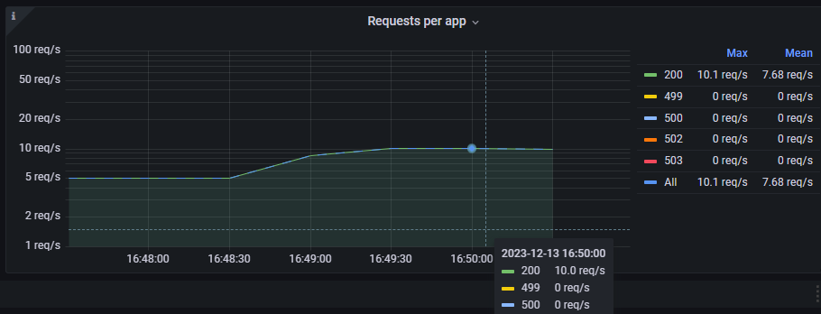

# Домашнее задание №4 (Chaos Engineering) MtsCloud "Проект для студента poshta69" K8s namespase "sre-cource-student-72"
*Задача:*

1. Отключение узла: Планово остановить один из узлов кластера, чтобы проверить процедуру переключения ролей (failover). - Анализировать время, необходимое для восстановления и как система выбирает новый Master узел (и есть ли вообще там стратегия выбора?).
2. Имитация частичной потери сети: Использовать инструменты для имитации потери пакетов или разрыва TCP-соединений между узлами. Цель — проверить, насколько хорошо система справляется с временной недоступностью узлов и как быстро восстанавливается репликация.
3. Высокая нагрузка на CPU или I/O: Запустить процессы, которые создают высокую нагрузку на CPU или дисковую подсистему одного из узлов кластера, чтобы проверить, как это влияет на производительность кластера в целом и на работу Patroni.
4. Тестирование систем мониторинга и оповещения: С помощью chaos engineering можно также проверить, насколько эффективны системы мониторинга и оповещения. Например, можно искусственно вызвать отказ, который должен быть зарегистрирован системой мониторинга, и убедиться, что оповещения доставляются вовремя.

*Если сделали все предыдущие:*

1. "Split-brain": Одновременно изолировать несколько узлов от сети и дать им возможность объявить себя новыми мастер-узлами. Проверить, успеет ли Patroni достичь
консенсуса и избежать ситуации "split-brain".
2. Долгосрочная изоляция: Оставить узел изолированным от кластера на длительное время, затем восстановить соединение и наблюдать за процессом синхронизации и
восстановления реплики.
3. Сбои сервисов зависимостей: Изучить поведение кластера Patroni при сбоях в сопутствующих сервисах, например, etcd (которые используются для хранения состояния кластера), путем имитации его недоступности или некорректной работы.

*Схема системы*


## Инструменты
Для выполнения тестирования будем использовать следующие инструменты:
- [Artillery](https://www.artillery.io/docs/get-started/get-artillery)
- [ChaosBlade](https://chaosblade.io/en/)
- Консоль MtsCloud
- ChatGPT v4

## Задача №1.
Иcходя из условий задачи, нашей цулью является кластер Postgres под управлением patroni. Поведение кластера ETCD будет проверено в задаче по Split-brain.
### Описание эксперимента
Отработаем два варианта отключения:
1. Ведомый хост
2. Ведущий хост
Ход выполнения:
1. Создадим нагрузку на приложение в 10 rps/s используя Artillery
2. Планово остановим один из узлов кластера используя один из способов
```Bash
shutdown -P now
services postgresql stop
```
или выключить хост через консоль MtsCloud
Определим сервера:
```Bash
sudo patronictl list
+ Cluster: postgres-cluster ------+-----------+----+-----------+
| Member    | Host      | Role    | State     | TL | Lag in MB |
+-----------+-----------+---------+-----------+----+-----------+
| db-srv-01 | 10.0.10.2 | Leader  | running   |  1 |           |
| db-srv-02 | 10.0.10.3 | Replica | streaming |  1 |         0 |
+-----------+-----------+---------+-----------+----+-----------+
```
Сеачала проведем отключение реплики, после восстановления - лидера.
Отключать хосты будем через консоль MtsCloud.
### Ожидаемые результаты
При потере ведомомо узла - оповещения от системы мониторинга и при наличии разделения чтение/запись просадку в rps/s, если не настроено, то влияния на приложение не окажет. Приложение не настроено на разделение чтение/запись, значит должны получить только оповещения, на работу не должно быть оказано влияние.

При потере ведущего узла - оповещения от системы мониторинга, смена лидера и недоступность ресурса не более 30 секунд (patroni ttl=30), после восстановления работы отключенной ноды она должна стать ведомой и начать репликацию.
### Реальные результаты
При отключении реплики:
- При плановом выключении и при имитации потери питания влияния на работу приложения оказано не было
```Bash
sudo patronictl list
+ Cluster: postgres-cluster -----+---------+----+-----------+
| Member    | Host      | Role   | State   | TL | Lag in MB |
+-----------+-----------+--------+---------+----+-----------+
| db-srv-01 | 10.0.10.2 | Leader | running |  1 |           |
+-----------+-----------+--------+---------+----+-----------+
```
Сработали алерты на потерю экспортеров завязанных на хост и о потери плеча реплики от Haproxy


После включени хоста работа кластера восстановилась и восстановились алерты.
```Bash
sudo patronictl list
+ Cluster: postgres-cluster ------+-----------+----+-----------+
| Member    | Host      | Role    | State     | TL | Lag in MB |
+-----------+-----------+---------+-----------+----+-----------+
| db-srv-01 | 10.0.10.2 | Leader  | running   |  1 |           |
| db-srv-02 | 10.0.10.3 | Replica | streaming |  1 |         0 |
+-----------+-----------+---------+-----------+----+-----------+
```

При отключении лидера:
```Bash
sudo patronictl list
+ Cluster: postgres-cluster -----+---------+----+-----------+
| Member    | Host      | Role   | State   | TL | Lag in MB |
+-----------+-----------+--------+---------+----+-----------+
| db-srv-02 | 10.0.10.3 | Leader | running |  2 |           |
+-----------+-----------+--------+---------+----+-----------+
```
Произошла смена лидера мене 10s

Сработали алерты на потерю экспортеров завязанных на хост и о потери плеча реплики от Haproxy.
После включени хоста работа кластера восстановилась и восстановились алерты.
```Bash
sudo patronictl list
+ Cluster: postgres-cluster ------+-----------+----+-----------+
| Member    | Host      | Role    | State     | TL | Lag in MB |
+-----------+-----------+---------+-----------+----+-----------+
| db-srv-01 | 10.0.10.2 | Replica | streaming |  2 |         0 |
| db-srv-02 | 10.0.10.3 | Leader  | running   |  2 |           |
+-----------+-----------+---------+-----------+----+-----------+
```
Произошло падение RPS, errors 499, 500 выросло latency P99. P95 осталось в пределах SLO.


### Анализ результатов
Ожидаемые результаты совпали с реальными - тест пройден.

Механизм failover-а и выбора нового лидера отработал штатно, согласно схемы

Из возможных улучшений - добавить алерт на потерю ноды кластера postgres.

## Задача №2.
Иcходя из условий задачи, сконцентрируемся на кластере Postgres и ETCD.
### Описание эксперимента
Будем имитировать потерю исходящих пакетов на мастер ноде.
Ход выполнения:
1. Создадим нагрузку на приложение в 10 rps/s используя Artillery
2. Используя инструмент ChaosBlade имитируем потерю пакетов 30% 50% 70%
```Bash
blade create network loss --interface ens* --percent 30 --timeout 60 --exclude-port 22 --destination-ip *.*.*.*
blade create network loss --interface ens* --percent 50 --timeout 60 --exclude-port 22 --destination-ip *.*.*.*
blade create network loss --interface ens* --percent 70 --timeout 60 --exclude-port 22 --destination-ip *.*.*.*
```
или альтернативный вариант, используя iptables
```Bash
iptables -I OUTPUT -d *.*.*.* -m statistic --mode random --probability 0.30 -j DROP
iptables -I OUTPUT -d *.*.*.* -m statistic --mode random --probability 0.50 -j DROP
iptables -I OUTPUT -d *.*.*.* -m statistic --mode random --probability 0.70 -j DROP
```
Определим сервера:
```Bash
sudo patronictl list
+ Cluster: postgres-cluster ------+-----------+----+-----------+
| Member    | Host      | Role    | State     | TL | Lag in MB |
+-----------+-----------+---------+-----------+----+-----------+
| db-srv-01 | 10.0.10.2 | Leader  | running   |  3 |           |
| db-srv-02 | 10.0.10.3 | Replica | streaming |  3 |         0 |
+-----------+-----------+---------+-----------+----+-----------+
```
```Bash
sudo ETCDCTL_API=3 etcdctl endpoint status --write-out=table --endpoints=http://10.0.10.4:2379 --endpoints=http://10.0.10.5:2379 --endpoints=http://10.0.10.6:2379
+-----------------------+------------------+---------+---------+-----------+------------+-----------+------------+--------------------+--------+
|       ENDPOINT        |        ID        | VERSION | DB SIZE | IS LEADER | IS LEARNER | RAFT TERM | RAFT INDEX | RAFT APPLIED INDEX | ERRORS |
+-----------------------+------------------+---------+---------+-----------+------------+-----------+------------+--------------------+--------+
| http://10.0.10.4:2379 | 28cd7332cee13aa8 |   3.5.9 |   90 kB |     false |      false |         2 |        236 |                236 |        |
| http://10.0.10.5:2379 | e8cc3f7ff72fe07d |   3.5.9 |   94 kB |     false |      false |         2 |        236 |                236 |        |
| http://10.0.10.6:2379 | b586ded327f9460d |   3.5.9 |   94 kB |      true |      false |         2 |        236 |                236 |        |
+-----------------------+------------------+---------+---------+-----------+------------+-----------+------------+--------------------+--------+
```
Далее на каждом мастере будем поочередно запускать комманды и наблюдать за поведением системы. При тестировании ETCD будем производить смену лидера в кластере postgres. При тестировании postgres будем писать и стирать данные в БД кластера.
### Ожидаемые результаты
По мере увеличения процента потерь должно увеличиваться отставание реплик, при привышение порога отставания должен сработать алерт, если такой имеется. При наличии разделения чтение/запись нарушение консистентности данных. Приложение не настроено на разделение чтение/запись, на работу не должно быть оказано влияние.
### Реальные результаты
При при проведении эксперемента на ETCD кластере не было выявлено критического воздействия на репликацию даже при повышении потерь до 98%, члены кластера в течении секунды забирали изменения с лидера, время переключения лидера в кластере postgres также оставлось в пределах 10s.


При проведении теста на кластере postgres были выявлены следующие результаты:
- При потере 30% пакетов не наблюдалось отставания репликации
- При потере 50% был стабильный лаг в 20ms

- При потере 70% был стабильный лаг в 90ms

Оповещений от системы мониторинга не было.

### Анализ результатов
Ожидаемые результаты частично совпали с реальными.

Кластер ETCD в данной схеме оказался наименее подвержен проблемам сети, это связано с небольшой активностью работы с хранимой в нем информации, при более активном использовании мы бы получили задержки при сохранении данных, так как ответ об сохранинии данных в кластере отдается только после подтверждения их сохранения всеми членами кластера.

При тестировании кластера postgres наблюдалась четкая закономерность, что при увеличении потерь происходило увеличение отставания репликации! Цифры получились небольшие, т.к. использовался небольшой объем изменяемых данных в БД, однако при его увеличении цифры покажут рост. Для получения более показательного результата необходимо подготовить сценарий на грузки направленный на операции записи и редактирования записей в БД.

Система оповещения не сработала, т.к. не были достигнуты граничные результаты. Для отслежывания таких ситуаций стоит добавить правило для отслеживания потери пакетов.

## Задача №3.
Иcходя из условий задачи, сконцентрируемся на кластере Postgres как наиболее ответсвенной точке системы.
### Описание эксперимента
Будем имитировать наргузку 80-100% на CPU и чтение запись на дисковую подсистему на мастер ноде.
Ход выполнения:
1. Создадим нагрузку на приложение в 10 rps/s используя Artillery
2. Используя инструмент ChaosBlade создадим нагрузку на диск и процессор
```Bash
blade create cpu fullload --cpu-percent 80 --timeout 600
blade create cpu fullload --cpu-percent 100 --timeout 600
blade create disk burn --read --write --path ~/test --timeout 600
```

### Ожидаемые результаты
По мере увеличения нагрузки должны сработать алерты от системы мониторинга по утилизации ресурсов, увеличиться время ответа системы. Возмажна задержка репликации или смена лидера.

### Реальные результаты
- При нагрузке на CPU в 80% система работает стабильно, наблюдается небольшое увеличение latency, оповещений о приближении к крит. лимиту cpu нет.



- При нагрузке на CPU в 100% система работает не устойчиво, но при этом ошибок в приложении не наблюдается при текущей нагрузке, есть небольшой лаг в сборе метрик и увеличилось время ответа приложения. Операции чтения и изменения данных в БД также увеличились по времени и занимали 40-250ms, при штатной работе выполнялись >40. При тестировании процессор не был загружен на 100%, максимум 97-98%. Оповещений о приближении к крит. лимиту cpu нет.


- При нагрузке на дисковую систему наблюдалось схожее поведение с результатом 100% нагрузки на CPU, оповещений о приближении к крит. лимиту cpu нет.

### Анализ результатов
Ожидаемые результаты частично совпали с реальными.
При текущих нагрузках система вела себя предсказуемо, однако при увеличении числа запросов и их смешанном характере возможна деградация сервиса. Задержка в репликации отсутствует, лидер не сменился. Так же влияние оказало не возможность полностью нагрузить процессор, из-за этого результаты не ровные. Отсутствуют оповещения!

Для улучшения наблюдаемости стоит настроить оповещения с корректными порогами по утилизации ресурсов!

## Задача №3.
В проведенных тестах уже есть упоминание системы монит оринга, поэтому в этом пункте просто подитожим результаты.

В результате тестов выяснили, что система мониторинга присутствует и имеющиеся в ней правила отрабатывают в штатном порядке, однако отсутствуют оповещения по утилизации ресурсов и работоспособности сервисов. Для улучшения работы мониторинга и наблюдаемости системы необходимо настроить оповещения по:
1. Утилизации ресурсов (cpu, i/o, mem)
2. Ключевых служб системы (patroni, etcd, postgres, haproxy)

## Задача Split-brain
Возможны два варианта один для кластера postgres второй для etcd.

Для postgres, переключением занимается patroni, информацию о лидере он хранит в etcd, при потере связи с etcd кластер перходит в состояние read only или при наличии опции `failsafe_mode: true` у patroni - остаемся в последнем состоянии. Исходя из это получаем, что Split-brain не возможен.

Для etcd, кластер состоит из 3 членов используется протокол Raft. Исходя из это получаем, что Split-brain не возможен

### Описание эксперимента
Изолируем postgres от кластера etcd, на кждой ноде кластера postgres прописываем
```Bash
blade create network loss --percent 100 --destination-ip адреса etcd --interface ens160 --exclude-port 22 --timeout 600
```
Изолируем одну ноду etcd от остальных нод кластера
```Bash
blade create network loss --percent 100 --destination-ip адреса etcd --interface ens160 --exclude-port 22 --timeout 600
```
### Ожидаемые результаты
В первом случае
### Анализ результатов