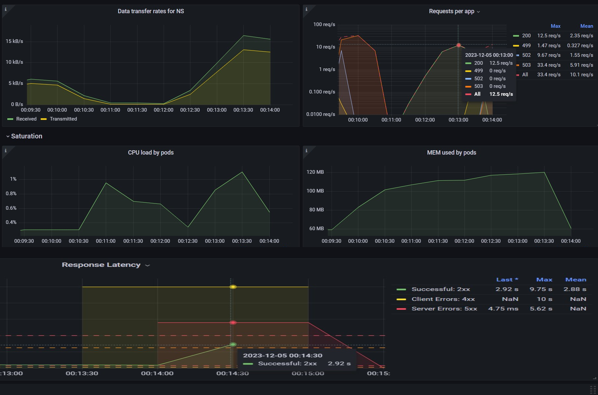
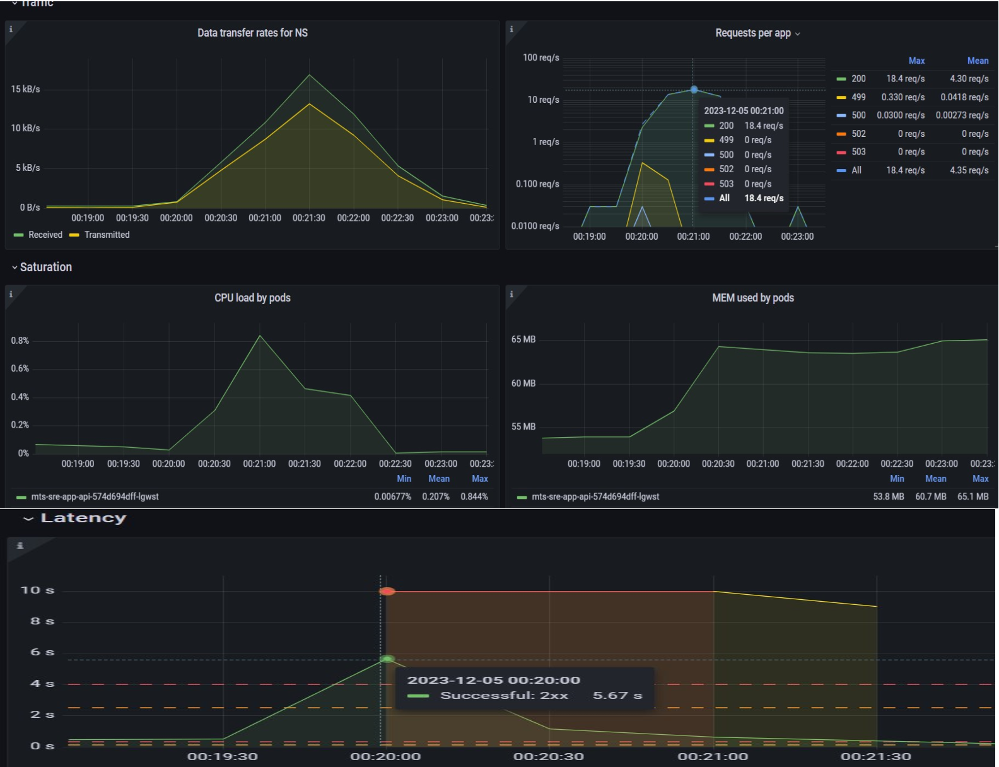
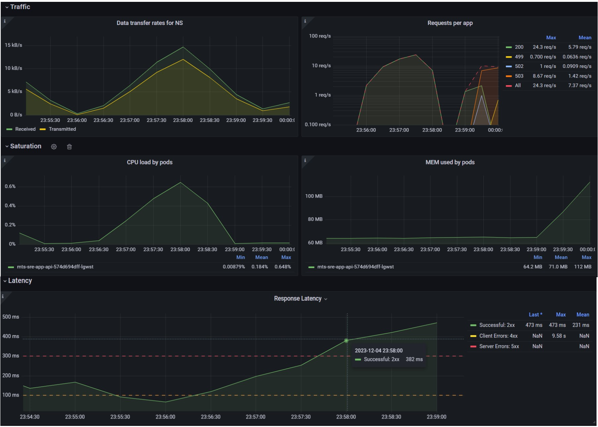
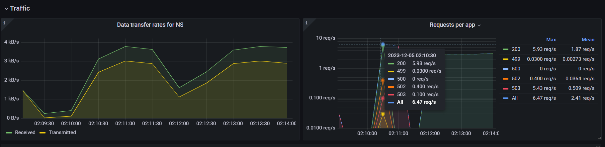
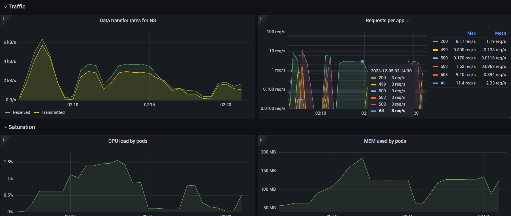

# MtsCloud "Проект для студента poshta69" K8s namespase "sre-cource-student-72"

Нагрузочное тестирование WEB API - mts-sre.app

В качестве инструмента тестирования выбран [Artillery](https://www.artillery.io/docs).

Из преимуществ: 
- имеет декларативный язык написания тестов (YAML)
- поддержку плагинов
- метрики и отчеты

Установка и использование инструмента

   - [Artillery](https://www.artillery.io/docs/get-started/get-artillery)
   - создать файл сценария
   - запустить тестирование
  ```
  artillery run test.yml
  ```

# Анамнез

Схема системы


Легенда.

Тестировать будем виджет погоды на региональном новостном сайте "Тамбовский вестник", ариложение содержит в себе погодные данные городов области, наполнение данными происходит автоматически или оператором несколько раз в день. Из этого можем предположить, что нам потребуется найти максимальное число GET запросов при том, что  POST запросов будет менее 1% - MaxPerformanceTest тест. Далее возьмем 90-95% от максимальной нагрузки и проведем стрес тест - StressTest. По результатам тестов прощетаем стабильную нагрузку укладывающуюся до 80% от MaxPerformance системы - StabilityTest.

Для выполнения тестирования нам потребуются следующие данные:
- Headers:
   - `'Host: mts-sre.app'`

- Endpoints - GET:
   - `/WeatherForecast` - прогноз погоды по всем городам (аналагичен Forecast, только Forecast еще используется для обновления/добавления прогноза)
   - `/Cities` - список всех городов
   - `/Cities/{id}` - конкретный город
   - `/Forecast` - прогноз по всем городам
   - `/Forecast/{id}` - конкретный прогноз

- Endpoints - POST:
   - `/Cities` - добавить город
   - `/Cities/{id}` - изменить конкртный город
   - `/Forecast/{cityId}` - прогноз для города
   - `/Forecast/{id}` - изменить конкретный прогноз

# Требования по производительности к системе (SLO/SLA)
`SLA:`
- http.response_time.p99: < 800 mc
- http.response_time.p95: < 500 mc
- http.maxErrorRate: < 2%

`SLO:`
- http.response_time.p99: < 700 mc
- http.response_time.p95: < 400 mc
- http.maxErrorRate: < 1%

# Профили нагрузки:

- #### MaxPerformanceTest
  * Описание: Постепенное увеличение нагрузки до критической.
  * Цели: Поиск максимума нагрузки RPS, поиск узкого места, происк точки отказа.
  * Методы: 
    * GET (WeatherForecast) от 0 до 100%
    * GET (Forecast) от 0 до 100%
    * GET (Cities) от 0 до 100%

- #### StressTest
  * Описание: Постепенное увеличение нагрузки до 90% от максимума. Поддержание нагрузки 1 x Max Load time.
  * Цели: Проверка выполнения SLO за расчетное время под нагрузкой 90% от максимума 1 x Max Load time.
  * Методы: 90% от MAXRPS точки с наименьшим RPS

- #### StabilityTest
  * Описание: Постепенное увеличение небольшой нагрузки на все эндпоинты API. Поддержание нагрузки 1 x Max Load time.
  * Цели: Проверка работы всех эндпоинтов API на ошибки при соблюдении SLA/SLO. 
  * Методы: GET (ALL) 80% от MAXRPS точки с наименьшим RPS

# Результаты

## MaxPerformanceTest:
* Методы: 
    * GET (WeatherForecast) - при достижении >=13 req/s возникает отказ в обслуживании, оперативная память пода утилизируется полностью и происходит его рестарт, задержка запросов достигает 3s.
    * GET (Forecast) - при достижении >=19 req/s возникает отказ в обслуживании, оперативная память пода утилизируется полностью и происходит его рестарт, задержка запросов достигает 6s.
    * GET (Cities) - при достижении >=25 req/s возникает отказ в обслуживании, оперативная память пода утилизируется полностью и происходит его рестарт, задержка запросов достигает 475ms.
* Графики наргузки
  * WeatherForecast
  
  * Forecast
  
  * Cities
  

## StressTest
При проведени стресс теста система вела себя крайне не стабильно, приложение постоянно падало при достижении лимита памяти!
* Графики наргузки



## StabilityTest
При текущей конфигурации приложения и результатах предыдущих тестов, запускать тесты на стабильность не имеет смысла! Система не настроена для нагружок более 1-2 req/s.

# Вывод
В результате тестирования были выявлены следующие слабые места:

* Конфигурация приложения 
    - занижены лимиты по памяти
    - отсутствует автомаштабирование
* проблемы с реализацией методов
    - WeatherForecast - слишком тяжелый, расходует много ОП, много обращений к БД (в цикле делает выборку погоды по городу и объединяет в JSON)
    - Forecast - слишком тяжелый, расходует много ОП
* проблемы со схемой БД

Для улучшения результатов необходимо произвести следующие действия:

* Увеличить лимиты по памяти
* Настроить автомаштабирование или увеличить количество реплик приложения
* Добавить индексы в БД
* Пересмотреть реализацию методов, ограничить выдаваемые результаты по времени
* Так как данные в бд редко обновляются, добавить кеширование

PS Во время тестирования наблюдались задержки на сетевом уровне в локальном сегменте VM, что оказало влияние на задежки по запросам